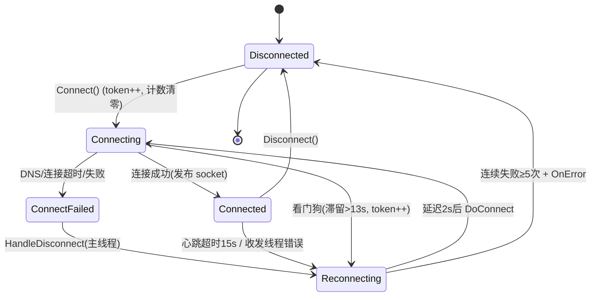

# NetworkClient 网络架构（学习文档）

> 对象：`Client/Assets/Script/Core/Net/NetworkClient.cs`（C# 单例）
> 　　　`Client/Assets/Script/Lua/Net/ClientNetManager.lua`（Lua 门面，简述）
> 日期：2026-08-14　|　对应版本：弱网重连修复（1A+2+3）之后
> 符号名定位为准，行号会漂移。

---

## 1. 总览

基于 `TcpClient` 的自定义二进制协议长连接客户端，C# 层负责传输与协议，
Lua 层（`ClientNetManager`）负责业务侧的收发队列与协议转换。

```
Lua 业务 ── ClientNetManager ──> NetworkClient.Inst（C# 单例）
                                    ├─ Net.Send 线程（合并发送）
                                    ├─ Net.Recv 线程（收包拆包）
                                    ├─ ThreadPool（连接/重连流程）
                                    └─ Net.Dns 线程（短命，限时解析）
主线程每帧调 Update()：消息 pump / 回调分发 / 心跳 / 超时检测 / 看门狗
```

设计目标（类注释声明，部分未落地，见 §11）：粘包处理、小包合并、弱网重发、
服务端去重。**实际实现只落地了前两项**，重发/去重的字段位置保留但未启用。

## 2. 线程模型

| 线程 | 产生方式 | 职责 | 退出条件 |
|---|---|---|---|
| 主线程 | Unity | `Update()`：消息 pump（≤5 条/帧）、`mainThreadActions` 回调分发、心跳发送（5s）、心跳超时检测（15s）、Connecting 看门狗（13s） | — |
| `Net.Send` | `createThread()` | 等待 `sendSignal`（50ms 窗口）→ 队列取包合并 → `FlushMergeBuffer` 写 socket；`Sleep(5)` 轮询 | `isRunning=false` |
| `Net.Recv` | `createThread()` | `stream.Read`（ReadTimeout=15s）→ 粘包拆包 → 入 `recMsgDataQueues`；`Sleep(5)` 轮询 | `isRunning=false` |
| ThreadPool 工作项 | `DoConnect`/重连延迟 | 连接全流程（DNS→connect→校验→发布）；重连前 `Sleep(2000)` | 一次性 |
| `Net.Dns` | `ResolveHost` 按需 | 同步 `Dns.GetHostAddresses`，`Join(5s)` 限时 | 一次性（后台线程） |

**跨线程约定**：

- 业务回调（`OnStateChanged`/`OnMessageReceived`/`OnError`/`OnRecHeartBeat`）
  一律通过 `mainThreadActions` 队列投递到主线程执行——Lua 侧拿到的事件
  全部在主线程，无需加锁。
- `state`、`isRunning`、`connectToken`、`isRecvFlag/isSendFlag/isExpectedClose`
  为 `volatile`；计数用 `Interlocked`；共享资源用细粒度锁
  （`stateLock`/`streamLock`/`countLock`/`flagLock`），锁内不做 IO，
  socket 关闭一律在锁外。
- `clock`（`Stopwatch`）提供线程安全毫秒时钟，任何线程可读。

## 3. 协议格式（实际实现）

> ⚠️ 类头注释写的"14 字节包头 / SeqId / Flags / ACK / 弱网重发"是**设计稿，
> 未落地**。实际线上格式如下，收发两侧必须按此对齐。

```
┌──────────────┬─────────┬────────────┬──────────────────┐
│ len (3B 小端) │ flag(1B) │ msgId(2B 小端) │ payload ...   │
└──────────────┴─────────┴────────────┴──────────────────┘
HEADER_SIZE = 6
```

- **len**：3 字节小端，值 = payload 长度 + 2（发送侧 `byteMsgCount + 2`；
  接收侧读出后减 2 还原 body 长度）。上限 `MAX_PACKET_SIZE=65536`。
- **flag**：bit1(0x2) = payload 已加密（发送侧恒置位）。
- **msgId**：ushort 小端。内部保留：`3000`=心跳，`2`=ACK（收到即丢弃）。
- **payload**：可选加密（见 §4）。

发送 `SerializeByteMsg` 写入 `totalSendBuffer`（复用的 `BufferStream`），
再从缓冲池取等长数组拷出；接收侧对称地在 `recvBuffer` 上就地拆包。

**注意**：发送时 `EncryptBuff(in payload, ...)` 会**原地修改调用方传入的
payload 数组**——Lua 侧经 xLua 传入的 byte[] 会被改写，复用缓冲时须留意。

### 加密（对称、逐字节）

- 加密：每字节**循环左移** `(i%7+1)` 位，再**异或** `key[i%8]`。
- 解密：先**异或** `key[i%8]`，再**循环右移** `(i%7+1)` 位。
- `encryptionKey` / `decryptionKey` 是两把不同的 8 字节硬编码 key。
- 逐字节软件实现，大包（64KB）时 CPU 开销可观，属已知性能点。

## 4. 连接状态机



关键机制：

- **connectToken**（递增序号）：`Connect()` 与看门狗触发时递增，用于作废
  滞留/过期的异步流程。`HandleDisconnect(token)` 与连接成功后的 token 校验
  都会丢弃过期事件，防止旧连接任务污染新状态。
- **reconnectCount**：自动重连上限 5 次。清零点只有两个——显式 `Connect()`、
  收到**首个服务端心跳**。`Disconnect()` 会置满以阻止自动重连。
- **Connecting 看门狗**（本次修复新增）：`DoConnect` 进入 `Connecting` 时
  记 `connectingStartTime`；`Update()` 检测滞留 >13s（DNS 5s + 连接 5s + 余量
  3s）→ 重置计时 → token++ → 强制 `HandleDisconnect`。`Connect()` 与
  `HandleDisconnect` 对滞留超阈值的 `Connecting` 放行抢占/打断——状态机
  任何情况下不会永久卡在 `Connecting`。
- **连接流程**（ThreadPool 工作项内）：
  1. `ResolveHost(host)`：IP 直通 / 缓存命中 / 专用线程限时(5s) DNS；
  2. `ConnectAsync(IP, port)` + CTS 5s 超时（Register 回调关 socket 兜底）；
  3. 成功后**立即 `cts.Dispose()`** 解除定时器武装（防误杀，见问题分析文档）；
  4. `IsOnline` 二次确认（Poll + 零字节探测）→ 加锁发布 `netStream/tcpClient`；
  5. token/状态终检 → `Connected`。
  任何一步失败：关闭资源 → `ConnectFailed` → 主线程 `HandleDisconnect`。
- **主动断开标记 isExpectedClose**：跨线程 Close 前置位，让收发线程能区分
  "我方主动断开"与"真网络错误"（Mono 下异常包装链不可靠，不靠错误码猜）。

## 5. 发送链路

```
Send(msgId, payload)          [主线程，仅 Connected 态]
  → SerializeByteMsg（组包+加密+池取缓冲）
  → sendQueue.Enqueue + sendSignal.Set()
Net.Send 线程：
  Wait(50ms 窗口) → 队列所有包合并进 mergeBuffer
    （超 SEND_MERGE_MAX_SIZE=8KB 先 flush 再续）
  → FlushMergeBuffer：锁内取 netStream 引用 → Write+Flush
  失败(IOException/Disposed/InvalidOperation)：
    isSendFlag=false → 主线程 HandleDisconnect
```

- `NoDelay=true` 关闭系统 Nagle，合并节奏完全由 50ms 窗口控制。
- 发送为 **fire-and-forget**：无应用层 ACK、无重发（`CheckRetransmission`/
  `HandleAck` 均被注释）。可靠性完全依赖 TCP 自身。
- 心跳包（3000）也走同一条发送链路。

## 6. 接收链路（粘包/半包）

```
Net.Recv 线程：
  锁内取 netStream 引用（null/不可读 → disconnect）
  stream.Read → recvBuffer（128KB，追加式）
  TryUnpackMessage 循环：
    <6B        → 等待（半包）
    len 非法    → 断连（协议错误防护）
    <6+bodyLen → 等待（半包）
    完整       → 解密 → recMsgDataQueues.Enqueue
    剩余数据前移（消除已处理包）
  bytesRead==0 → 服务器 FIN，断连
主线程 Update()：每帧最多 pump 5 条（MAX_MSG_COUNT_FRAME）
  → 心跳：刷新 lastHeartbeatRecvTime，首个心跳清零 reconnectCount
  → 业务：OnMessageReceived(msgId, data)
  → 用完的 byte[] 归还缓冲池
```

- 缓冲区写满（128KB 无完整可拆包）视为协议异常，断连自保。
- 读超时（15s）不视为断线，仅 continue；真正的断线判定交给主线程心跳超时。
- 每帧 5 条的上限防止大消息风暴卡帧，代价是高吞吐场景下有排队延迟。

## 7. 心跳与超时参数

| 参数 | 值 | 含义 |
|---|---|---|
| `HEARTBEAT_INTERVAL_MS` | 5000 | 客户端心跳发送间隔（`Update` 驱动） |
| `HEARTBEAT_TIMEOUT_MS` | 15000 | 心跳接收超时 → 判定断线重连；同时是 `ReceiveTimeout`/`stream.ReadTimeout` |
| `CONNECT_TIMEOUT_MS` | 5000 | TCP 连接超时 |
| `DNS_TIMEOUT_MS` | 5000 | DNS 解析超时（本次修复新增） |
| `WATCHDOG_EXTRA_MS` | 3000 | 看门狗余量；看门狗阈值合计 13s |
| `RECONNECT_DELAY_MS` | 2000 | 重连前延迟 |
| `MAX_RECONNECT_COUNT` | 5 | 自动重连上限 |

心跳是双向的：客户端发 3000，服务端也回 3000；**收到任何业务消息都会刷新
`lastHeartbeatRecvTime`**（pump 处统一刷新），即"有数据 = 活着"。

## 8. 缓冲池

- 静态 `buffPools: ConcurrentDictionary<size, ConcurrentQueue<byte[]>>`，
  按**精确长度**分桶收发共用，避免弱网重连/高频收发下的 GC 压力。
- `getBuffFromPool` 取出时 `Array.Clear`；`recycleBuffToPool` 归还。
- ⚠️ 池**无上限**、无租约校验：同一 byte[] 若被误双重回收/复用会引发数据
  错乱；`Dispose()` 会把 `buffPools` 置 null，单例此后再用会在取池时 NRE
  （见 §11）。

## 9. 生命周期

| 入口 | 行为 |
|---|---|
| `Init()` / `createThread()` | 启动 `Net.Send`/`Net.Recv`（后台线程），`isRunning=true` |
| `Connect(host, port)` | 状态守卫（Connected/未滞留 Connecting 拒绝）→ token++ → 计数清零 → `DoConnect` |
| `Disconnect()` | 计数置满（阻止自动重连）→ `DoDisconnect`（关 socket、置 Disconnected）→ `killThread`（Join 500ms 超时则 Interrupt） |
| `Dispose()` | 清空回调队列 → `Disconnect` → 释放 `sendSignal`/`mergeBuffer` → 清空并置 null `buffPools` |

## 10. Lua 门面：ClientNetManager（简述）

- 持有 `NetworkClient.Inst` 引用，注册四个回调（状态/消息/错误/首心跳）；
  所有回调在主线程触发。
- `connect("ip:port")` 解析地址后转调 `NetworkClient:Connect`；
- 业务发送走 `sendReq`：同类型消息 pending 去重（防重复请求）→ 队列 →
  `sendProto`（pb 转换）；登录/重连的特权消息走 `directSendReq` 免排队；
- 自身另有 Lua 心跳（`sendHeartbeat` → `Send(ProtoID.HeartBeat)`），与 C# 层
  3000 心跳并存，注意区分协议 ID。

## 11. 已知限制与风险清单（现状，未修复）

| # | 问题 | 影响 |
|---|---|---|
| 1 | 类头注释与实现不符（14B 包头/SeqId/Flags/ACK/重发均未实现） | 误导维护者；接口字段（`Send` 的 needAck 语义、`MSG_ID_ACK`）名存实亡 |
| 2 | 发送无应用层确认与重发 | 弱网丢包静默（靠 TCP）；断线期间消息直接丢弃（清空 sendQueue） |
| 3 | `Dispose()` 置 null `buffPools`，单例可再 `Inst` 复活但池已 null | 复活后首条收发 NRE |
| 4 | `FlushMergeBuffer` 用 `stream.CanRead` 判断可写 | 能工作但是 API 误用，隐含维护风险 |
| 5 | 收发线程 `Sleep(5)` 轮询 + 50ms 合并窗口 | 发送最小延迟 ~5-50ms；空转功耗（可接受但需知情） |
| 6 | `reconnectCount` 清零依赖"首个心跳" | "连上但心跳慢"场景易耗尽 5 次重连（弱网体验差） |
| 7 | 逐字节软件加解密 | 64KB 大包 CPU 开销可观 |
| 8 | `mainThreadActions` / `recMsgDataQueues` 无界 | 主线程卡顿（加载等）期间积压无上限 |
| 9 | 成功路径先发布字段后校验 token | 抢占竞态下可能出现一次多余的双发布/重连（自愈但多余） |
| 10 | `killThread` 仅在 Join 超时分支清线程引用 | 正常退出后引用残留（无功能影响） |
| 11 | DNS 缓存无 TTL | 服务器换 IP 后需重启客户端才生效 |

## 12. 配套阅读

- [弱网重连卡死-问题分析与修复.md](弱网重连卡死-问题分析与修复.md)：
  连接超时/看门狗/token 抢占的来龙去脉与可迁移模式。
