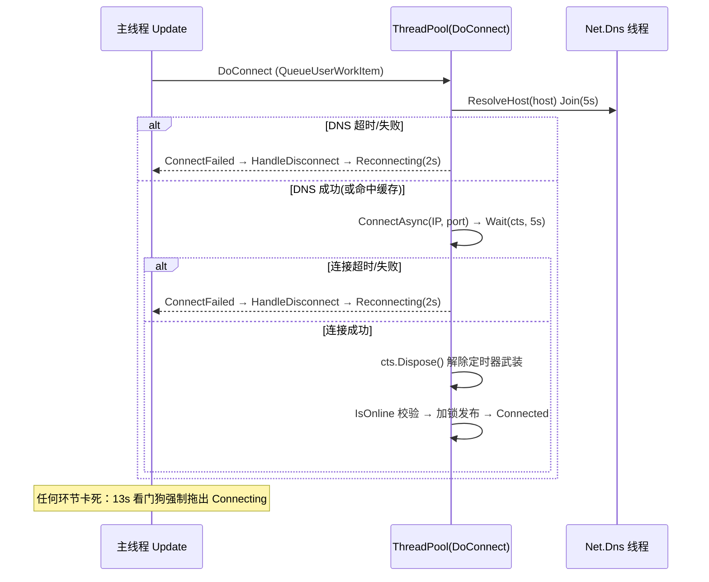

# 弱网重连卡死：问题分析与修复（学习笔记）

> 对象：`Client/Assets/Script/Core/Net/NetworkClient.cs`
> 日期：2026-08-14　|　状态：已修复并编译验证
> 行号以修复当次版本为准，后续可能漂移，请以符号名定位。

---

## 1. 现象

弱网（高丢包 / 高延迟 / DNS 不稳）下触发重连后，客户端永久停留在 `Connecting` 状态：

- 不再发起重连；
- 外部调 `Connect()` 被拒绝（"Already connecting"）；
- 心跳超时检测不生效（只在 `Connected` 状态运行）。

表现即"卡死"，只能重启或显式 `Disconnect()` 解锁。

## 2. 原始代码的关键段（修复前）

```csharp
using var cts = new CancellationTokenSource(CONNECT_TIMEOUT_MS);   // 5s
try
{
    var connectTask = client.ConnectAsync(host, port);   // ← 卡死点
    cts.Token.Register(() => { client.Close(); });       // 超时回调：关 socket
    connectTask.Wait(cts.Token);                         // 带取消的等待
}
catch (OperationCanceledException) { ... throw new TimeoutException(...); }
```

设计意图：`ConnectAsync` + CTS 5 秒超时 + 回调关 socket，实现"可靠连接超时"。

## 3. 根因分析

### 根因一（主因）：`ConnectAsync(host, port)` 返回 Task 之前有同步阻塞段

Unity 的 Mono/IL2CPP 运行时**没有真正的异步 DNS**：

```
TcpClient.ConnectAsync(host, port)
  → Socket.BeginConnect(hostname, ...)
    → Dns.GetHostAddresses(hostname)   ← 同步阻塞，发生在 Task 创建之前
    → 才开始异步 TCP 连接
```

弱网下 DNS 查询慢或挂起时，`ConnectAsync` 这一行**在返回 Task 之前**就阻塞，
耗时由 OS 解析器决定（十几秒甚至无限）。而 CTS / Register / Wait 全部在这行
**之后**才建立——整套超时机制保护不到这段同步阻塞。

注意：`Wait(cts.Token)` 本身是响应取消的，5 秒必抛 `OperationCanceledException`。
所以**无限阻塞点是 `ConnectAsync` 调用行的同步段，不是 Wait**。

### 根因二：状态机三道闸门把退路全封死

阻塞期间 `state == Connecting`，此时所有逃生路径都失效：

| 逃生路径 | 位置（修复前） | 结果 |
|---|---|---|
| 外部重新 `Connect()` | 开头的状态检查 | `Connecting` 直接 return，拒绝新连接 |
| `HandleDisconnect()` | 幂等保护 | 见 `Connecting/Reconnecting` 直接 return |
| 心跳超时检测 | `Update()` | 只在 `Connected` 状态运行 |

没有任何代码路径能把状态从 `Connecting` 拉回来 → 永久卡死。

### 根因三：5 秒定时器会误杀刚建好的连接（重连风暴放大器）

CTS 定时器**不管连接成败，到点必触发** Register 回调（关闭 client）。弱网下：

```
TCP 握手 3~5s 成功 → IsOnline() 的 Poll(1000) 再耗最多 1s
→ 期间定时器到点 → 把刚建好/刚发布的连接直接 Close
→ 连上就被掐死 → HandleDisconnect → reconnectCount+1
```

`reconnectCount` 只在收到**第一个心跳**时清零，而被掐的连接恰恰收不到心跳
→ 5 次快速耗尽 → "Max reconnect attempts reached" → 彻底断开。
这是另一种表现形式的"卡死"（不再重连）。

（成功路径末尾 `client = null` 会让定时器回调变 no-op，但存在
`Wait 成功 → client=null` 之间的时间窗，弱网下该窗口正好被定时器命中。）

### 伴生问题

1. **线程池占用**：`DoConnect` 跑在 ThreadPool 上，每次失败占一个池线程
   `Wait` 5s；重连延迟再占一个 `Sleep(2000)`。Mono 线程池扩容慢，且
   **CTS 超时回调本身也靠线程池调度**——池被占满时取消会延迟，形成反馈环。
2. **泄漏**：超时后 `connectTask` 被丢弃未观察；Mono 下对已 Close socket
   上挂起的 APM connect 可能永不完成，反复重连会累积。

## 4. 修复方案（1A + 2 + 3）

### 4.1 修复 1A —— DNS 移出 `ConnectAsync`

**思路**：先自己解析出 IP，再走 `ConnectAsync(IPAddress, port)` 的无 DNS 路径，
让 Task 立即返回，5 秒 CTS 机制就能完整覆盖。

落地（`ResolveHost` + `DoConnect`）：

- IP 字面量 `IPAddress.TryParse` 直通，不走 DNS；
- 域名解析结果缓存（`resolvedHostKey` / `resolvedHostIP`），重连复用，
  弱网下省去重复解析；
- 真正的 `Dns.GetHostAddresses` 放到**专用短命线程** `Net.Dns` 上执行，
  `Join(DNS_TIMEOUT_MS=5000)` 限时；超时/失败抛异常走既有失败路径
  （`ConnectFailed` → `HandleDisconnect` → 正常重连循环）。

### 4.2 修复 2 —— 成功即解除定时器武装

**思路**：连接建立后，后续校验/发布阶段不再允许定时器杀连接。

落地（`DoConnect` 成功路径）：

```
connectTask.Wait(cts.Token);   // 成功返回
cts.Dispose();                 // ← 立刻解除 5s 定时器武装
// 之后才进入 IsOnline 校验（Poll 最长 1s）与加锁发布字段
```

`using var cts` 结束时的二次 Dispose 是无害 no-op。残余竞态只剩
`Wait 返回 → Dispose 执行` 之间的微秒级窗口，命中后走干净的失败重连，
不再出现"连上即被掐"。

### 4.3 修复 3 —— Connecting 看门狗（必须有的兜底）

**思路**：无论 1A/2 是否漏网，都不允许状态机永久停留在 `Connecting`。

落地三处：

1. **计时起点**：`DoConnect` 在 `SetState(Connecting)` 前同步置
   `connectingStartTime = clock.ElapsedMilliseconds`。
2. **检测**：`Update()` 中，`Connecting` 滞留超过
   `DNS_TIMEOUT_MS + CONNECT_TIMEOUT_MS + WATCHDOG_EXTRA_MS`（5+5+3=13s）
   → 重置计时窗口（防止每帧刷）→ `Interlocked.Increment(connectToken)`
   作废滞留中的旧尝试 → `HandleDisconnect(token)`。
3. **放行**：
   - `HandleDisconnect` 的幂等保护改为"带时效"——`Connecting` 滞留超阈值时
     不再早退，允许打断；
   - `Connect()` 对滞留超阈值的 `Connecting` 放行新连接抢占
     （token 递增本来就支持抢占，此前被 return 挡住）。

token 递增的作用：旧尝试即使稍后"成功"，也会在发布字段后的 token 校验处
抛 "State is changed." 走失败路径，不会污染新一轮连接。

## 5. 修复后的行为时序



重连上限：连续失败 5 次（`MAX_RECONNECT_COUNT`）→ `Disconnected` +
`OnError("Max reconnect attempts reached.")`；`Connect()` 或收到首个服务端心跳
才清零计数。

## 6. 验证

- 编译：桩掉 `UnityEngine.Debug` / `BufferStream` 后 `dotnet build`：
  **0 警告 0 错误**；
- 行为链复核：DNS ≤5s、连接 ≤5s 均落入 catch → 正常重连循环；未预知卡死
  由 13s 看门狗兜底；`Connect()`/`HandleDisconnect` 两条逃生路不再被封死；
- 建议冒烟（本机无 Unity，未执行）：编辑器中断网/限速连域名服务器，确认日志
  能走完 `Reconnecting (n/5)` 循环或成功连上，卡住时 ≤13s 出现
  `Connecting watchdog fired`。

## 7. 学习要点（可迁移的模式）

1. **超时保护必须覆盖阻塞调用的全部同步前摇**。`XxxAsync` 不等于纯异步——
   Mono 的 DNS、某些运行时的序列化/握手都可能藏在"返回 Task 之前"。
   排查卡死先问：超时是从哪一行开始生效的？
2. **中间状态必须有看门狗**。任何 `Connecting/Loading/Waiting` 类状态的
   进入点都要记录时间戳，并存在一个无条件运行的检测者（这里是主线程
   `Update`），滞留超阈值即强制迁移。这是状态机的"逃生门"。
3. **到点必炸的定时器要显式解除武装**。CTS/Register 这类"绝对时间触发"的
   回调，在成功路径上要第一时间 `Dispose`，否则它会把"慢但成功"误判为
   "超时失败"——弱网下慢是常态。
4. **取消令牌（token）要参与抢占**。`connectToken` 递增使旧异步流程作废，
   新流程不必等旧的"善终"；但要配合状态守卫的"带时效豁免"，否则守卫会
   把抢占也挡住（本次 `HandleDisconnect` 早退就是反例）。
5. **看门狗触发时重置计时窗口再动作**，避免动作未生效时每帧重入刷屏。
6. **阻塞型工作项别放 ThreadPool**（尤其还套定时器回调也依赖池的场合），
   用专用线程或控制并发上限；Mono/IL2CPP 池扩容慢，容易形成二级故障。
7. **平台特性优先怀疑**：同一份 C# 代码在 .NET Core 与 Unity Mono 上，
   网络 API 的异步纯度完全不同，超时类 bug 往往只在特定运行时复现。

## 8. 遗留风险（未在本次修复范围）

- `DoConnect` 仍在 ThreadPool 上执行（1A 已把 DNS 挪去专用线程，池占用从
  最多 10s+ 降到 5s 内，但极端池饥饿仍可能延迟工作项启动——由看门狗兜底）；
- 超时后 `connectTask` 仍未观察异常（UnobservedTaskException）；
- `reconnectCount` 清零条件仍较苛刻（首个心跳），"连上但心跳慢"场景仍可能
  耗尽 5 次计数——属产品策略问题，见架构文档风险清单。
