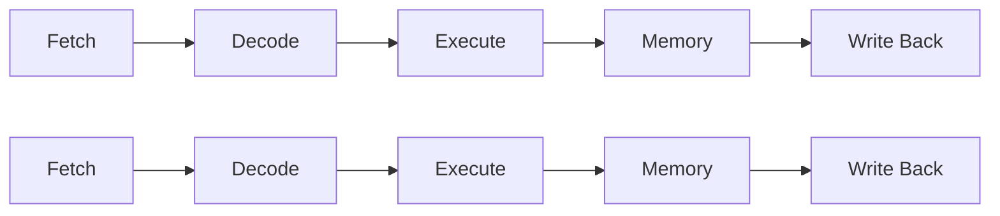

# CSAPP 系统级主题

> [!abstract] 覆盖范围
> CSAPP 第 5-10 章：处理器设计与流水线、程序优化、存储层次与缓存、链接、异常控制流与信号、虚拟内存与动态内存分配。涵盖从硬件微架构到操作系统抽象的完整技术栈。

## 第 5 章：处理器设计与流水线

### Y86-64 指令集

Y86-64 是 x86-64 的精简教学版本：
- 15 个寄存器（而非 16 个——因为 4 bit 编码两寄存器，0xF 表示"无寄存器"）
- 8 种指令：`halt`, `nop`, `rrmovq`, `irmovq`, `rmmovq`, `mrmovq`, `OPq`, `jXX`, `call`, `ret`, `pushq`, `popq`
- 3 个条件码：ZF, SF, OF（无 CF）

### 顺序实现：五阶段流水

每条指令经历以下阶段：

| 阶段 | 职责 |
|------|------|
| **Fetch** | 从 I-cache 取指令，解析 icode/ifun、寄存器、立即数 |
| **Decode** | 读寄存器文件（含隐式寄存器如 `%rsp`） |
| **Execute** | ALU 执行算术/地址计算、设置条件码 |
| **Memory** | 读写数据内存 |
| **Write Back** | 写回寄存器 |
| **PC Update** | 确定下一条指令地址（顺序/跳转/call/ret） |

### 流水线原理 (Pipelining)

- **吞吐量 (Throughput)**：每秒完成的指令数
- **延迟 (Latency)**：单条指令从开始到完成的时间

流水线将指令执行划分为多个阶段，各阶段并行处理不同指令。**时钟周期由最慢的阶段决定**。



### 流水线冒险 (Hazards)

1. **数据冒险 (Data Hazards)**：后一条指令依赖前一条的结果
2. **控制冒险 (Control Hazards)**：分支指令导致预取的指令可能无效

## 第 6 章：程序优化

### 编译器优化的障碍

**内存别名 (Memory Aliasing)**：编译器必须假设两个指针可能指向同一内存位置。

```c
// 这两种看似等价的写法，编译器不能自动优化
*xp += *yp;   // 两次读+两次写
*xp += *yp;
*xp += 2 * *yp;  // 两次读+一次写 (若 xp==yp 则语义不同!)
```

### 优化策略

| 优化 | 说明 |
|------|------|
| **消除函数调用** | 将循环中的函数调用提到循环外，避免重复调用开销 |
| **消除内存引用** | 使用局部变量（寄存器）累积结果，最后一次性写回内存 |
| **循环展开** | 每次迭代处理多个元素，减少循环开销和关键路径延迟 |
| **提高并行性** | 利用多个累加器打破数据依赖链 |

> [!tip] 关键路径
> 性能瓶颈通常由数据依赖链（关键路径）决定。循环展开 + 多累加器可打破单条依赖链。

### 分支预测

CPU 使用分支预测推测执行。预测成功则无延迟；预测失败则需丢弃已执行指令，产生约 15-20 周期的惩罚。

> [!important] 性能计数器
> - **Latency**：执行指令所需时钟周期数
> - **Issue time**：同类指令的最小发射间隔
> - **Capacity**：可同时执行的同类指令数（由 ALU 功能单元数决定）

## 第 7 章：存储层次与缓存

### 存储技术

| 层次 | 技术 | 特性 |
|------|------|------|
| 寄存器 | 触发器 | CPU 内部，~1 cycle |
| L1/L2/L3 Cache | SRAM | 持久性，纳秒级 |
| 主存 | DRAM | 需刷新，~100ns |
| 固态硬盘 | NAND Flash | 需 FTL 层管理擦写 |
| 磁盘 | 磁性介质 | 毫秒级寻道 |

### DRAM 访问流程

1. 发送**行地址** (RAS)，将整行读入 Row Buffer
2. 发送**列地址** (CAS)，从 Row Buffer 读出具体数据

### 局部性原理

- **时间局部性 (Temporal Locality)**：刚访问的数据/指令不久后可能再次访问
- **空间局部性 (Spacial Locality)**：临近地址的数据/指令很可能被访问
- 行优先遍历 >> 列优先遍历（因为符合空间局部性）

### 缓存结构

**地址划分**：

```
┌──────────┬──────────┬──────────┐
│   Tag    │   Set    │  Offset  │
│ (标记位)  │ (组索引)  │ (块偏移)  │
└──────────┴──────────┴──────────┘
```

### 三种缓存映射方式

| 类型 | 描述 | 特点 |
|------|------|------|
| **直接映射** | 每组 1 行 (E=1) | 简单但冲突 miss 多 |
| **组相联** | 每组 E 行 (1<E<C/B) | 折中方案 |
| **全相联** | 所有行在 1 组 (E=C/B) | 用于小容量缓存 |

**缓存抖动**：直接映射中，两个映射到同一组的地址交替访问，导致反复替换。

### 缓存访问步骤

1. **组选择 (Set Selection)**：从地址中提取组索引，定位组
2. **行匹配 (Line Matching)**：检查组内各行的 valid 位和 tag 是否匹配
3. **字抽取 (Word Extraction)**：用 offset 从匹配的块中取出目标字节

### 写策略

| 策略 | 写命中 | 写不命中 |
|------|--------|----------|
| 写穿透 (Write-Through) | 同时写 cache 和内存 | 直接写内存 |
| 写回 (Write-Back) | 仅写 cache，设 dirty 位 | 先读入 cache，再修改 |

典型组合：**写回 + 写分配**（现代 CPU 主流）或**写穿透 + 写不分配**。

### 替换算法

- 随机替换
- FIFO（先进先出）
- LRU（最近最少使用）
- 近似 LRU（使用引用位模拟）

### Intel Core i7 缓存层级

- L1：32KB 数据 + 32KB 指令，每核独立，8 路组相联
- L2：256KB，每核独立，8 路组相联
- L3：多核共享 (MB 级)，16 路组相联

## 第 8 章：链接

### 编译到链接流程

```
.c  →(预处理)→ .i  →(编译)→ .s  →(汇编)→ .o  →(链接)→ executable
```

### ELF 文件结构

| Section | 内容 |
|---------|------|
| `.text` | 编译后的机器指令 |
| `.rodata` | 只读数据（字符串常量、跳转表） |
| `.data` | **已初始化**的全局/静态变量 |
| `.bss` | **未初始化**的全局/静态变量（Better Save Space，不占磁盘空间） |
| `.symtab` | 符号表（链接的关键数据结构） |
| `.rel.text` / `.rel.data` | 重定位条目 |
| `.debug` | 调试信息 |

### 符号表

符号分类：

| 类型 | Bind | Ndx |
|------|------|-----|
| 全局符号（函数/已初始化全局变量） | GLOBAL | 所属 section 索引 |
| 外部符号（未定义引用） | GLOBAL | UND |
| 局部符号（static） | LOCAL | 所属 section 索引 |
| 未初始化全局变量 | GLOBAL | COMMON |
| 未初始化静态/初始化为 0 的全局 | GLOBAL | `.bss` |

### 强符号与弱符号

- **强符号**：函数和已初始化的全局变量——只能出现一次
- **弱符号**：未初始化的全局变量——可以出现多次

> [!danger] 链接规则
> 1. 不允许有多个同名强符号
> 2. 一个强符号 + 多个弱符号 → 选强符号
> 3. 多个弱符号 → 任选一个（可能导致类型不匹配的 bug）

### 静态库与符号解析

链接器维护三个集合：E（`.o` 文件集合）、U（未解析符号集合）、D（已定义符号集合）。

处理顺序：**从左到右**扫描输入文件。若 `.a` 出现在引用它的 `.o` 之前，链接失败——

```bash
# 错误：libx.a 在 main.o 之前
gcc -lvector main.o    # ❌
# 正确：main.o 在先
gcc main.o -lvector    # ✅
```

> [!tip] 循环依赖
> 库 A 依赖库 B，库 B 也依赖库 A → 需要指定两次：`-la -lb -la`

### 重定位 (Relocation)

1. **合并节**：将多个 `.o` 的同类 section 合并
2. **填充地址**：
   - **PC 相对寻址**：`ref_ptr = target_addr - ref_addr + addend`
   - **绝对寻址**：直接从符号表获取目标地址

## 第 9 章：异常控制流

### 异常分类

| 类型 | 触发方式 | 返回行为 | 示例 |
|------|----------|----------|------|
| **中断 (Interrupt)** | 外部 I/O 信号 | 返回下一条指令 | 网络包到达、磁盘完成 |
| **陷阱 (Trap)** | 有意执行 syscall | 返回下一条指令 | `read()`, `write()`, `open()` |
| **故障 (Fault)** | 潜在可修复的错误 | 可能重新执行 | 缺页异常 (page fault) |
| **中止 (Abort)** | 不可恢复的错误 | 不返回 | 硬件错误、奇偶校验错 |

### 系统调用

x86-64 使用 `syscall` 指令：
- `%rax`：系统调用号
- `%rdi, %rsi, %rdx, %r10, %r8, %r9`：参数
- 返回后 `%rax` 为返回值

### 进程

**进程状态**：
```
创建 → 就绪 ⇄ 运行 → 终止
         ↖ 阻塞 ←
```

**上下文切换**：
1. 保存当前进程上下文到内核栈
2. 恢复被调度进程的上下文
3. 控制传递给新进程

> [!important] 上下文组成
> 通用寄存器、浮点寄存器、PC、栈指针、状态寄存器、内核栈、打开文件表。

### fork 与 execve

```c
pid_t pid = fork();
if (pid == 0) {
    // 子进程：fork 返回 0
} else if (pid > 0) {
    // 父进程：fork 返回子进程 PID
} else {
    // 错误
}
```

- `fork()`：创建子进程，**复制**地址空间（写时复制优化）
- `execve()`：用新程序**替换**当前进程的地址空间（不创建新进程）
- `waitpid()`：父进程等待子进程终止，回收僵尸进程

### 信号 (Signal)

**信号处理流程**：
1. 产生信号 → 内核设置 pending 位向量
2. 从内核态返回用户态时检查 pending 位
3. 调用 handler（若已注册）或执行默认行为

**信号阻塞**：
- 隐式阻塞：正在处理的信号类型的后续信号被自动阻塞
- 显式阻塞：`sigprocmask()` 手动设置阻塞集合

> [!tip] 信号安全的编码规则
> - 信号处理函数中**不应修改全局变量**（除非 `volatile sig_atomic_t`）
> - 使用 `volatile` 限定符确保每次从内存读取，避免寄存器优化
> - 进入 handler 时保存 `errno`，退出时恢复

## 第 10 章：虚拟内存

### 核心概念

**虚拟内存**将主存视为磁盘的缓存，提供三个关键能力：
1. **高效使用主存**：只将活跃页加载到内存
2. **简化内存管理**：每个进程有统一的线性地址空间
3. **地址空间隔离**：一个进程不能访问另一个进程的内存

### 页与页表

- 页大小：典型 4KB
- 虚拟地址 = VPN (虚拟页号) + VPO (页内偏移)
- 物理地址 = PPN (物理页号) + PPO (页内偏移)

**页表条目 (PTE)** 含有效位和物理页号。有效位为 0 → 缺页异常 → OS 从磁盘加载。

### 地址翻译流程

```
CPU VA → MMU 查 TLB → 命中? → 得 PA → 查 L1 Cache → 命中? → 数据
                  ↘ 未命中 → 查页表(内存) → 得 PA → 填 TLB ↗
```

### TLB (Translation Lookaside Buffer)

MMU 内部缓存页表项的小型硬件缓存。命中时地址翻译在 CPU 内部完成，无需访问内存。

### 多级页表

避免为整个 64 位地址空间维护一个巨大的页表：
- x86-64：4 级页表（PGD → PUD → PMD → PTE）
- 未分配的中间页表项不需要对应的下级页表，节省大量内存

### 内存映射 (mmap)

ELF 可执行文件的加载通过内存映射实现：

> [!important] 惰性加载
> **可执行文件并没有被实际加载到物理内存中**。进程首次访问某个页时触发缺页异常，缺页处理程序才从磁盘读取对应数据。

**映射类型**：
- **文件映射**：`.text`、`.rodata`、`.data` 直接映射到可执行文件
- **匿名映射**：堆、栈使用匿名文件映射（内容初始化为 0，不与磁盘交互）
- **共享映射**：多个进程共享同一物理页（如共享库 `.so`）
- **私有映射 + 写时复制 (COW)**：`fork()` 使用 COW，父子进程共享页直到某方写入时才复制

### 动态内存分配

**堆管理**：
- `brk` / `sbrk`：调整程序断点（堆顶），系统调用
- `malloc` / `free`：C 库函数，管理堆上的空闲块
- `calloc`：分配并初始化为 0
- `realloc`：调整已分配块大小

> [!warning] 对齐要求
> 分配地址必须对齐：32 位系统 8 字节，64 位系统 16 字节。

### 分配器设计目标

1. **最大化吞吐率**：单位时间内完成的分配/释放请求数
2. **最大化内存利用率**：减少碎片

| 碎片类型 | 原因 |
|----------|------|
| **内部碎片** | 对齐要求造成的块内浪费 |
| **外部碎片** | 已分配块之间的空闲空间，总空间足够但无连续大块 |

### 空闲块管理

**隐式空闲链表**：使用块头记录大小和分配状态，通过 size 字段遍历所有块。

**显式空闲链表**：在空闲块内部存储前驱/后继指针，形成双向链表。

**分离空闲链表**：不同大小类使用不同链表，减少搜索时间（类似 slab 分配器）。

### brk vs mmap

`brk/sbrk` 分配的内存释放后不归还系统，保留在 malloc 内存池中复用。优点：减少缺页异常；缺点：可能造成长期内存碎片。

`mmap` 可直接映射匿名页面或文件，`munmap` 立即归还给系统。

## 相关资源

- [CSAPP 官网](https://csapp.cs.cmu.edu/3e/home.html)
- [CMU 15-213 Schedule](https://www.cs.cmu.edu/afs/cs/academic/class/15213-f15/www/schedule.html)
- [南大 ICS Wiki](https://njuics-wiki.github.io/ics-wiki/)
- [南大 PA 实验](https://nju-projectn.github.io/ics-pa-gitbook/ics2024/)
- [CS61C (UC Berkeley)](https://cs61c.org/sp24/)
