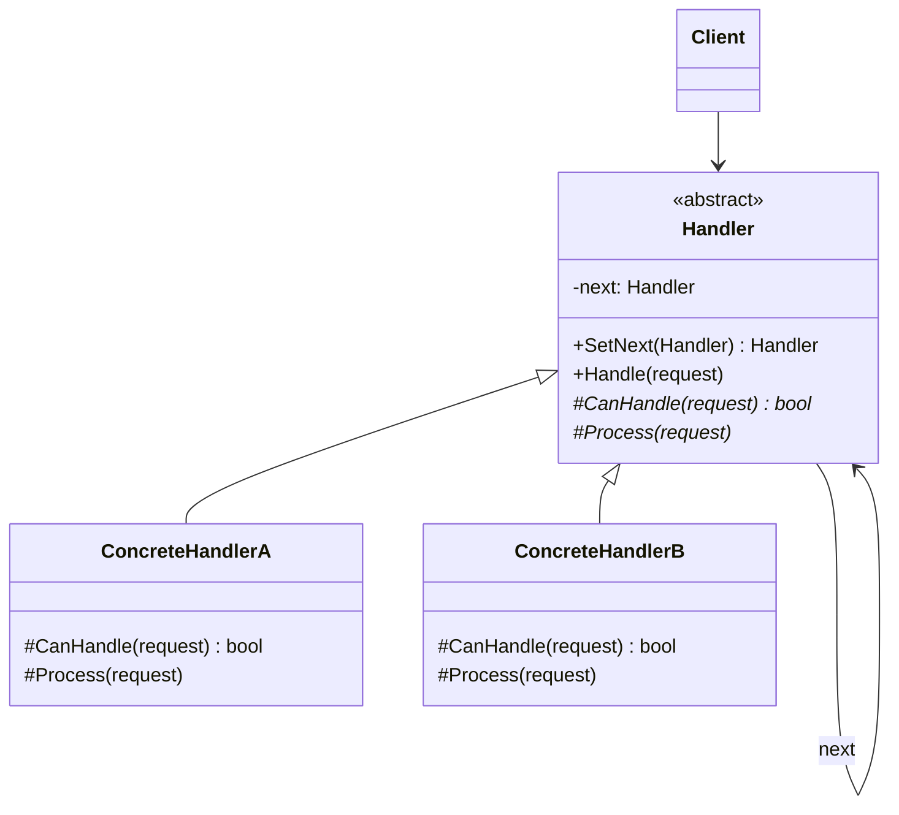
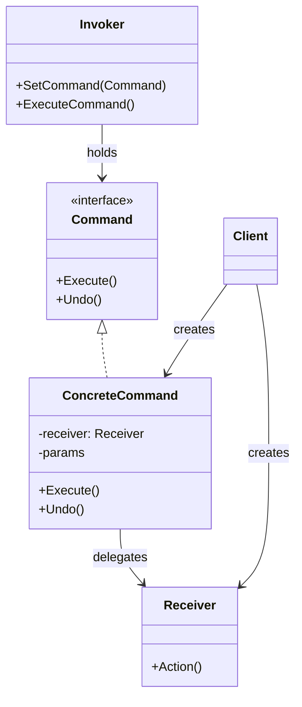
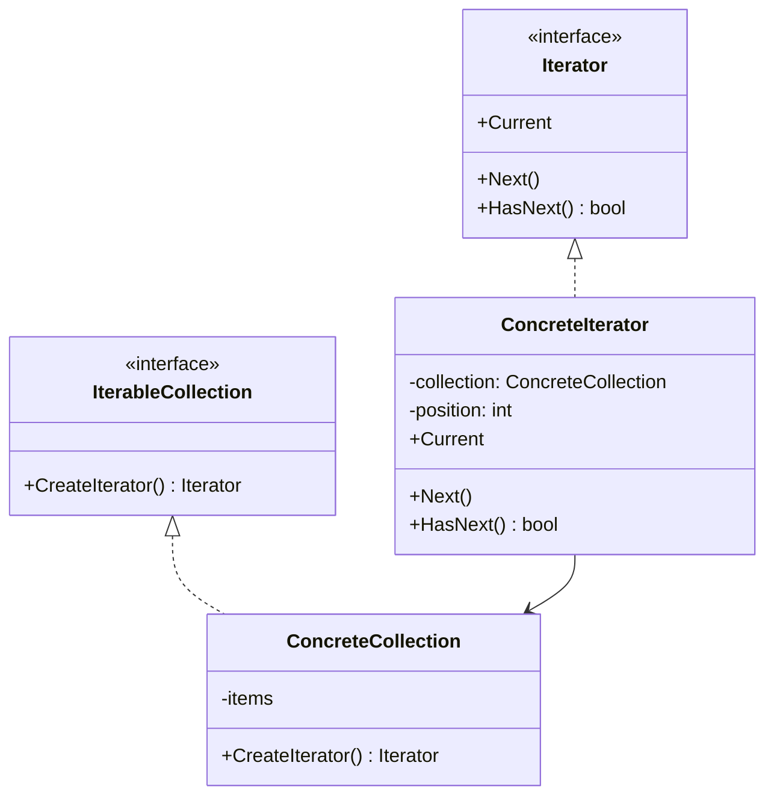
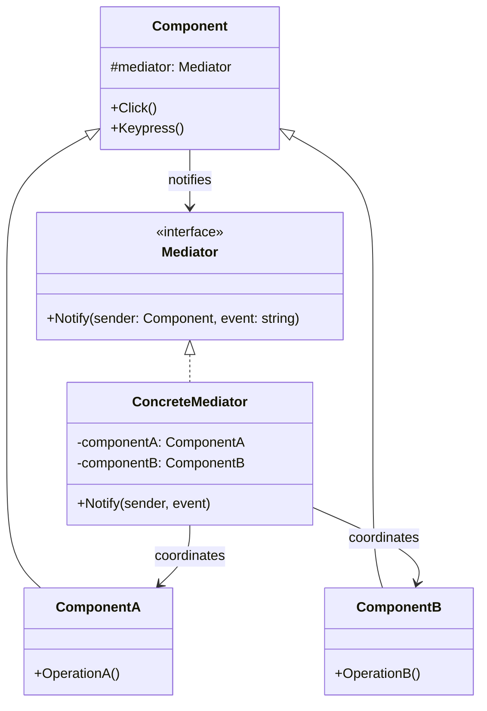
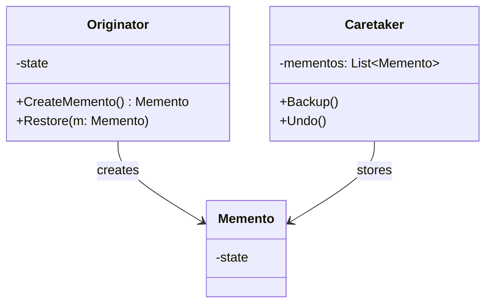
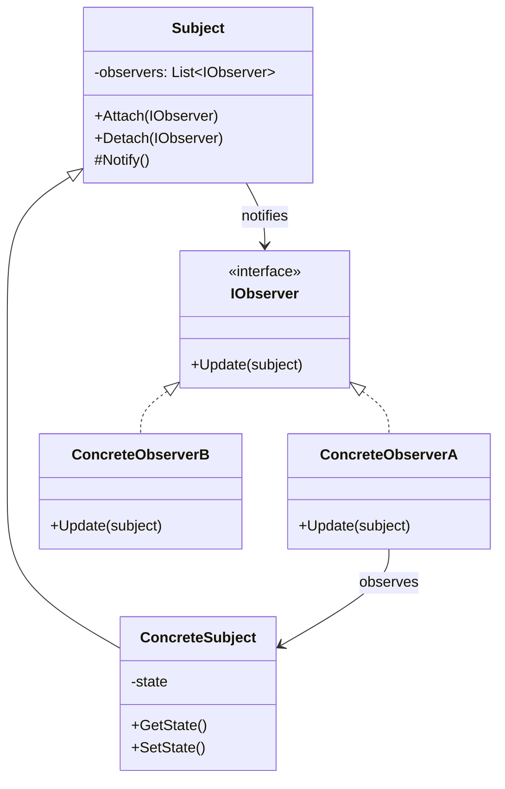
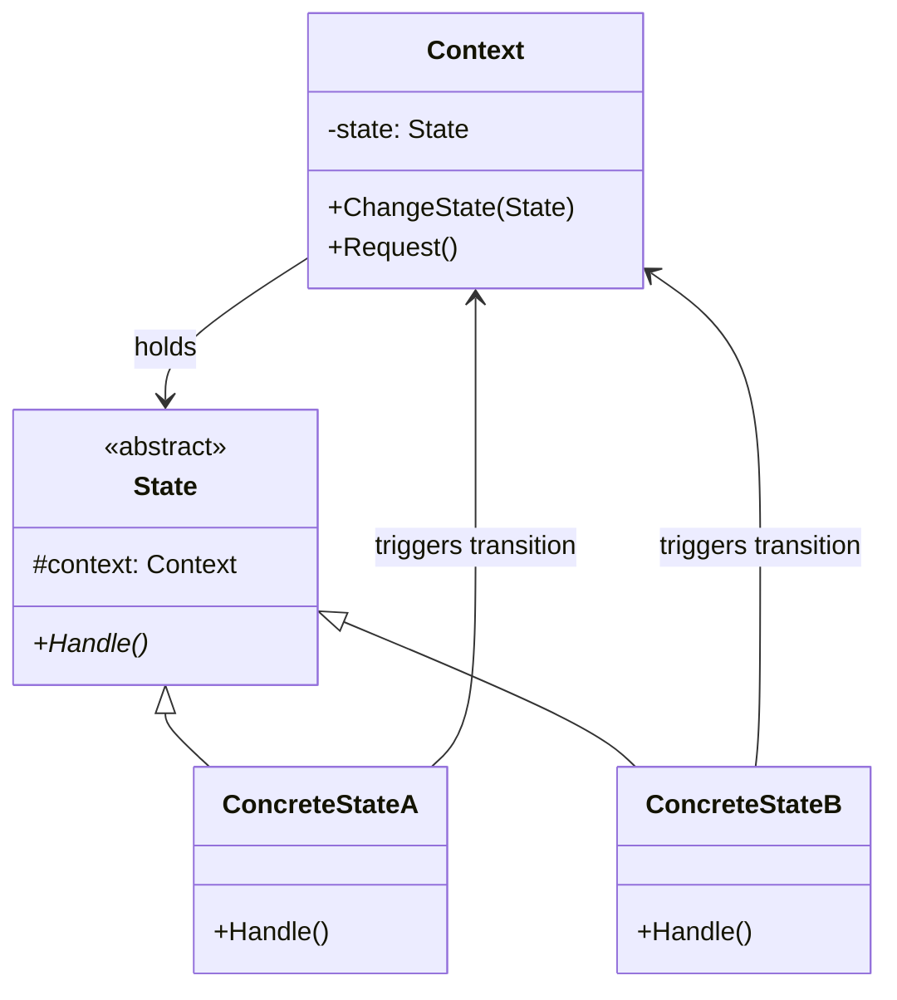
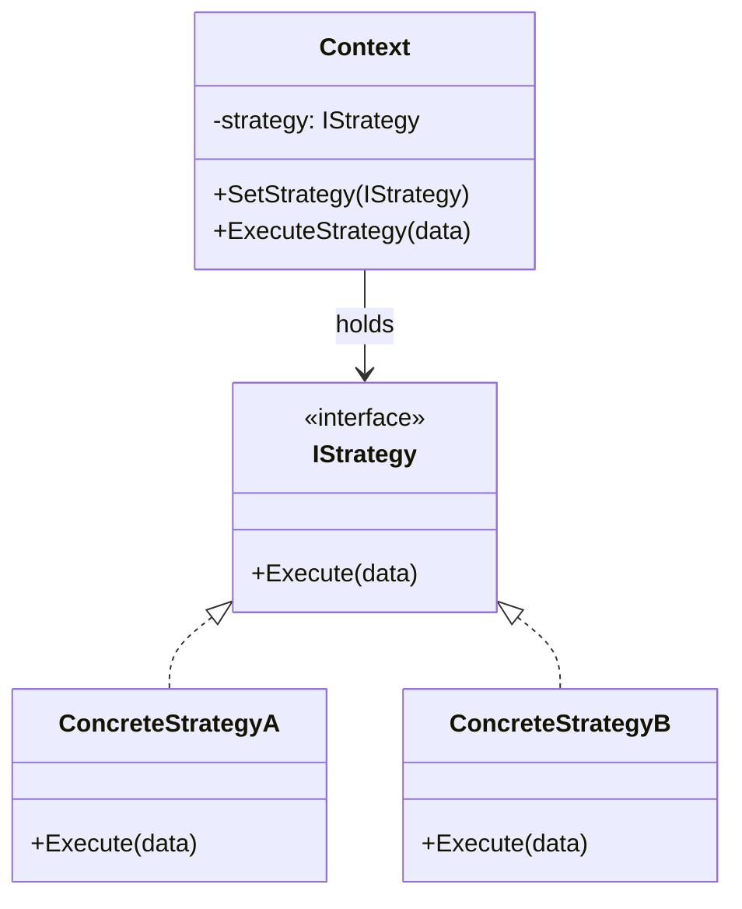
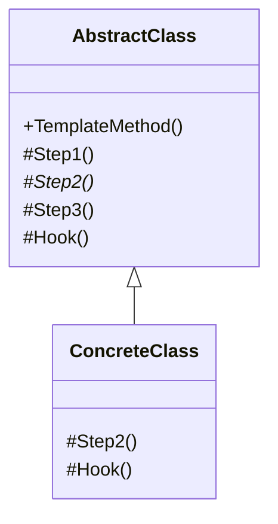
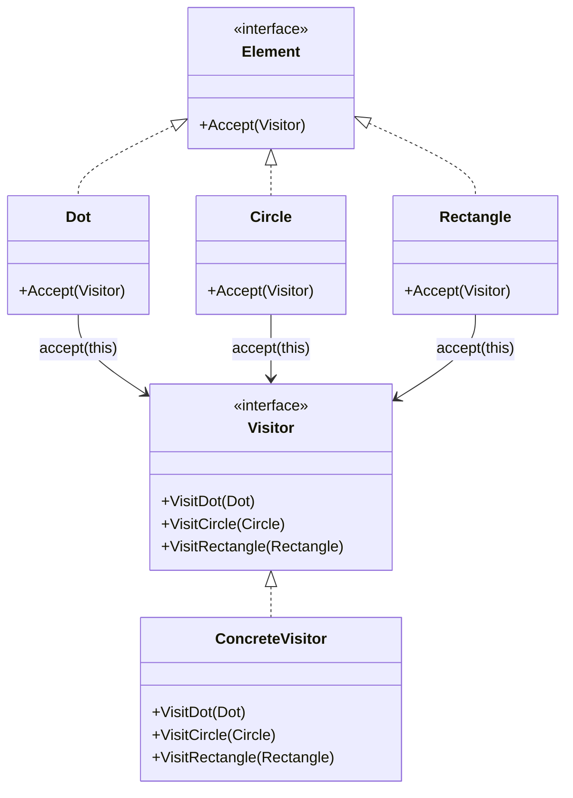

# 行为型设计模式

行为型模式关注**对象之间的通信**和**职责分配**。它们不仅描述对象或类的模式，还描述它们之间的通信模式。

| 模式 | 核心思想 | 一句话 |
|------|----------|--------|
| 责任链 | 将请求沿处理者链传递 | 中间件管道——逐个过滤 |
| 命令 | 将请求封装为对象 | 可撤销的操作 |
| 迭代器 | 不暴露集合内部结构地遍历 | `foreach` 的核心机制 |
| 中介者 | 通过中介对象减少组件间直接耦合 | 空中交通管制塔 |
| 备忘录 | 保存和恢复对象之前的状态 | Ctrl+Z 的实现原理 |
| 观察者 | 定义一对多依赖，状态变化时自动通知 | 发布—订阅 |
| 状态 | 对象内部状态改变时改变其行为 | 有限状态机 |
| 策略 | 定义可互换的算法族 | 运行时切换支付方式 |
| 模板方法 | 在父类中定义算法骨架，子类实现具体步骤 | 好莱坞原则 |
| 访问者 | 将操作与对象结构分离 | AST 遍历、报表导出 |

---

## 1. 责任链模式 (Chain of Responsibility)

### Intent

使多个对象都有机会处理请求，从而避免请求的发送者和接收者之间的耦合。将这些对象连成一条链，并沿着这条链传递请求，直到有一个对象处理它为止。

**核心思想**：责任链将特定行为转换为被称作**处理者**的独立对象。有两种变体：
- **纯责任链**：每个处理者自行决定是否处理，处理后不再传递。GUI 事件冒泡是典型案例
- **不纯责任链**：请求沿链依次处理（每个处理者都执行），如中间件管道

### Structure



### Participants

| 角色 | 职责 |
|------|------|
| **Handler** (抽象类) | 定义处理请求的接口；持有下个处理者的引用；可选实现默认的链传递行为 |
| **ConcreteHandler** | 实现 `CanHandle()` 和 `Process()`——决定是否处理及如何处理；通常是**不可变的**（通过构造函数一次获得所有数据） |
| **Client** | 组装处理链；向链的第一个处理者发起请求 |

> [!note] 关键设计
> 所有处理者类均实现同一接口是关键所在。每个具体处理者仅关心下一个包含处理方法的处理者。这样就可以在运行时动态创建链，而无需将代码与具体类耦合。

### C# Example: HTTP 请求中间件

```csharp
// 请求类型
public record HttpRequest(string Url, string User, string Role);

// 抽象处理者
public abstract class Middleware
{
    private Middleware? _next;

    public Middleware SetNext(Middleware next)
    {
        _next = next;
        return next; // 返回 next 支持链式组装
    }

    public void Handle(HttpRequest request)
    {
        if (CanHandle(request))
        {
            Process(request);
        }
        else
        {
            _next?.Handle(request);
        }
    }

    protected abstract bool CanHandle(HttpRequest request);
    protected abstract void Process(HttpRequest request);
}

// 具体处理者——认证
public class AuthenticationMiddleware : Middleware
{
    protected override bool CanHandle(HttpRequest req) => string.IsNullOrEmpty(req.User);
    protected override void Process(HttpRequest req)
        => Console.WriteLine("[Auth] 用户未认证，返回 401");
}

// 具体处理者——授权
public class AuthorizationMiddleware : Middleware
{
    protected override bool CanHandle(HttpRequest req) => req.Role != "Admin";
    protected override void Process(HttpRequest req)
        => Console.WriteLine("[AuthZ] 权限不足，返回 403");
}

// 具体处理者——最终处理
public class ResourceHandler : Middleware
{
    protected override bool CanHandle(HttpRequest _) => true;
    protected override void Process(HttpRequest req)
        => Console.WriteLine($"[Resource] 返回 {req.Url} 的资源内容");
}

// 客户端组装链
var chain = new AuthenticationMiddleware();
chain.SetNext(new AuthorizationMiddleware())
     .SetNext(new ResourceHandler());

chain.Handle(new HttpRequest("/api/data", "", ""));           // → 401
chain.Handle(new HttpRequest("/api/data", "alice", "User"));  // → 403
chain.Handle(new HttpRequest("/api/data", "admin", "Admin")); // → 资源内容
```

> [!tip] ASP.NET Core 的中间件管道
> ASP.NET Core 的中间件管道正是责任链模式的经典应用——每个中间件可以选择处理请求或调用 `_next(context)` 传递给下一个。

### Applicability

**何时使用：**
- 多个对象可能处理同一个请求，但处理者事先未知——运行时动态确定
- 希望在不指定接收者的情况下向多个对象之一发送请求
- 需要动态指定能处理请求的对象集合——链可在运行时增删处理者

**何时不使用：**
- 处理顺序固定且不会变化——直接在代码中硬编码顺序即可
- 所有请求都必须被所有处理者处理——责任链可能中途停止
- 性能敏感——链过长时遍历开销大

### Relations

- 与 [[concepts/设计模式-结构型|组合]] 结合：处理者可以是组合树的节点——请求沿树向上传递（GUI 事件冒泡）
- 与 [[concepts/设计模式-结构型|装饰]] 对比：责任链可能**提前终止**，装饰栈**每个都执行**
- 与 [[concepts/设计模式-行为型|命令]] 结合：链中的处理者可以封装为命令对象
- 与 [[concepts/设计模式-行为型|观察者]] 对比：观察者是广播（所有观察者都收到），责任链是线性传递（找到处理者即停）

### Variants

- **纯责任链**：一个处理者处理后不继续传递（如审批流）
- **不纯责任链**：每个处理者都执行部分工作并传给下一个（如 ASP.NET 中间件）
- **树状责任链**：处理者可以有多个后继——请求沿多条路径分派

### Anti-patterns / Pitfalls

- **链断裂**：某个处理者忘记调用 `_next`——请求被无声吞没
- **循环链**：A 指向 B，B 指向 A——栈溢出
- **链过长**：数十个处理者串联——性能下降，应考虑分组或树状分派

---

## 2. 命令模式 (Command)

### Intent

将请求封装为一个对象，从而让你可以用不同的请求对客户端进行参数化；对请求排队或记录请求日志，以及支持可撤销的操作。

**核心思想**：将请求转换为一个包含与请求相关的所有信息的独立对象。该转换让你能根据不同的请求将方法参数化、延迟请求执行或将其放入队列中，且能实现可撤销操作。优秀的软件设计通常将关注点分离——GUI 层将工作委派给业务逻辑底层。

### Structure



### Participants

| 角色 | 职责 |
|------|------|
| **Command** (接口) | 声明 `Execute()` 方法（可选 `Undo()`） |
| **ConcreteCommand** | 持有 Receiver 引用和请求参数；实现 `Execute()` 调用 Receiver 的对应方法 |
| **Invoker** (发送者) | 持有命令对象；通过命令接口触发执行——不知道具体命令类 |
| **Receiver** | 实际执行业务逻辑的对象——命令将工作委派给它 |
| **Client** | 创建 Receiver → 创建 Command → 将 Command 传递给 Invoker |

### C# Example: 文本编辑器撤销/重做

```csharp
// 接收者
public class Editor
{
    public string Text { get; set; } = "";
    private string _clipboard = "";

    public void Copy(int start, int length)
        => _clipboard = Text.Substring(start, length);

    public void Cut(int start, int length)
    {
        _clipboard = Text.Substring(start, length);
        Text = Text.Remove(start, length);
    }

    public void Paste(int position)
        => Text = Text.Insert(position, _clipboard);
}

// 命令接口
public interface ICommand
{
    void Execute();
    void Undo();
}

// 具体命令——剪切
public class CutCommand : ICommand
{
    private readonly Editor _editor;
    private readonly int _start, _length;
    private string? _backup;

    public CutCommand(Editor editor, int start, int length)
    {
        _editor = editor;
        _start = start;
        _length = length;
    }

    public void Execute()
    {
        _backup = _editor.Text; // 保存状态用于撤销
        _editor.Cut(_start, _length);
    }

    public void Undo()
    {
        if (_backup is not null)
            _editor.Text = _backup;
    }
}

// 调用者——管理命令历史
public class CommandHistory
{
    private readonly Stack<ICommand> _history = new();

    public void ExecuteCommand(ICommand command)
    {
        command.Execute();
        _history.Push(command);
    }

    public void Undo()
    {
        if (_history.TryPop(out var command))
            command.Undo();
    }
}

// 使用
var editor = new Editor { Text = "Hello, World!" };
var history = new CommandHistory();

history.ExecuteCommand(new CutCommand(editor, 5, 7));
Console.WriteLine(editor.Text); // "Hello!"

history.Undo();
Console.WriteLine(editor.Text); // "Hello, World!"
```

### Applicability

**何时使用：**
- 需要通过操作来参数化对象——如 GUI 按钮对应不同命令
- 需要在不同时间指定、排列和执行请求——延迟执行、任务队列
- 需要支持撤销/重做——命令保存执行前的状态
- 需要支持日志记录和崩溃恢复——将命令序列化为日志

**何时不使用：**
- 操作简单且不需要撤销——直接调用方法更简单
- 命令数量极少——引入命令接口和类的开销不值得
- C# 已有委托/闭包——`Action`/`Func` 可替代简单命令场景

### Relations

- 与 [[concepts/设计模式-行为型|备忘录]] 结合：命令在执行前用备忘录保存状态，撤销时恢复——两者天然组合
- 与 [[concepts/设计模式-行为型|策略]] 对比：两者都能通过行为参数化对象，但意图不同——命令封装**请求及其参数**，策略封装**可互换算法**
- 与 [[concepts/设计模式-行为型|责任链]] 结合：链中的每个步骤可以是命令对象
- 与 [[concepts/设计模式-创建型|原型]] 结合：命令可克隆原型来保存历史状态

### Variants

- **智能命令**：命令自身实现业务逻辑（不委派给 Receiver）——适合简单操作
- **宏命令**：一个命令包含多个子命令——按顺序执行，统一撤销
- **队列命令**：命令放入队列异步执行——生产者-消费者模式
- **日志持久化命令**：命令序列化为日志——系统崩溃后可重放恢复

### Anti-patterns / Pitfalls

- **命令膨胀**：每个微小操作都创建一个命令类——类数量爆炸。考虑用 `Action<ICommand>` 或 lambda
- **命令持有过多状态**：命令保存了大量接收者数据——改用备忘录保存状态
- **撤销逻辑不一致**：`Execute()` 和 `Undo()` 不对称——写完 Execute 忘写 Undo

---

## 3. 迭代器模式 (Iterator)

### Intent

提供一种方法顺序访问一个聚合对象中的各个元素，而又不暴露该对象的内部表示。

**核心思想**：将遍历行为抽取到独立的迭代器对象中。迭代器封装遍历状态（当前位置）并通过统一接口暴露 `Next()` / `HasNext()`。客户端仅通过接口与集合和迭代器交互，不与具体类耦合。

### Structure



### Participants

| 角色 | 职责 |
|------|------|
| **Iterator** (接口) | 声明遍历方法——`Next()`, `HasNext()`, `Current` |
| **ConcreteIterator** | 实现 Iterator；跟踪遍历位置；持有对集合的引用 |
| **IterableCollection** (接口) | 声明创建迭代器的工厂方法 |
| **ConcreteCollection** | 实现 IterableCollection；返回与该集合匹配的具体迭代器 |

### C#：`IEnumerable<T>` + `yield return`

GoF 迭代器模式在 C# 中被语言特性内建支持：

```csharp
// 自定义集合
public class WordsCollection : IEnumerable<string>
{
    private readonly List<string> _words = new();

    public void Add(string word) => _words.Add(word);

    public IEnumerator<string> GetEnumerator() => _words.GetEnumerator();
    System.Collections.IEnumerator System.Collections.IEnumerable.GetEnumerator()
        => GetEnumerator();

    // 反向迭代器
    public IEnumerable<string> Reverse()
    {
        for (int i = _words.Count - 1; i >= 0; i--)
            yield return _words[i];
    }
}

// 使用
var words = new WordsCollection();
words.Add("First");
words.Add("Second");
words.Add("Third");

foreach (var w in words)
    Console.WriteLine(w);  // First, Second, Third

foreach (var w in words.Reverse())
    Console.WriteLine(w);  // Third, Second, First
```

> [!note] C# 中的迭代器
> `IEnumerable<T>` / `IEnumerator<T>` 就是迭代器模式的标准化实现。`yield return` 语句使得编写自定义迭代器极为简洁，编译器自动生成状态机。

### Applicability

**何时使用：**
- 集合的内部结构复杂（树、图、哈希表），但希望对外隐藏
- 需要多种遍历方式（正序、倒序、层序）
- 希望遍历逻辑与集合类分离——更换/新增遍历方式无需修改集合类

**何时不使用：**
- C# 中——`IEnumerable<T>` + `yield return` 已内置，无需手写迭代器模式
- 集合结构简单且只需一种遍历方式——直接 `foreach` 或 `for` 循环
- .NET 的 LINQ 已经提供了丰富的遍历和查询能力——直接使用

### Relations

- 与 [[concepts/设计模式-结构型|组合]] 结合：迭代器遍历组合树——深度优先或广度优先
- 与 [[concepts/设计模式-行为型|访问者]] 结合：迭代器遍历元素，访问者对每个元素执行操作
- 与 [[concepts/设计模式-创建型|工厂方法]] 关系：集合的 `CreateIterator()` 是工厂方法——子类可返回不同类型迭代器

### Variants

- **外部迭代器**：客户端控制迭代过程——`foreach`, `while (iter.HasNext())`
- **内部迭代器**：集合自身控制迭代，通过回调通知客户端——`list.ForEach(item => ...)`
- **双向迭代器**：支持向前和向后遍历——`IEnumerator` + `Reset()`
- **随机访问迭代器**：支持按索引直接跳转——C# 的 `IList<T>` 是随机访问

### Anti-patterns / Pitfalls

- **并发修改**：迭代期间集合被修改——抛出 `InvalidOperationException`。使用不可变集合或快照
- **迭代器比集合活得长**：迭代器持有集合引用，阻止 GC
- **滥用 yield return 的延迟查询**：每次迭代重新查询数据库——提前 `.ToList()` 物化

---

## 4. 中介者模式 (Mediator)

### Intent

用一个中介对象来封装一系列对象之间的交互。中介者使各对象不需要显式地相互引用，从而使其耦合松散。

**核心思想**：减少对象之间混乱无序的依赖关系——限制对象之间的直接交互，迫使它们通过一个中介者对象进行合作。组件会使用中介者接口与中介者交互，只需将它们与不同中介者连接，即可在不同情境中复用组件。

### Structure



### Participants

| 角色 | 职责 |
|------|------|
| **Mediator** (接口) | 声明组件通知中介者的方法 |
| **ConcreteMediator** | 持有所有组件的引用；实现协调逻辑——根据事件决定调用哪些组件的方法 |
| **Component** (基类) | 持有 Mediator 引用；当事件发生时通知中介者，而不是直接与其他组件通信 |
| **ConcreteComponent** | 具体组件——只知中介者，不知其他组件的存在 |

### C# Example: 登录对话框

```csharp
// 中介者接口
public interface IDialogMediator
{
    void Notify(Component sender, string eventName);
}

// 组件基类
public abstract class Component
{
    protected readonly IDialogMediator Dialog;
    protected Component(IDialogMediator dialog) => Dialog = dialog;
}

public class Button : Component
{
    public Button(IDialogMediator dialog) : base(dialog) { }
    public void Click() => Dialog.Notify(this, "click");
}

public class TextBox : Component
{
    public string Text { get; set; } = "";
    public TextBox(IDialogMediator dialog) : base(dialog) { }
}

public class CheckBox : Component
{
    public bool Checked { get; set; }
    public CheckBox(IDialogMediator dialog) : base(dialog) { }
    public void Toggle()
    {
        Checked = !Checked;
        Dialog.Notify(this, "check");
    }
}

// 具体中介者——协调登录与注册表单
public class LoginDialog : IDialogMediator
{
    private readonly CheckBox _modeSwitch;
    private readonly Button _okBtn;

    public LoginDialog()
    {
        _modeSwitch = new CheckBox(this);
        _okBtn = new Button(this);
    }

    public void Notify(Component sender, string eventName)
    {
        if (sender == _modeSwitch && eventName == "check")
        {
            if (_modeSwitch.Checked)
                Console.WriteLine("[Dialog] 切换到注册模式");
            else
                Console.WriteLine("[Dialog] 切换到登录模式");
        }

        if (sender == _okBtn && eventName == "click")
        {
            if (_modeSwitch.Checked)
                Console.WriteLine("[Dialog] 提交注册...");
            else
                Console.WriteLine("[Dialog] 提交登录...");
        }
    }

    public void Simulate()
    {
        _modeSwitch.Toggle(); // 切到注册
        _okBtn.Click();       // 提交注册
        _modeSwitch.Toggle(); // 切回登录
        _okBtn.Click();       // 提交登录
    }
}
```

### Applicability

**何时使用：**
- 一组对象以定义良好的方式通信，但通信模式复杂——"意大利面条"式依赖
- 难以复用组件——组件与太多其他组件耦合
- 想在多个对象之间分布的行为应该集中——避免为定制行为而创建大量子类

**何时不使用：**
- 组件间通信简单（如只有 2-3 个组件）——直接耦合更清晰
- 中介者变为上帝对象——过于复杂以至于难以维护——考虑拆分为多个中介者
- C# 社区已有 MediatR 库——优先使用成熟方案而非手写

### Relations

- 与 [[concepts/设计模式-结构型|外观]] 对比：外观是**单向**简化（客户端→子系统），中介者是**多对多双向**协调
- 与 [[concepts/设计模式-行为型|观察者]] 对比：观察者是一对多通知（Subject 不知道 Observer），中介者是集中式协调（所有组件都知道中介者）。两者可组合——中介者作为观察者处理事件后协调其他组件
- 与 [[concepts/设计模式-行为型|命令]] 结合：组件将命令对象发送给中介者，中介者调度执行

### Variants

- **集中式中介者**：所有逻辑在中介者中——组件完全"傻"
- **协作式中介者**：组件有部分自治逻辑，仅在需要协调时通知中介者
- **基于事件的中介者**：中介者使用事件总线——组件发布事件，中介者订阅并协调

### Anti-patterns / Pitfalls

- **上帝中介者**：所有业务逻辑集中在中介者——类膨胀、难以测试
- **中介者循环依赖**：组件 A 通知中介者→中介者调用 B→B 通知中介者→无限循环
- **过度中介**：两个组件之间的简单交互也经过中介者——引入不必要的间接层

---

## 5. 备忘录模式 (Memento)

### Intent

在不破坏封装的前提下，捕获一个对象的内部状态，并在该对象之外保存这个状态，以便以后恢复。

**核心思想**：备忘录模式将创建状态快照的工作委派给实际状态的拥有者**原发器**（Originator）对象。这样其他对象就不再需要从"外部"复制状态——原发器拥有其状态的完全访问权，可以自行生成快照。备忘录内容对其他对象不可见。

### Structure



### Participants

| 角色 | 职责 |
|------|------|
| **Originator** (原发器) | 持有当前状态；创建包含状态快照的 Memento；从 Memento 恢复状态 |
| **Memento** (备忘录) | 不可变对象；存储 Originator 的状态快照；仅 Originator 可读取其内部数据 |
| **Caretaker** (负责人) | 持有 Memento 列表；不修改或读取 Memento 内容——仅存储和按序返回 |

### C# Example: 编辑器撤销

```csharp
// 备忘录——不可变，仅对 Originator 可见内部
public class EditorMemento
{
    internal string Text { get; }
    internal int CursorX { get; }
    internal int CursorY { get; }

    internal EditorMemento(string text, int cursorX, int cursorY)
    {
        Text = text;
        CursorX = cursorX;
        CursorY = cursorY;
    }
}

// 原发器
public class TextEditor
{
    public string Text { get; private set; } = "";
    public int CursorX { get; private set; }
    public int CursorY { get; private set; }

    public void Type(string text)
    {
        Text += text;
        CursorX += text.Length;
    }

    public EditorMemento CreateSnapshot()
        => new(Text, CursorX, CursorY);

    public void Restore(EditorMemento memento)
    {
        Text = memento.Text;
        CursorX = memento.CursorX;
        CursorY = memento.CursorY;
    }

    public override string ToString()
        => $"'{Text}' cursor=({CursorX},{CursorY})";
}

// 负责人（Caretaker）——管理快照历史
public class EditorHistory
{
    private readonly Stack<EditorMemento> _history = new();

    public void Save(TextEditor editor)
        => _history.Push(editor.CreateSnapshot());

    public void Undo(TextEditor editor)
    {
        if (_history.TryPop(out var memento))
            editor.Restore(memento);
    }
}

// 使用
var editor = new TextEditor();
var history = new EditorHistory();

editor.Type("Hello");
history.Save(editor);

editor.Type(", World!");
history.Save(editor);

Console.WriteLine(editor); // 'Hello, World!' cursor=(13,0)

history.Undo(editor);
Console.WriteLine(editor); // 'Hello' cursor=(5,0)

history.Undo(editor);
Console.WriteLine(editor); // '' cursor=(0,0)
```

### 与命令模式的结合

备忘录常与命令模式组合使用——命令在执行前保存备忘录，撤销时恢复：

```csharp
public class TypingCommand : ICommand
{
    private readonly TextEditor _editor;
    private readonly string _text;
    private EditorMemento? _backup;

    public TypingCommand(TextEditor editor, string text)
    {
        _editor = editor;
        _text = text;
    }

    public void Execute()
    {
        _backup = _editor.CreateSnapshot();
        _editor.Type(_text);
    }

    public void Undo()
    {
        if (_backup is not null)
            _editor.Restore(_backup);
    }
}
```

### Applicability

**何时使用：**
- 需要保存对象状态的快照以便以后恢复——撤销/重做、游戏存档
- 直接获取状态接口会破坏封装——备忘录确保只有原发器能访问内部状态
- 状态历史需要管理（时间线、多级撤销）

**何时不使用：**
- 对象状态简单（几个基本类型字段）——直接复制更简单
- 对象状态包含大量数据——每个备忘录都是完整副本，内存消耗大。考虑增量快照
- C# 中不可变 `record` 类型——`record` 天然适合作为快照，减少样板代码

### Relations

- 与 [[concepts/设计模式-行为型|命令]] 结合：命令在 Execute 前用备忘录保存状态，撤销时恢复——**标准组合**
- 与 [[concepts/设计模式-创建型|原型]] 对比：备忘录保存**状态**用于恢复，原型**克隆对象**创建独立副本
- 与 [[concepts/设计模式-行为型|迭代器]] 结合：迭代器用备忘录保存迭代位置

### Variants

- **嵌套类实现**：Memento 作为 Originator 的私有嵌套类——最强的封装保证（Java 中常见，C# 中可用 `internal` 近似）
- **接口基实现**：Memento 暴露受限接口——Caretaker 只能看到元数据（时间戳、描述）
- **增量备忘录**：仅保存变化的部分而非完整状态——适用于大对象或频繁保存的场景

### Anti-patterns / Pitfalls

- **备忘录泄露**：Caretaker 或外部代码修改了备忘录内容——破坏封装。备忘录必须是不可变的
- **内存膨胀**：保存大量完整快照——使用增量快照或限制历史深度
- **忘记保存**：命令忘记在 Execute 前保存备忘录——撤销行为不正确

---

## 6. 观察者模式 (Observer)

### Intent

定义对象间的一种一对多的依赖关系，使得每当一个对象改变状态，其所有依赖者都会得到通知并自动更新。

**核心思想**：Subject 维护一个观察者列表，状态变化时遍历通知。观察者实现统一接口以接收更新。Subject 不知道具体的观察者类型——只依赖 Observer 接口。

### Structure



### Participants

| 角色 | 职责 |
|------|------|
| **Subject** | 知道它的所有观察者；提供注册/注销观察者的方法 |
| **ConcreteSubject** | 持有具体状态；状态变化时调用 `Notify()` 通知所有观察者 |
| **Observer** (接口) | 定义观察者的更新接口 |
| **ConcreteObserver** | 维护指向 ConcreteSubject 的引用；实现 `Update()`——使自身状态与 Subject 保持一致 |

### C#：使用 `event` 和 `IObservable<T>`

C# 原生支持观察者模式——事件（`event`）是其最直接的实现：

```csharp
// 方式一：使用 event（推荐用于简单场景）
public class Stock
{
    private decimal _price;
    public string Symbol { get; }

    public event EventHandler<decimal>? PriceChanged;

    public Stock(string symbol, decimal price)
    {
        Symbol = symbol;
        _price = price;
    }

    public decimal Price
    {
        get => _price;
        set
        {
            if (_price != value)
            {
                _price = value;
                PriceChanged?.Invoke(this, _price);
            }
        }
    }
}

// 观察者
public class StockDisplay
{
    public void OnPriceChanged(object? sender, decimal newPrice)
        => Console.WriteLine($"[Display] {((Stock)sender!).Symbol}: ${newPrice}");

    public void Subscribe(Stock stock)
        => stock.PriceChanged += OnPriceChanged;

    public void Unsubscribe(Stock stock)
        => stock.PriceChanged -= OnPriceChanged;
}

// 使用
var apple = new Stock("AAPL", 150m);
var display = new StockDisplay();
display.Subscribe(apple);

apple.Price = 155m; // [Display] AAPL: $155
apple.Price = 160m; // [Display] AAPL: $160

// 方式二：使用 IObservable<T>（适合复杂数据流/Rx 场景）
public class PriceObservable : IObservable<decimal>
{
    private readonly List<IObserver<decimal>> _observers = new();

    public IDisposable Subscribe(IObserver<decimal> observer)
    {
        _observers.Add(observer);
        return new Unsubscriber(_observers, observer);
    }

    public void UpdatePrice(decimal price)
    {
        foreach (var obs in _observers)
            obs.OnNext(price);
    }

    private class Unsubscriber : IDisposable
    {
        private readonly List<IObserver<decimal>> _observers;
        private readonly IObserver<decimal> _observer;
        public Unsubscriber(List<IObserver<decimal>> observers, IObserver<decimal> observer)
        { _observers = observers; _observer = observer; }
        public void Dispose() => _observers.Remove(_observer);
    }
}

// 观察者实现 IObserver<T>
public class PriceLogger : IObserver<decimal>
{
    public void OnNext(decimal price) => Console.WriteLine($"[Logger] Price: ${price}");
    public void OnError(Exception error) => Console.WriteLine($"Error: {error.Message}");
    public void OnCompleted() => Console.WriteLine("Stream completed");
}
```

> [!tip] C# 最佳实践
> 优先使用 `event` 关键字实现观察者模式。对于复杂数据流/可组合通知场景，考虑使用 Reactive Extensions (Rx.NET) 的 `IObservable<T>`。

### Applicability

**何时使用：**
- 一个对象的状态变化需要通知多个其他对象——且这些对象的数量和类型在运行时可能变化
- 需要在对象间建立一对多的依赖，且不希望这些对象紧密耦合
- 跨层通信——如 Model 层通知 View 层

**何时不使用：**
- 只有一个观察者——直接调用即可
- 通知顺序重要——观察者模式不保证通知顺序
- C# 中——优先使用 `event`，比手动维护观察者列表更简洁、更安全

### Relations

- 与 [[concepts/设计模式-行为型|中介者]] 对比：观察者是一对多广播，中介者是集中式协调。两者可组合——中介者作为观察者处理通知后协调其他组件
- 与 [[concepts/设计模式-行为型|状态]] 结合：状态变化时用观察者通知外部——状态机输出事件的实现方式
- 与 [[concepts/设计模式-行为型|策略]] 关系：观察者模式可作为策略的通信基础——Subject 状态变化通知所有策略重新评估
- C# `event` 是观察者模式的语言级实现：`event` 本质上是观察者模式的语法糖

### Variants

- **推送模式**：Subject 将状态数据作为参数推送——`Update(newState)`——观察者获取全部数据
- **拉取模式**：Subject 仅通知"有变化"——观察者自行调用 Subject 的 getter 获取所需数据——更灵活
- **事件聚合器**：所有事件通过中心事件总线发布/订阅——解耦发布者和订阅者
- **弱引用观察者**：使用 `WeakReference` 持有观察者——防止内存泄露

### Anti-patterns / Pitfalls

- **内存泄露**：观察者注册后忘记注销——Subject 持有观察者引用导致 GC 无法回收。使用 `WeakReference` 或 `IDisposable` 订阅
- **通知风暴**：一次状态变化触发级联通知→其他状态变化→更多通知——使用批量更新或防抖
- **循环通知**：A 通知 B→B 修改 A→A 再次通知 B——设置标志位避免循环
- **`event` 的 null 检查**：`PriceChanged?.Invoke()`（C# 6+) 比手动 null 检查更安全

---

## 7. 状态模式 (State)

### Intent

允许一个对象在其内部状态改变时改变它的行为。对象看起来似乎修改了它的类。

**核心思想**：原始对象被称为**上下文**（Context），它并不会自行实现所有行为，而是保存一个指向表示当前状态的状态对象的引用，并将所有与状态相关的工作委派给该对象。状态模式基于**有限状态机**——程序在任意时刻仅可处于几种有限的状态中，状态切换规则称为**转移**。

### Structure



### Participants

| 角色 | 职责 |
|------|------|
| **Context** | 持有当前 State 对象；将状态相关的请求委派给当前 State；提供 `ChangeState()` 供 State 触发转换 |
| **State** (抽象类) | 定义状态接口——声明状态相关的行为方法 |
| **ConcreteState** | 实现特定状态的行为；可以触发 Context 的状态转换（创建新 State 并调用 `ChangeState()`） |

### C# Example: 文档审批流程

```csharp
// 状态基类
public abstract class DocumentState
{
    protected Document Doc;

    protected DocumentState(Document doc) => Doc = doc;

    public abstract void Publish();
    public abstract void Reject();
    public abstract string StatusName { get; }
}

// 草稿状态
public class DraftState : DocumentState
{
    public DraftState(Document doc) : base(doc) { }

    public override string StatusName => "草稿";

    public override void Publish()
    {
        Console.WriteLine("  提交审核...");
        Doc.ChangeState(new ReviewState(Doc));
    }

    public override void Reject()
        => Console.WriteLine("  草稿无需拒绝");
}

// 审核中状态
public class ReviewState : DocumentState
{
    public ReviewState(Document doc) : base(doc) { }

    public override string StatusName => "审核中";

    public override void Publish()
    {
        Console.WriteLine("  审核通过，发布!");
        Doc.ChangeState(new PublishedState(Doc));
    }

    public override void Reject()
    {
        Console.WriteLine("  审核驳回，退回草稿");
        Doc.ChangeState(new DraftState(Doc));
    }
}

// 已发布状态
public class PublishedState : DocumentState
{
    public PublishedState(Document doc) : base(doc) { }

    public override string StatusName => "已发布";

    public override void Publish()
        => Console.WriteLine("  已发布，无需重复发布");

    public override void Reject()
        => Console.WriteLine("  已发布，无法拒绝");
}

// 上下文——文档
public class Document
{
    private DocumentState _state;

    public string Name { get; }

    public Document(string name)
    {
        Name = name;
        _state = new DraftState(this);
    }

    public void ChangeState(DocumentState state) => _state = state;

    public void Publish() => _state.Publish();
    public void Reject() => _state.Reject();

    public void DisplayStatus()
        => Console.WriteLine($"[{Name}] 状态: {_state.StatusName}");
}

// 使用——状态转换：草稿 → 审核 → 发布
var doc = new Document("需求文档 v2.0");
doc.DisplayStatus(); // 草稿
doc.Publish();       // 提交审核
doc.DisplayStatus(); // 审核中
doc.Reject();        // 审核驳回→退回草稿
doc.DisplayStatus(); // 草稿
doc.Publish();       // 提交审核
doc.Publish();       // 审核通过
doc.DisplayStatus(); // 已发布
```

### Audio Player Example (from draft)

```csharp
// 音频播放器的状态模式实现
public class AudioPlayer
{
    private State _state;
    public bool IsPlaying { get; set; }

    public AudioPlayer() => _state = new ReadyState(this);

    public void ChangeState(State state) => _state = state;

    public void ClickLock() => _state.ClickLock();
    public void ClickPlay() => _state.ClickPlay();
    public void ClickNext() => _state.ClickNext();
    public void StartPlayback() => IsPlaying = true;
    public void StopPlayback() => IsPlaying = false;
}

public abstract class State
{
    protected AudioPlayer Player;
    protected State(AudioPlayer player) => Player = player;

    public abstract void ClickLock();
    public abstract void ClickPlay();
    public abstract void ClickNext();
}

public class LockedState : State
{
    public LockedState(AudioPlayer player) : base(player) { }

    public override void ClickLock()
        => Player.ChangeState(Player.IsPlaying
            ? new PlayingState(Player)
            : new ReadyState(Player));

    public override void ClickPlay() { /* 已锁定，无操作 */ }
    public override void ClickNext() { /* 已锁定，无操作 */ }
}

public class ReadyState : State
{
    public ReadyState(AudioPlayer player) : base(player) { }

    public override void ClickLock() => Player.ChangeState(new LockedState(Player));
    public override void ClickPlay()
    {
        Player.StartPlayback();
        Player.ChangeState(new PlayingState(Player));
    }
    public override void ClickNext() => Console.WriteLine("下一首");
}

public class PlayingState : State
{
    public PlayingState(AudioPlayer player) : base(player) { }

    public override void ClickLock() => Player.ChangeState(new LockedState(Player));
    public override void ClickPlay()
    {
        Player.StopPlayback();
        Player.ChangeState(new ReadyState(Player));
    }
    public override void ClickNext() => Console.WriteLine("快进 5s");
}
```

### Applicability

**何时使用：**
- 对象的行为依赖于它的状态，并且必须在运行时根据状态改变行为——用 `if`/`switch` 会导致庞大的条件分支
- 操作有大量的、与状态相关的多分支条件——状态模式将每个分支移到独立的类中
- 状态转换规则复杂——状态模式明确声明状态转移

**何时不使用：**
- 状态数量少（2-3 个）且转换简单——`if`/`switch` 更直接
- 状态行为几乎相同——状态模式过度设计
- 状态对象无状态（只是行为不同）——考虑用 [[concepts/设计模式-行为型|策略]] 代替

### Relations

- 与 [[concepts/设计模式-行为型|策略]] 对比：类图几乎相同，但意图不同
  - **状态**：内部驱动转换——状态对象**知道彼此**并能触发状态转换
  - **策略**：外部切换算法——策略对象**彼此独立**，由客户端或上下文在外部切换
- 与 [[concepts/设计模式-结构型|享元]] 结合：如果状态对象无实例变量，可作为享元共享（多个上下文共用同一状态实例）
- 与 [[concepts/设计模式-行为型|观察者]] 结合：状态变化时用观察者通知外部

### Variants

- **状态驱动的状态机**：状态对象负责触发转换——如上面的例子
- **表驱动状态机**：用字典 `(state, event) -> nextState` 管理转换规则——集中管理，更易修改
- **分层状态机**：状态可以嵌套子状态——如"播放中"状态包含"正常播放"/"快进"/"快退"子状态

### Anti-patterns / Pitfalls

- **状态对象持有过多上下文状态**：状态对象应轻量——上下文的引用就够了
- **状态转换散落各处**：转换逻辑分散在多个状态类中——难以理解全局状态图
- **状态爆炸**：每个微小的行为差异都创建新状态类——合并相似状态

---

## 8. 策略模式 (Strategy)

### Intent

定义一系列算法，把它们一个个封装起来，并且使它们可以相互替换。策略模式让算法的变化独立于使用它的客户端。

**核心思想**：定义一系列算法，将每种算法分别放入独立的类中，以使算法的对象能够相互替换。上下文持有策略接口引用，在运行时切换策略。

### Structure



### Participants

| 角色 | 职责 |
|------|------|
| **Strategy** (接口) | 声明算法接口——所有具体策略的公共契约 |
| **ConcreteStrategy** | 实现具体算法——策略接口使它们在上下文中可互换 |
| **Context** | 持有 Strategy 引用；将工作委派给策略对象；可通过构造函数或 setter 接收策略 |

### C# Example: 支付策略

```csharp
// 策略接口
public interface IPaymentStrategy
{
    void Pay(decimal amount);
}

// 具体策略
public class CreditCardPayment : IPaymentStrategy
{
    private readonly string _cardNumber;
    public CreditCardPayment(string cardNumber) => _cardNumber = cardNumber;

    public void Pay(decimal amount)
        => Console.WriteLine($"信用卡 {_cardNumber} 支付 ${amount:F2}");
}

public class WeChatPayment : IPaymentStrategy
{
    private readonly string _account;
    public WeChatPayment(string account) => _account = account;

    public void Pay(decimal amount)
        => Console.WriteLine($"微信 {_account} 支付 ${amount:F2}");
}

public class CashPayment : IPaymentStrategy
{
    public void Pay(decimal amount)
        => Console.WriteLine($"现金支付 ${amount:F2}");
}

// 上下文
public class ShoppingCart
{
    private readonly List<(string item, decimal price)> _items = new();
    private IPaymentStrategy? _paymentStrategy;

    public void AddItem(string item, decimal price) => _items.Add((item, price));

    public void SetPaymentStrategy(IPaymentStrategy strategy) => _paymentStrategy = strategy;

    public decimal GetTotal() => _items.Sum(i => i.price);

    public void Checkout()
    {
        var total = GetTotal();
        _paymentStrategy?.Pay(total);
    }
}

// 使用——运行时切换支付方式
var cart = new ShoppingCart();
cart.AddItem("键盘", 299m);
cart.AddItem("鼠标", 149m);

cart.SetPaymentStrategy(new WeChatPayment("user123"));
cart.Checkout(); // 微信 user123 支付 $448.00

cart.SetPaymentStrategy(new CashPayment());
cart.Checkout(); // 现金支付 $448.00
```

### Applicability

**何时使用：**
- 需要在运行时选择算法——不同支付方式、不同压缩算法、不同排序策略
- 同一算法的多个变体——且这些变体需要可互换
- 需要隐藏算法的实现细节——客户端只知道策略接口
- 避免大量条件分支选择算法——每种算法移到自己的策略类中

**何时不使用：**
- 算法固定不变——直接用方法实现
- 只有 2-3 个简单变体——`if`/`switch` 更直接
- C# 中有更轻量的替代——`Func<>`/`Action<>` 委托或 lambda 可以替代简单策略

### Relations

- 与 [[concepts/设计模式-行为型|命令]] 对比：两者都能通过行为参数化对象，但意图不同：
  - **命令**：封装请求——延迟执行、队列、撤销/重做
  - **策略**：封装算法——运行时切换，策略通常无状态
- 与 [[concepts/设计模式-行为型|状态]] 对比：类图相同但意图不同——策略由**外部**切换，状态**内部**驱动转换
- 与 [[concepts/设计模式-行为型|模板方法]] 对比：
  - **策略**：组合——Context 持有策略接口（**运行时切换**）
  - **模板方法**：继承——父类控制骨架，子类填充细节（**编译时确定**）
- 与 [[concepts/设计模式-结构型|装饰]] 关系：策略改变对象的"内核"，装饰改变对象的"外壳"
- 与 [[concepts/依赖注入|依赖注入]] 结合：DI 容器注入策略实现——通过注册不同策略切换行为

### Variants

- **函数式策略**：用 `Func<T, TResult>` 或 lambda 代替策略类——适合单一方法接口的策略
- **上下文感知策略**：策略接受 Context 参数——策略可以访问上下文的公共状态
- **策略工厂**：根据条件创建策略——客户端的 `if`/`switch` 移入工厂

### Anti-patterns / Pitfalls

- **策略过多**：每个微小差异都创建一个策略类——类爆炸。用参数化策略或 lambda
- **策略泄露**：客户端知道具体策略类——通过 `is ConcreteStrategy` 判断——破坏了可互换性
- **策略膨胀**：Strategy 接口方法太多——具体策略被迫实现不相关的方法

---

## 9. 模板方法模式 (Template Method)

### Intent

在一个方法中定义算法的骨架，将一些步骤延迟到子类中。模板方法使得子类可以在不改变算法结构的情况下，重新定义算法的某些步骤。

**核心思想**：在超类中定义算法框架，允许子类在不修改结构的情况下重写算法的特定步骤。有**三种步骤类型**：
- **抽象步骤**：必须由子类实现
- **默认步骤**：有默认实现，可选择性重写
- **钩子方法**：内容为空的可选步骤——为子类提供额外扩展点

### Structure



### Participants

| 角色 | 职责 |
|------|------|
| **AbstractClass** | 定义模板方法（算法的骨架）；声明抽象步骤方法；提供默认步骤和钩子方法 |
| **ConcreteClass** | 实现抽象步骤；可选重写默认步骤和钩子 |

> [!note] 好莱坞原则
> "Don't call us, we'll call you." ——父类控制调用流程，子类只提供具体实现。这是框架设计的核心原则。

### C# Example: 数据挖掘流程

```csharp
// 抽象类——定义模板方法
public abstract class DataMiner
{
    // 模板方法——定义算法骨架（不可重写）
    public void Mine(string path)
    {
        var data = OpenFile(path);
        var extracted = ExtractData(data);
        var analyzed = AnalyzeData(extracted);
        SendReport(analyzed);
        CloseFile();
    }

    // 抽象步骤——子类必须实现
    protected abstract string ExtractData(string rawData);
    protected abstract string AnalyzeData(string extractedData);

    // 默认实现——子类可选重写
    protected virtual string OpenFile(string path)
    {
        Console.WriteLine($"[{GetType().Name}] 打开文件: {path}");
        return $"RAW({path})";
    }

    protected virtual void CloseFile()
        => Console.WriteLine($"[{GetType().Name}] 关闭文件");

    // 钩子方法——子类可选的扩展点（空实现）
    protected virtual void SendReport(string analysis)
    {
        var filename = $"report_{DateTime.Now:yyyyMMdd}.txt";
        File.WriteAllText(filename, analysis);
        Console.WriteLine($"[{GetType().Name}] 报告已保存到 {filename}");
    }
}

// 具体实现——PDF 数据挖掘
public class PDFDataMiner : DataMiner
{
    protected override string ExtractData(string raw)
    {
        Console.WriteLine("  [PDF] 抽取文本...");
        return raw.Replace("RAW", "EXTRACTED_PDF");
    }

    protected override string AnalyzeData(string extracted)
    {
        Console.WriteLine("  [PDF] 分析文本...");
        return $"Analysis of: {extracted}";
    }
}

// 具体实现——CSV 数据挖掘（重写钩子：额外发送邮件）
public class CSVDataMiner : DataMiner
{
    protected override string ExtractData(string raw)
    {
        Console.WriteLine("  [CSV] 解析列数据...");
        return raw.Replace("RAW", "EXTRACTED_CSV");
    }

    protected override string AnalyzeData(string extracted)
    {
        Console.WriteLine("  [CSV] 统计分析...");
        return $"Stats of: {extracted}";
    }

    // 重写钩子——添加邮件发送
    protected override void SendReport(string analysis)
    {
        Console.WriteLine($"[CSV] 同时发送邮件报告...");
        base.SendReport(analysis);
    }
}

// 使用
DataMiner pdfMiner = new PDFDataMiner();
pdfMiner.Mine("doc.pdf");

DataMiner csvMiner = new CSVDataMiner();
csvMiner.Mine("data.csv");
```

### Applicability

**何时使用：**
- 多个子类有相似的算法结构，但某些步骤不同——模板方法消除重复的算法骨架
- 需要控制子类扩展——模板方法定义固定执行顺序，只允许重写特定步骤
- 框架设计中定义生命周期——如 ASP.NET 的 `Page_Load`、游戏引擎的 `Update`/`Render`

**何时不使用：**
- 算法结构可能完全变化——模板方法约束了子类的自由度
- 只有一层继承——不如用组合/策略灵活
- 步骤数量少且固定——不如直接写虚方法

### Relations

- 与 [[concepts/设计模式-行为型|策略]] 对比：**模板方法用继承**（父类控制骨架），**策略用组合**（Context 持有策略接口）。模板方法在编译时确定结构，策略在运行时切换
- 与 [[concepts/设计模式-创建型|工厂方法]] 关系：工厂方法是模板方法的一种特殊形式——`CreateProduct()` 是抽象步骤，`PlanDelivery()` 是模板方法
- 与 [[concepts/设计模式-行为型|状态]]：状态模式的 Context 调用 State 方法的方式类似于模板方法
- 常被框架使用——ASP.NET 页面生命周期、游戏引擎 Update 循环

### Variants

- **带返回值的模板方法**：步骤方法返回结果，模板方法组合结果——如数据挖掘中的链式处理
- **条件模板方法**：钩子方法返回 `bool`——模板方法根据 hooks 的结果选择性执行步骤
- **模板方法 + 策略**：父类的默认步骤使用策略模式——子类可替换步骤算法

### Anti-patterns / Pitfalls

- **模板方法过大**：骨架包含太多步骤——拆分为多个较小的模板方法
- **滥用钩子**：大量空实现的钩子方法——接口不清晰，子类困惑于该重写哪个
- **遗忘 `base` 调用**：子类重写默认步骤时忘记调用 `base.Method()`——破坏了父类的关键逻辑

---

## 10. 访问者模式 (Visitor)

### Intent

表示一个作用于某对象结构中的各元素的操作。访问者让你可以在不改变各元素的类的前提下定义作用于这些元素的新操作。

**核心思想**：访问者模式使用**双分派**（Double Dispatch）技巧——与其让客户端选择调用正确版本的方法，不如将选择权委派给作为参数传递给访问者的对象。元素"接收"一个访问者并告诉其应执行哪个访问者方法。

### Structure



### Participants

| 角色 | 职责 |
|------|------|
| **Visitor** (接口) | 为每种元素类型声明一个 `Visit` 方法——方法名/参数类型标识被访问的元素 |
| **ConcreteVisitor** | 实现访问者接口——每个 `Visit` 方法实现针对该元素类型的算法 |
| **Element** (接口) | 声明 `Accept(Visitor)` 方法 |
| **ConcreteElement** | 实现 `Accept`——调用 `visitor.VisitXxx(this)`，将自身传递给访问者的合适方法 |
| **ObjectStructure** | 元素集合（列表、树）——提供遍历元素的方法 |

### C# Example: 图形导出

```csharp
// 元素接口
public interface IShape
{
    void Accept(IShapeVisitor visitor);
}

// 具体元素
public class Dot : IShape
{
    public int Id { get; set; }
    public int X { get; set; }
    public int Y { get; set; }

    public Dot(int id, int x, int y) { Id = id; X = x; Y = y; }

    public void Accept(IShapeVisitor visitor) => visitor.VisitDot(this);
}

public class Circle : IShape
{
    public int Id { get; set; }
    public int X { get; set; }
    public int Y { get; set; }
    public int Radius { get; set; }

    public Circle(int id, int x, int y, int r) { Id = id; X = x; Y = y; Radius = r; }

    public void Accept(IShapeVisitor visitor) => visitor.VisitCircle(this);
}

public class Rectangle : IShape
{
    public int Id { get; set; }
    public int X { get; set; }
    public int Y { get; set; }
    public int Width { get; set; }
    public int Height { get; set; }

    public Rectangle(int id, int x, int y, int w, int h)
    { Id = id; X = x; Y = y; Width = w; Height = h; }

    public void Accept(IShapeVisitor visitor) => visitor.VisitRectangle(this);
}

// 访问者接口——为每种元素类型声明一个 Visit 方法
public interface IShapeVisitor
{
    void VisitDot(Dot dot);
    void VisitCircle(Circle circle);
    void VisitRectangle(Rectangle rectangle);
}

// 具体访问者——XML 导出
public class XMLExportVisitor : IShapeVisitor
{
    public void VisitDot(Dot dot)
        => Console.WriteLine($"<dot id=\"{dot.Id}\" x=\"{dot.X}\" y=\"{dot.Y}\"/>");

    public void VisitCircle(Circle circle)
        => Console.WriteLine($"<circle id=\"{circle.Id}\" x=\"{circle.X}\" "
                          + $"y=\"{circle.Y}\" r=\"{circle.Radius}\"/>");

    public void VisitRectangle(Rectangle rect)
        => Console.WriteLine($"<rect id=\"{rect.Id}\" x=\"{rect.X}\" "
                          + $"y=\"{rect.Y}\" w=\"{rect.Width}\" h=\"{rect.Height}\"/>");
}

// 具体访问者——面积计算（跨元素累积状态）
public class AreaCalculator : IShapeVisitor
{
    public double TotalArea { get; private set; }

    public void VisitDot(Dot _) { } // 点没有面积
    public void VisitCircle(Circle circle)
        => TotalArea += Math.PI * circle.Radius * circle.Radius;
    public void VisitRectangle(Rectangle rect)
        => TotalArea += rect.Width * rect.Height;
}

// 使用——同一组元素，不同访问者
var shapes = new List<IShape>
{
    new Dot(1, 10, 20),
    new Circle(2, 50, 30, 15),
    new Rectangle(3, 5, 5, 40, 20)
};

// XML 导出
var xmlExporter = new XMLExportVisitor();
foreach (var shape in shapes)
    shape.Accept(xmlExporter);

// 面积计算
var calculator = new AreaCalculator();
foreach (var shape in shapes)
    shape.Accept(calculator);
Console.WriteLine($"总面积: {calculator.TotalArea:F2}");
```

### 双分派原理

```
1. Client 调用 shape.Accept(visitor)    ← 第一次分派：根据 shape 的实际类型选择 Accept 实现
2. Accept 中调用 visitor.VisitXxx(this) ← 第二次分派：根据 visitor 和 this 的具体类型选择 VisitXxx 重载
```

C# 的 `dynamic` 关键字可以简化双分派，但会失去编译期类型检查：

```csharp
public void AcceptDynamic(dynamic visitor) => visitor.Visit((dynamic)this);
```

### Applicability

**何时使用：**
- 对象结构包含多种类型的元素，且需要对所有元素执行操作——避免为每个元素类添加操作
- 元素类层次**稳定**但需要**频繁添加新操作**——访问者模式天然支持开闭原则
- 不同访问者需要累积不同状态——访问者可持有自己的状态（如 `TotalArea`）
- 访问者模式在复杂对象结构（如**组合树**）上使用时能发挥最大作用

**何时不使用：**
- 元素类层次**频繁变化**——每次新增元素类型，所有访问者接口和实现都需要更新
- 操作需要访问元素的私有成员——访问者可能需要暴露内部状态，破坏封装
- 只有 2-3 种元素类型——用 `if`/`switch` 或 `is` 模式匹配更简单
- C# 中 `switch` 模式匹配已足够——C# 7+ 的类型模式匹配可以替代简单访问者

### Relations

- 与 [[concepts/设计模式-结构型|组合]] 结合：访问者在组合树上执行操作——访问者遍历组合树并累积状态
- 与 [[concepts/设计模式-行为型|迭代器]] 结合：迭代器遍历元素结构，访问者对每个元素执行操作
- 与 [[concepts/设计模式-行为型|命令]] 结合：访问者的每个 Visit 调用可以封装为命令对象
- 与 [[concepts/设计模式-行为型|策略]] 对比：访问者用于**对象结构**上的操作，策略用于**单一对象**的算法

### Variants

- **默认遍历访问者**：基类提供默认遍历逻辑——子类只重写关心的 Visit 方法
- **函数式访问者**：使用 `Action<T>` 字典代替 Visitor 接口——更灵活但失去类型安全
- **动态分派访问者**：使用 `dynamic` 关键字——避免为每种元素声明 Visit 方法

### Anti-patterns / Pitfalls

- **过度使用**：只有 2-3 种元素类型时引入访问者——过度设计
- **元素泄露**：访问者通过转型获取元素内部状态——破坏封装
- **访问者膨胀**：一个访问者承担太多职责——每个访问者应该只有一个明确目标
- **忘记更新所有访问者**：新增元素类型后遗漏某个 ConcreteVisitor——编译期不报错但运行时 `Accept` 调用可能抛出 `NotImplementedException`

---

## 模式关系总览


## 关键对比总结

| 对比组 | 共同点 | 核心差异 |
|--------|--------|----------|
| **策略 vs 状态** | 类图相同 | 策略由外部切换，状态内部驱动转换 |
| **策略 vs 命令** | 参数化行为 | 策略封装算法，命令封装请求 |
| **模板方法 vs 策略** | 封装算法骨架 | 模板方法用继承（编译时），策略用组合（运行时） |
| **观察者 vs 中介者** | 解耦通信 | 观察者是一对多广播，中介者是集中式协调 |
| **命令 vs 备忘录** | 支持撤销 | 命令封装操作，备忘录保存状态——常组合使用 |
| **责任链 vs 装饰** | 线性序列 | 责任链可提前终止，装饰栈每个都执行 |

## 关联页面

- [[concepts/设计模式-行为型|设计模式 — 行为型]]
- [[concepts/设计模式-创建型|设计模式 — 创建型]]
- [[concepts/设计模式-结构型|设计模式 — 结构型]]
- [[concepts/依赖注入|依赖注入]] — 策略模式、观察者模式常用 DI 注入策略/观察者集合
