# 行为型设计模式

行为型模式关注**对象之间的通信**和**职责分配**。它们不仅描述对象或类的模式，还描述它们之间的通信模式。

| 模式 | 核心思想 | 典型场景 |
|------|----------|----------|
| 责任链 | 将请求沿处理者链传递 | 中间件管道、事件冒泡、审批流程 |
| 命令 | 将请求封装为对象 | 撤销/重做、任务队列、宏命令 |
| 迭代器 | 在不暴露集合内部结构的情况下遍历元素 | 自定义集合遍历 |
| 中介者 | 通过中介对象减少组件间直接耦合 | GUI 对话框、聊天室 |
| 备忘录 | 保存和恢复对象之前的状态 | 撤销操作、游戏存档 |
| 观察者 | 定义一对多依赖，状态变化时通知依赖方 | 事件系统、数据绑定、发布—订阅 |
| 状态 | 对象内部状态改变时改变其行为 | 有限状态机、工作流引擎 |
| 策略 | 定义一系列算法，使它们可以互换 | 排序策略、支付方式、压缩算法选择 |
| 模板方法 | 在父类中定义算法骨架，子类实现具体步骤 | 框架中的生命周期方法 |
| 访问者 | 将算法与对象结构分离 | AST 遍历、报表导出 |

---

## 1. 责任链模式 (Chain of Responsibility)

### 意图

使多个对象都有机会处理请求，从而避免请求的发送者和接收者之间的耦合。将这些对象连成一条链，并沿着这条链传递请求，直到有一个对象处理它为止。

### 问题

系统中存在多种请求处理方式，但发送者不知道（也不应知道）哪个处理者最终会处理它。

### 解决方案

将处理者链接为一条链。每个处理者决定自己处理请求，还是将其传递给下一个处理者。

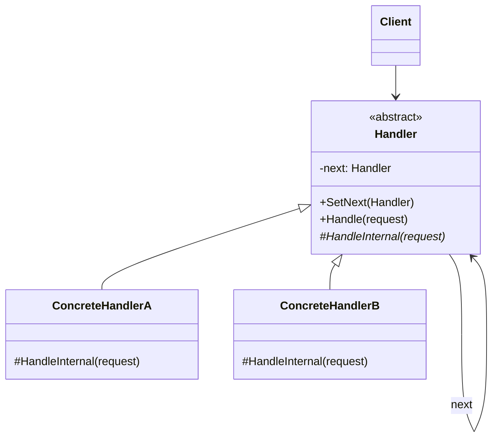

### C# 示例：HTTP 请求中间件

```csharp
// 请求类型
public record HttpRequest(string Url, string User, string Role);

// 抽象处理者
public abstract class Middleware
{
    private Middleware? _next;

    public Middleware SetNext(Middleware next)
    {
        _next = next;
        return next; // 支持链式组装
    }

    public void Handle(HttpRequest request)
    {
        if (CanHandle(request))
        {
            Process(request);
        }
        else
        {
            _next?.Handle(request);
        }
    }

    protected abstract bool CanHandle(HttpRequest request);
    protected abstract void Process(HttpRequest request);
}

// 具体处理者——认证
public class AuthenticationMiddleware : Middleware
{
    protected override bool CanHandle(HttpRequest req) => req.User == "";
    protected override void Process(HttpRequest req)
        => Console.WriteLine("[Auth] 用户未认证，返回 401");
}

// 具体处理者——授权
public class AuthorizationMiddleware : Middleware
{
    protected override bool CanHandle(HttpRequest req) => req.Role != "Admin";
    protected override void Process(HttpRequest req)
        => Console.WriteLine("[AuthZ] 权限不足，返回 403");
}

// 具体处理者——最终处理
public class ResourceHandler : Middleware
{
    protected override bool CanHandle(HttpRequest _) => true;
    protected override void Process(HttpRequest req)
        => Console.WriteLine($"[Resource] 返回 {req.Url} 的资源内容");
}

// 客户端组装链
var chain = new AuthenticationMiddleware();
chain.SetNext(new AuthorizationMiddleware())
     .SetNext(new ResourceHandler());

chain.Handle(new HttpRequest("/api/data", "", ""));       // → 401
chain.Handle(new HttpRequest("/api/data", "alice", "User")); // → 403
chain.Handle(new HttpRequest("/api/data", "admin", "Admin")); // → 资源内容
```

> [!tip] ASP.NET Core 的中间件管道
> ASP.NET Core 的中间件管道正是责任链模式的经典应用——每个中间件可以选择处理请求或调用 `_next(context)` 传递给下一个。

---

## 2. 命令模式 (Command)

### 意图

将请求封装为一个对象，从而让你可以用不同的请求对客户端进行参数化；对请求排队或记录请求日志，以及支持可撤销的操作。

### 问题

需要将操作的"调用者"与"执行者"解耦。例如 GUI 按钮不应直接调用业务逻辑——同样的操作可能通过菜单、快捷键、脚本等方式触发。

### 解决方案

将每个操作封装为命令对象，包含执行该操作所需的所有参数。调用者持有命令对象并调用其 `Execute()` 方法。

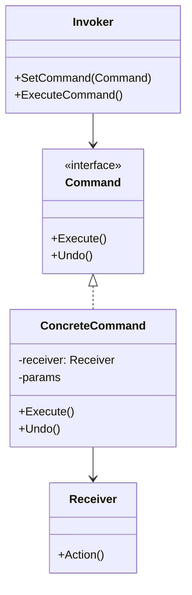

### C# 示例：文本编辑器撤销/重做

```csharp
// 接收者
public class Editor
{
    public string Text { get; set; } = "";
    private string _clipboard = "";

    public void Copy(int start, int length)
        => _clipboard = Text.Substring(start, length);

    public void Cut(int start, int length)
    {
        _clipboard = Text.Substring(start, length);
        Text = Text.Remove(start, length);
    }

    public void Paste(int position)
        => Text = Text.Insert(position, _clipboard);
}

// 命令接口
public interface ICommand
{
    void Execute();
    void Undo();
}

// 具体命令——剪切
public class CutCommand : ICommand
{
    private readonly Editor _editor;
    private readonly int _start, _length;
    private string? _backup;

    public CutCommand(Editor editor, int start, int length)
    {
        _editor = editor;
        _start = start;
        _length = length;
    }

    public void Execute()
    {
        _backup = _editor.Text;
        _editor.Cut(_start, _length);
    }

    public void Undo()
    {
        if (_backup is not null)
            _editor.Text = _backup;
    }
}

// 调用者——管理命令历史
public class CommandHistory
{
    private readonly Stack<ICommand> _history = new();

    public void ExecuteCommand(ICommand command)
    {
        command.Execute();
        _history.Push(command);
    }

    public void Undo()
    {
        if (_history.TryPop(out var command))
            command.Undo();
    }
}

// 使用
var editor = new Editor { Text = "Hello, World!" };
var history = new CommandHistory();

history.ExecuteCommand(new CutCommand(editor, 5, 7));
Console.WriteLine(editor.Text); // "Hello!"

history.Undo();
Console.WriteLine(editor.Text); // "Hello, World!"
```

---

## 3. 迭代器模式 (Iterator)

### 意图

提供一种方法顺序访问一个聚合对象中的各个元素，而又不暴露该对象的内部表示。

### 问题

集合的内部结构可能差异很大（数组、链表、树、哈希表），如果每个客户端都自己实现遍历逻辑，代码会与集合实现紧密耦合。

### 解决方案

将遍历行为抽取到独立的迭代器对象中。迭代器封装遍历状态（当前位置），通过统一接口暴露 `Next()` / `HasNext()`。

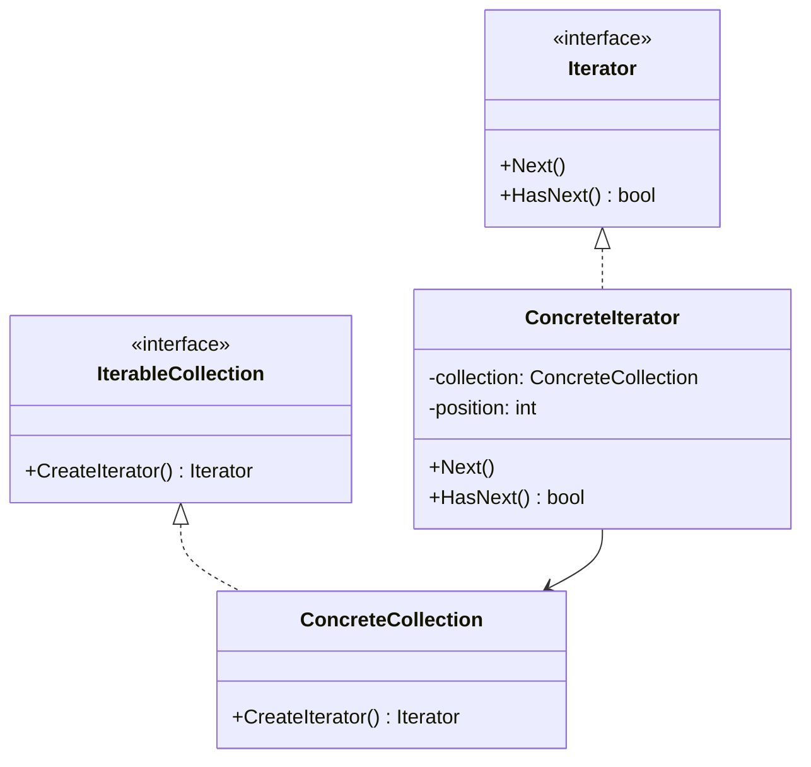

### C#：使用 `IEnumerable<T>` 和 `yield return`

GoF 迭代器模式在 C# 中被语言特性内建支持：

```csharp
// 自定义集合
public class WordsCollection : IEnumerable<string>
{
    private readonly List<string> _words = new();

    public void Add(string word) => _words.Add(word);

    public IEnumerator<string> GetEnumerator() => _words.GetEnumerator();
    System.Collections.IEnumerator System.Collections.IEnumerable.GetEnumerator()
        => GetEnumerator();

    // 反向迭代器
    public IEnumerable<string> Reverse()
    {
        for (int i = _words.Count - 1; i >= 0; i--)
            yield return _words[i];
    }
}

// 使用
var words = new WordsCollection();
words.Add("First");
words.Add("Second");
words.Add("Third");

foreach (var w in words)
    Console.WriteLine(w);  // First, Second, Third

foreach (var w in words.Reverse())
    Console.WriteLine(w);  // Third, Second, First
```

> [!note] C# 中的迭代器
> `IEnumerable<T>` / `IEnumerator<T>` 就是迭代器模式的标准化实现。`yield return` 语句使得编写自定义迭代器极为简洁，编译器自动生成状态机。

---

## 4. 中介者模式 (Mediator)

### 意图

用一个中介对象来封装一系列对象之间的交互。中介者使各对象不需要显式地相互引用，从而使其耦合松散。

### 问题

当组件之间存在复杂的多对多依赖时，修改一个组件会影响所有关联组件，系统演变为"意大利面条"结构。

### 解决方案

将所有组件间的通信限制为通过一个中介者对象进行。组件只知道中介者，不知道彼此。

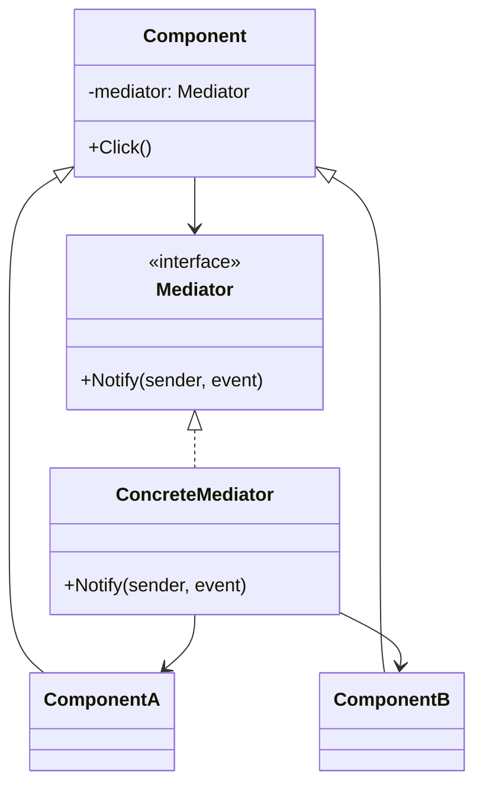

### C# 示例：登录对话框

```csharp
// 中介者接口
public interface IDialogMediator
{
    void Notify(Component sender, string eventName);
}

// 组件基类
public abstract class Component
{
    protected readonly IDialogMediator Dialog;
    protected Component(IDialogMediator dialog) => Dialog = dialog;
}

public class Button : Component
{
    public Button(IDialogMediator dialog) : base(dialog) { }
    public void Click() => Dialog.Notify(this, "click");
}

public class TextBox : Component
{
    public string Text { get; set; } = "";
    public TextBox(IDialogMediator dialog) : base(dialog) { }
}

public class CheckBox : Component
{
    public bool Checked { get; set; }
    public CheckBox(IDialogMediator dialog) : base(dialog) { }
    public void Toggle()
    {
        Checked = !Checked;
        Dialog.Notify(this, "check");
    }
}

// 具体中介者——协调登录与注册表单
public class LoginDialog : IDialogMediator
{
    private readonly TextBox _loginUser = new(null!);
    private readonly TextBox _loginPass = new(null!);
    private readonly TextBox _regUser = new(null!);
    private readonly TextBox _regEmail = new(null!);
    private readonly CheckBox _modeSwitch;
    private readonly Button _okBtn;

    public LoginDialog()
    {
        // 所有组件的 mediator 指向 this
        _modeSwitch = new CheckBox(this);
        _okBtn = new Button(this);
    }

    public void Notify(Component sender, string eventName)
    {
        if (sender == _modeSwitch && eventName == "check")
        {
            if (_modeSwitch.Checked)
                Console.WriteLine("[Dialog] 切换到注册模式");
            else
                Console.WriteLine("[Dialog] 切换到登录模式");
        }

        if (sender == _okBtn && eventName == "click")
        {
            if (_modeSwitch.Checked)
                Console.WriteLine("[Dialog] 提交注册...");
            else
                Console.WriteLine("[Dialog] 提交登录...");
        }
    }

    public void Simulate()
    {
        _modeSwitch.Toggle(); // 切到注册
        _okBtn.Click();       // 提交注册
        _modeSwitch.Toggle(); // 切回登录
        _okBtn.Click();       // 提交登录
    }
}
```

---

## 5. 备忘录模式 (Memento)

### 意图

在不破坏封装的前提下，捕获一个对象的内部状态，并在该对象之外保存这个状态，以便以后恢复。

### 问题

需要实现撤销操作。直观做法是记录对象状态并恢复，但这可能暴露对象的私有细节，破坏封装。

### 解决方案

让状态的所有者（**原发器**/Originator）自行创建包含其状态的快照（**备忘录**/Memento）。备忘录对外部不可见——只有原发器能读取/恢复它。

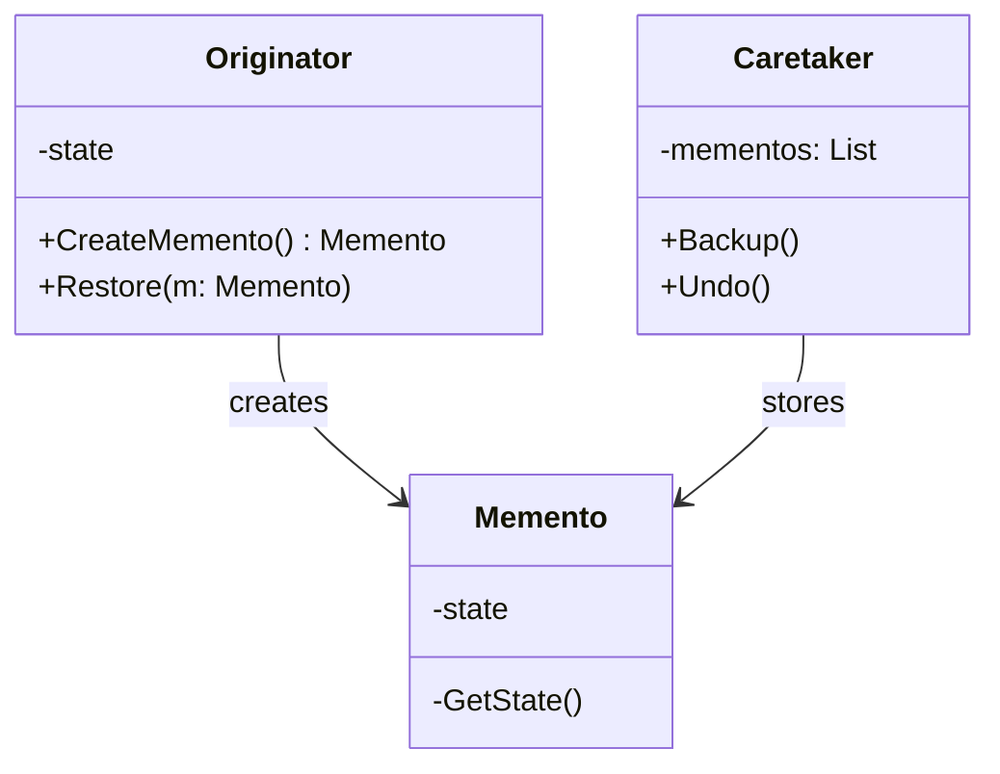

### C# 示例：编辑器撤销

```csharp
// 备忘录——不可变，只对 Originator 可见内部
public class EditorMemento
{
    internal string Text { get; }
    internal int CursorX { get; }
    internal int CursorY { get; }

    internal EditorMemento(string text, int cursorX, int cursorY)
    {
        Text = text;
        CursorX = cursorX;
        CursorY = cursorY;
    }
}

// 原发器
public class TextEditor
{
    public string Text { get; private set; } = "";
    public int CursorX { get; private set; }
    public int CursorY { get; private set; }

    public void Type(string text)
    {
        Text += text;
        CursorX += text.Length;
    }

    public EditorMemento CreateSnapshot()
        => new(Text, CursorX, CursorY);

    public void Restore(EditorMemento memento)
    {
        Text = memento.Text;
        CursorX = memento.CursorX;
        CursorY = memento.CursorY;
    }

    public override string ToString()
        => $"'{Text}' cursor=({CursorX},{CursorY})";
}

// 负责人（Caretaker）——管理快照历史
public class EditorHistory
{
    private readonly Stack<EditorMemento> _history = new();

    public void Save(TextEditor editor)
        => _history.Push(editor.CreateSnapshot());

    public void Undo(TextEditor editor)
    {
        if (_history.TryPop(out var memento))
            editor.Restore(memento);
    }
}

// 使用
var editor = new TextEditor();
var history = new EditorHistory();

editor.Type("Hello");
history.Save(editor);

editor.Type(", World!");
history.Save(editor);

Console.WriteLine(editor); // 'Hello, World!' cursor=(13,0)

history.Undo(editor);
Console.WriteLine(editor); // 'Hello' cursor=(5,0)

history.Undo(editor);
Console.WriteLine(editor); // '' cursor=(0,0)
```

### 与命令模式的结合

备忘录常与命令模式组合使用——命令在执行前保存备忘录，撤销时恢复：

```csharp
public class TypingCommand : ICommand
{
    private readonly TextEditor _editor;
    private readonly string _text;
    private EditorMemento? _backup;

    public TypingCommand(TextEditor editor, string text)
    {
        _editor = editor;
        _text = text;
    }

    public void Execute()
    {
        _backup = _editor.CreateSnapshot();
        _editor.Type(_text);
    }

    public void Undo()
    {
        if (_backup is not null)
            _editor.Restore(_backup);
    }
}
```

---

## 6. 观察者模式 (Observer)

### 意图

定义对象间的一种一对多的依赖关系，使得每当一个对象改变状态，其所有依赖者都会得到通知并自动更新。

### 问题

当一个对象的状态变化需要通知多个其他对象时，直接的耦合会导致代码难以维护。被观察者（Subject）不应知道具体的观察者。

### 解决方案

Subject 维护一个观察者列表，状态变化时遍历通知。观察者实现统一接口以接收更新。

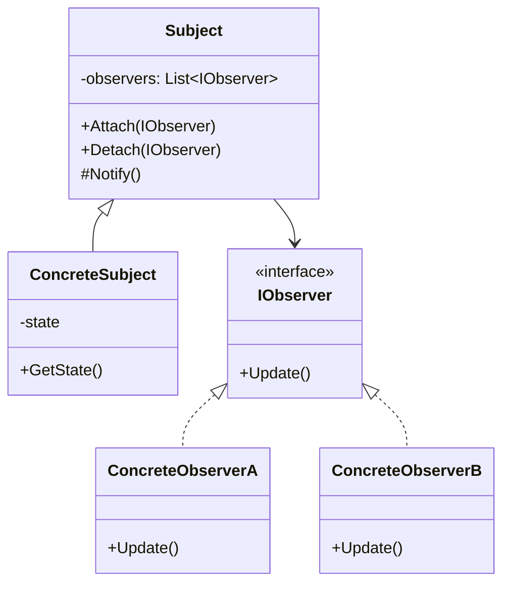

### C#：使用事件和 `IObservable<T>`

C# 原生支持观察者模式——事件（`event`）是其最直接的实现。.NET 还提供了 `IObservable<T>` / `IObserver<T>` 接口：

```csharp
// 方式一：使用 event（推荐用于简单场景）
public class Stock
{
    private decimal _price;
    public string Symbol { get; }

    public event EventHandler<decimal>? PriceChanged;

    public Stock(string symbol, decimal price)
    {
        Symbol = symbol;
        _price = price;
    }

    public decimal Price
    {
        get => _price;
        set
        {
            if (_price != value)
            {
                _price = value;
                PriceChanged?.Invoke(this, _price);
            }
        }
    }
}

// 观察者
public class StockDisplay
{
    public void OnPriceChanged(object? sender, decimal newPrice)
        => Console.WriteLine($"Display: Stock now at ${newPrice}");
}

// 使用
var apple = new Stock("AAPL", 150m);
var display = new StockDisplay();
apple.PriceChanged += display.OnPriceChanged;
apple.Price = 155m; // 触发通知
apple.Price = 160m;

// 方式二：使用 IObservable<T>（.NET 标准接口，适合 Rx/流式处理）
public class PriceObservable : IObservable<decimal>
{
    private readonly List<IObserver<decimal>> _observers = new();

    public IDisposable Subscribe(IObserver<decimal> observer)
    {
        _observers.Add(observer);
        return new Unsubscriber(_observers, observer);
    }

    public void UpdatePrice(decimal price)
    {
        foreach (var obs in _observers)
            obs.OnNext(price);
    }

    private class Unsubscriber : IDisposable
    {
        private readonly List<IObserver<decimal>> _observers;
        private readonly IObserver<decimal> _observer;
        public Unsubscriber(List<IObserver<decimal>> observers, IObserver<decimal> observer)
        { _observers = observers; _observer = observer; }
        public void Dispose() => _observers.Remove(_observer);
    }
}
```

> [!tip] C# 最佳实践
> 优先使用 `event` 关键字实现观察者模式。对于复杂数据流/可组合通知场景，考虑使用 Reactive Extensions (Rx.NET) 的 `IObservable<T>`。

---

## 7. 状态模式 (State)

### 意图

允许一个对象在其内部状态改变时改变它的行为。对象看起来似乎修改了它的类。

### 问题

一个对象的行为依赖于其状态，状态改变时行为随之改变。如果用 `if`/`switch` 实现，会导致庞大的条件分支且难以扩展新状态。

### 解决方案

为每个状态创建独立的类，将状态相关行为放入这些类中。上下文持有当前状态对象并委托所有状态相关的操作。

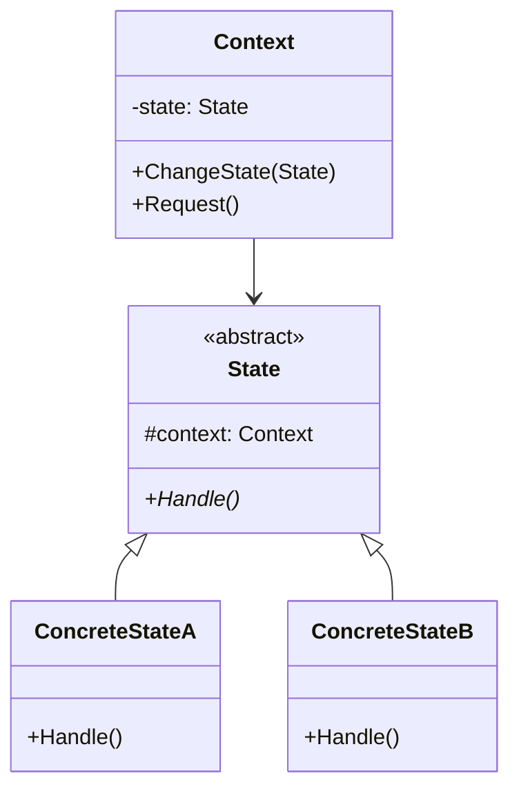

### C# 示例：文档审批流程

```csharp
// 状态基类
public abstract class DocumentState
{
    protected Document Doc;

    protected DocumentState(Document doc) => Doc = doc;

    public abstract void Publish();
    public abstract void Reject();
    public abstract string StatusName { get; }
}

// 草稿状态
public class DraftState : DocumentState
{
    public DraftState(Document doc) : base(doc) { }

    public override string StatusName => "草稿";

    public override void Publish()
    {
        Console.WriteLine("  提交审核...");
        Doc.ChangeState(new ReviewState(Doc));
    }

    public override void Reject()
        => Console.WriteLine("  草稿无需拒绝");
}

// 审核中状态
public class ReviewState : DocumentState
{
    public ReviewState(Document doc) : base(doc) { }

    public override string StatusName => "审核中";

    public override void Publish()
    {
        Console.WriteLine("  审核通过，发布!");
        Doc.ChangeState(new PublishedState(Doc));
    }

    public override void Reject()
    {
        Console.WriteLine("  审核驳回，退回草稿");
        Doc.ChangeState(new DraftState(Doc));
    }
}

// 已发布状态
public class PublishedState : DocumentState
{
    public PublishedState(Document doc) : base(doc) { }

    public override string StatusName => "已发布";

    public override void Publish()
        => Console.WriteLine("  已发布，无需重复发布");

    public override void Reject()
        => Console.WriteLine("  已发布，无法拒绝");
}

// 上下文——文档
public class Document
{
    private DocumentState _state;

    public string Name { get; }

    public Document(string name)
    {
        Name = name;
        _state = new DraftState(this);
    }

    public void ChangeState(DocumentState state) => _state = state;

    public void Publish() => _state.Publish();
    public void Reject() => _state.Reject();

    public void DisplayStatus()
        => Console.WriteLine($"[{Name}] 状态: {_state.StatusName}");
}

// 使用——状态转换：草稿 → 审核 → 发布
var doc = new Document("需求文档 v2.0");
doc.DisplayStatus(); // 草稿
doc.Publish();       // 提交审核
doc.DisplayStatus(); // 审核中
doc.Reject();        // 审核驳回
doc.DisplayStatus(); // 草稿
doc.Publish();       // 提交审核
doc.Publish();       // 审核通过
doc.DisplayStatus(); // 已发布
```

> [!note] 状态 vs 策略
> 状态模式中，状态对象知道彼此并能触发状态转换；策略模式中，策略对象彼此独立，由客户端或上下文在外部切换。状态模式的类图与策略模式相似，但其**意图和内部行为**不同。

---

## 8. 策略模式 (Strategy)

### 意图

定义一系列算法，把它们一个个封装起来，并且使它们可以相互替换。策略模式让算法的变化独立于使用它的客户端。

### 问题

同一操作有多种实现方式（如不同的排序算法、压缩算法、计费策略），使用 `if`/`switch` 选择具体实现会导致条件分支蔓延且难以扩展。

### 解决方案

将每种算法封装为独立的策略类，上下文持有策略接口的引用，在运行时切换策略。

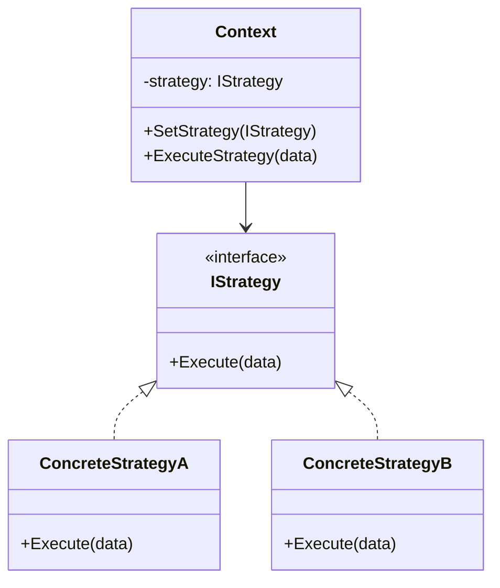

### C# 示例：支付策略

```csharp
// 策略接口
public interface IPaymentStrategy
{
    void Pay(decimal amount);
}

// 具体策略
public class CreditCardPayment : IPaymentStrategy
{
    private readonly string _cardNumber;
    public CreditCardPayment(string cardNumber) => _cardNumber = cardNumber;

    public void Pay(decimal amount)
        => Console.WriteLine($"信用卡 {_cardNumber} 支付 ${amount:F2}");
}

public class WeChatPayment : IPaymentStrategy
{
    private readonly string _account;
    public WeChatPayment(string account) => _account = account;

    public void Pay(decimal amount)
        => Console.WriteLine($"微信 {_account} 支付 ${amount:F2}");
}

public class CashPayment : IPaymentStrategy
{
    public void Pay(decimal amount)
        => Console.WriteLine($"现金支付 ${amount:F2}");
}

// 上下文
public class ShoppingCart
{
    private readonly List<(string item, decimal price)> _items = new();
    private IPaymentStrategy? _paymentStrategy;

    public void AddItem(string item, decimal price) => _items.Add((item, price));

    public void SetPaymentStrategy(IPaymentStrategy strategy) => _paymentStrategy = strategy;

    public decimal GetTotal() => _items.Sum(i => i.price);

    public void Checkout()
    {
        var total = GetTotal();
        _paymentStrategy?.Pay(total);
    }
}

// 使用
var cart = new ShoppingCart();
cart.AddItem("键盘", 299m);
cart.AddItem("鼠标", 149m);

cart.SetPaymentStrategy(new WeChatPayment("user123"));
cart.Checkout(); // 微信 user123 支付 $448.00

cart.SetPaymentStrategy(new CashPayment());
cart.Checkout(); // 现金支付 $448.00
```

### 策略 vs 命令

| | 策略 (Strategy) | 命令 (Command) |
|--|-----------------|---------------|
| 意图 | 封装可互换的算法 | 封装请求为对象 |
| 关系 | 策略通常无状态或多版本 | 命令持有执行所需参数 |
| 使用方式 | 上下文切换策略 | 调用者执行命令 |
| 典型应用 | 排序算法、计费方式、压缩 | 撤销/重做、任务队列、宏 |

---

## 9. 模板方法模式 (Template Method)

### 意图

在一个方法中定义算法的骨架，将一些步骤延迟到子类中。模板方法使得子类可以在不改变算法结构的情况下，重新定义算法的某些步骤。

### 问题

多个子类包含相似的算法结构，但某些步骤的实现不同。复制算法结构导致代码重复。

### 解决方案

在父类中定义模板方法（通常为 `final`/不可重写），调用一系列步骤方法。子类通过重写这些步骤方法来自定义行为。

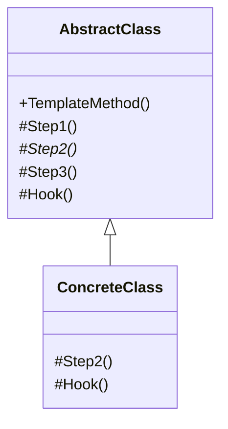

### C# 示例：数据挖掘流程

```csharp
// 抽象类——定义模板方法
public abstract class DataMiner
{
    // 模板方法——定义算法骨架
    public void Mine(string path)
    {
        var data = OpenFile(path);
        var extracted = ExtractData(data);
        var analyzed = AnalyzeData(extracted);
        SendReport(analyzed);
        CloseFile();
    }

    // 抽象步骤——子类必须实现
    protected abstract string ExtractData(string rawData);
    protected abstract string AnalyzeData(string extractedData);

    // 默认实现——子类可选重写
    protected virtual string OpenFile(string path)
    {
        Console.WriteLine($"[{GetType().Name}] 打开文件: {path}");
        return $"RAW({path})";
    }

    protected virtual void CloseFile()
        => Console.WriteLine($"[{GetType().Name}] 关闭文件");

    // 钩子方法——子类可选的扩展点
    protected virtual void SendReport(string analysis)
    {
        var filename = $"report_{DateTime.Now:yyyyMMdd}.txt";
        File.WriteAllText(filename, analysis);
        Console.WriteLine($"[{GetType().Name}] 报告已保存到 {filename}");
    }
}

// 具体实现——PDF 数据挖掘
public class PDFDataMiner : DataMiner
{
    protected override string ExtractData(string raw)
    {
        Console.WriteLine("  [PDF] 抽取文本...");
        return raw.Replace("RAW", "EXTRACTED_PDF");
    }

    protected override string AnalyzeData(string extracted)
    {
        Console.WriteLine("  [PDF] 分析文本...");
        return $"Analysis of: {extracted}";
    }
}

// 具体实现——CSV 数据挖掘
public class CSVDataMiner : DataMiner
{
    protected override string ExtractData(string raw)
    {
        Console.WriteLine("  [CSV] 解析列数据...");
        return raw.Replace("RAW", "EXTRACTED_CSV");
    }

    protected override string AnalyzeData(string extracted)
    {
        Console.WriteLine("  [CSV] 统计分析...");
        return $"Stats of: {extracted}";
    }

    protected override void SendReport(string analysis)
    {
        Console.WriteLine($"[CSV] 同时发送邮件报告...");
        base.SendReport(analysis);
    }
}

// 使用
DataMiner pdfMiner = new PDFDataMiner();
pdfMiner.Mine("doc.pdf");

DataMiner csvMiner = new CSVDataMiner();
csvMiner.Mine("data.csv");
```

### 钩子方法

钩子（Hook）是模板方法模式中的可选步骤——在基类中提供空实现或默认实现，子类可以选择性重写。钩子通常放在关键步骤前后，提供算法扩展点：

```csharp
protected virtual void BeforeExtract() { }  // 钩子——抽取前的预处理
protected virtual void AfterAnalyze() { }   // 钩子——分析后的后处理
```

> [!note] 好莱坞原则
> "Don't call us, we'll call you." ——父类控制调用流程，子类只提供具体实现。这是框架设计的核心原则。

---

## 10. 访问者模式 (Visitor)

### 意图

表示一个作用于某对象结构中的各元素的操作。访问者让你可以在不改变各元素的类的前提下定义作用于这些元素的新操作。

### 问题

需要为对象结构中的元素添加新操作，但修改每个元素类代价太高或不被允许。同时，这些操作分散在各元素类中，难以维护。

### 解决方案

使用**双分派**（Double Dispatch）技术：将操作封装在访问者对象中，元素通过 `Accept(Visitor)` 方法将自身传递给访问者的相应方法。

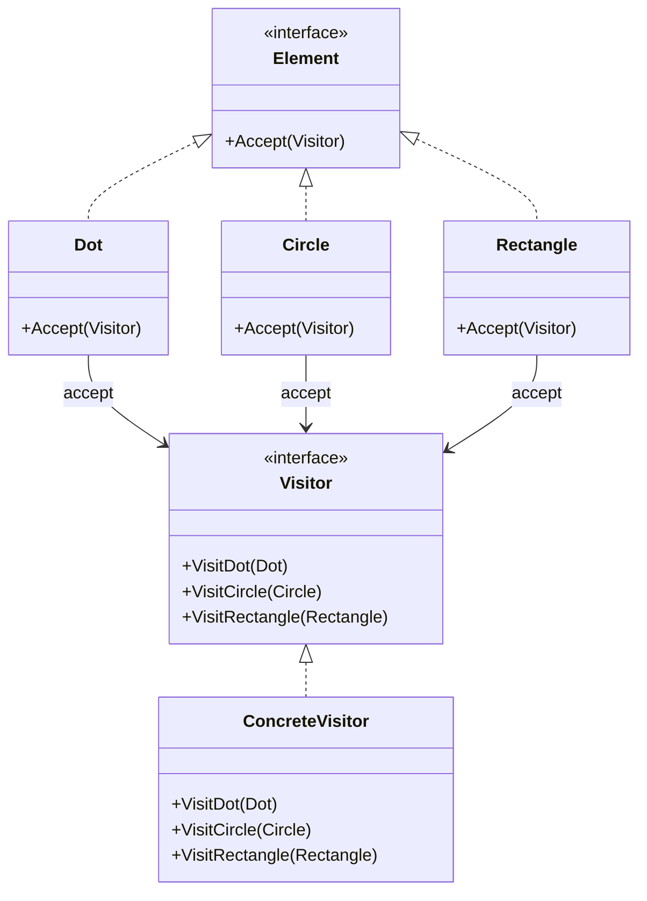

### C# 示例：图形导出

```csharp
// 元素接口
public interface IShape
{
    void Accept(IShapeVisitor visitor);
}

// 具体元素
public class Dot : IShape
{
    public int Id { get; set; }
    public int X { get; set; }
    public int Y { get; set; }

    public Dot(int id, int x, int y) { Id = id; X = x; Y = y; }

    public void Accept(IShapeVisitor visitor) => visitor.VisitDot(this);
}

public class Circle : IShape
{
    public int Id { get; set; }
    public int X { get; set; }
    public int Y { get; set; }
    public int Radius { get; set; }

    public Circle(int id, int x, int y, int r) { Id = id; X = x; Y = y; Radius = r; }

    public void Accept(IShapeVisitor visitor) => visitor.VisitCircle(this);
}

public class Rectangle : IShape
{
    public int Id { get; set; }
    public int X { get; set; }
    public int Y { get; set; }
    public int Width { get; set; }
    public int Height { get; set; }

    public Rectangle(int id, int x, int y, int w, int h)
    { Id = id; X = x; Y = y; Width = w; Height = h; }

    public void Accept(IShapeVisitor visitor) => visitor.VisitRectangle(this);
}

// 访问者接口——为每种元素类型声明一个 Visit 方法
public interface IShapeVisitor
{
    void VisitDot(Dot dot);
    void VisitCircle(Circle circle);
    void VisitRectangle(Rectangle rectangle);
}

// 具体访问者——XML 导出
public class XMLExportVisitor : IShapeVisitor
{
    public void VisitDot(Dot dot)
        => Console.WriteLine($"<dot id=\"{dot.Id}\" x=\"{dot.X}\" y=\"{dot.Y}\"/>");

    public void VisitCircle(Circle circle)
        => Console.WriteLine($"<circle id=\"{circle.Id}\" x=\"{circle.X}\" "
                          + $"y=\"{circle.Y}\" r=\"{circle.Radius}\"/>");

    public void VisitRectangle(Rectangle rect)
        => Console.WriteLine($"<rect id=\"{rect.Id}\" x=\"{rect.X}\" "
                          + $"y=\"{rect.Y}\" w=\"{rect.Width}\" h=\"{rect.Height}\"/>");
}

// 具体访问者——面积计算
public class AreaCalculator : IShapeVisitor
{
    public double TotalArea { get; private set; }

    public void VisitDot(Dot _) { } // 点没有面积

    public void VisitCircle(Circle circle)
        => TotalArea += Math.PI * circle.Radius * circle.Radius;

    public void VisitRectangle(Rectangle rect)
        => TotalArea += rect.Width * rect.Height;
}

// 使用
var shapes = new List<IShape>
{
    new Dot(1, 10, 20),
    new Circle(2, 50, 30, 15),
    new Rectangle(3, 5, 5, 40, 20)
};

// XML 导出
var xmlExporter = new XMLExportVisitor();
foreach (var shape in shapes)
    shape.Accept(xmlExporter);

// 面积计算
var calculator = new AreaCalculator();
foreach (var shape in shapes)
    shape.Accept(calculator);
Console.WriteLine($"总面积: {calculator.TotalArea:F2}");
```

### 双分派原理

```
1. Client 调用 shape.Accept(visitor)    ← 第一次分派：根据 shape 的实际类型选择 Accept 实现
2. Accept 中调用 visitor.VisitXxx(this)  ← 第二次分派：根据 visitor 和 this 的具体类型选择 VisitXxx 重载
```

C# 的 `dynamic` 关键字可以简化双分派，但会失去编译期类型检查：

```csharp
public void AcceptDynamic(dynamic visitor) => visitor.Visit((dynamic)this);
```

### 优点与局限

| 优点 | 局限 |
|------|------|
| 添加新操作很容易，只需新增访问者 | 添加新元素类困难——所有访问者都需更新 |
| 将相关操作集中到一个访问者中 | 访问者需要访问元素的内部状态，可能破坏封装 |
| 访问者可跨元素类累积状态 | 元素类层次结构必须稳定 |

> [!tip] 选择指南
> 当元素类层次**稳定**但需要频繁**添加新操作**时，访问者模式非常适合。
> 当元素类层次**频繁变化**时，不适用——每次添加新元素都要修改所有访问者。

---

## 模式关系总览

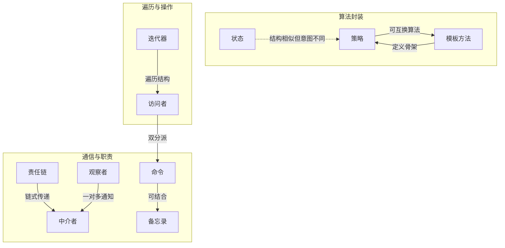
