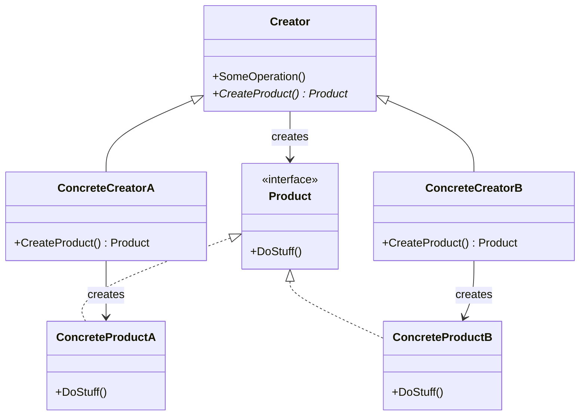
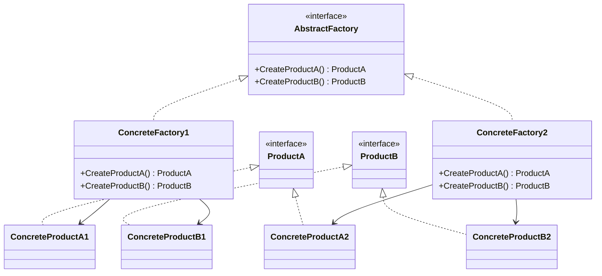
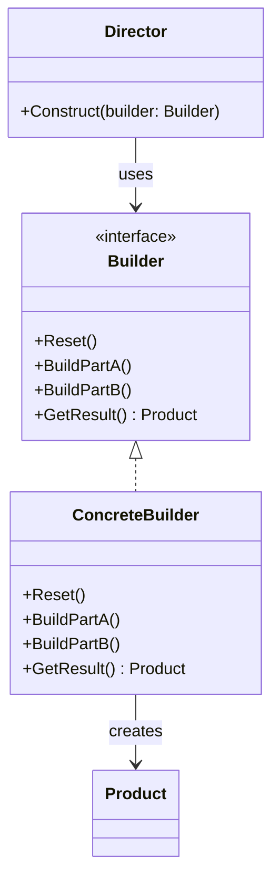
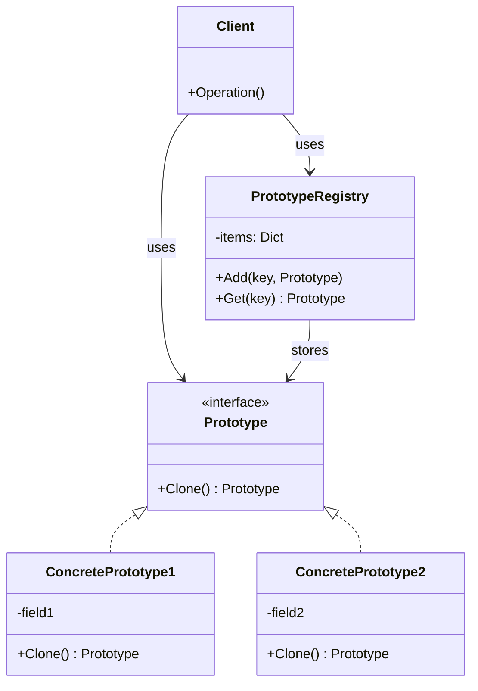
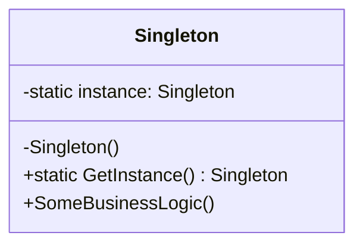
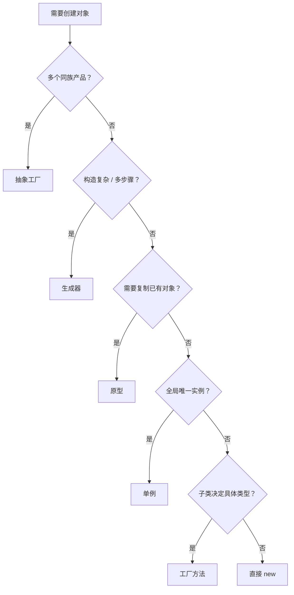

# 创建型设计模式

创建型模式关注**对象是如何创建的**。它们将对象的创建与使用分离，使得系统在创建什么、谁创建、何时创建、如何创建这些方面获得更大的灵活性。

GoF 定义了五种创建型模式：

| 模式 | 核心思想 | 一句话 |
|------|----------|--------|
| 工厂方法 | 子类决定实例化哪个类 | 不直接 `new`，交给子类的工厂方法 |
| 抽象工厂 | 创建一系列相关对象 | 保证产品族风格一致 |
| 生成器 | 分步构造复杂对象 | 避免"重叠构造函数" |
| 原型 | 克隆已有对象 | 复制代替创建 |
| 单例 | 全局唯一实例 | 一个类仅一个实例 |

> [!note] 模式演变路径
> 许多系统从工厂方法起步（简单定制），随需求增长演化为抽象工厂（产品族）。当构造过程极其复杂时引入生成器；当对象创建开销高时引入原型。单例常与其他四种模式组合使用。

---

## 1. 工厂方法模式 (Factory Method)

### Intent

定义一个用于创建对象的接口，但让子类决定实例化哪一个类。工厂方法使一个类的实例化延迟到其子类。

**核心思想**：不直接使用 `new` 创建对象——工厂方法返回的对象通常被称作"产品"。子类可以覆写对应的方法生成自己。

### Structure



### Participants

| 角色 | 职责 |
|------|------|
| **Product** (接口) | 定义产品对象的公共接口 |
| **ConcreteProduct** | 实现 Product 接口的具体产品类 |
| **Creator** (抽象类) | 声明工厂方法 `CreateProduct()`，返回 Product 类型；可包含依赖工厂方法的业务逻辑 |
| **ConcreteCreator** | 覆写工厂方法，返回具体的 ConcreteProduct 实例 |

> [!note] 关键约束
> 所有产品必须共享一个公共基类或接口。工厂方法的返回类型应声明为该公共接口，子类才能返回不同类型的产品。仅当产品具有共同基类或接口时，子类才能返回不同类型的产品。

### C# Example

```csharp
// 产品接口
public interface ITransport
{
    void Deliver();
}

// 具体产品
public class Truck : ITransport
{
    public void Deliver() => Console.WriteLine("陆路卡车运输");
}

public class Ship : ITransport
{
    public void Deliver() => Console.WriteLine("海路船舶运输");
}

// 创建者基类
public abstract class Logistics
{
    // 工厂方法——子类决定创建什么
    protected abstract ITransport CreateTransport();

    // 模板方法：依赖工厂方法但不依赖具体产品
    public void PlanDelivery()
    {
        ITransport transport = CreateTransport();
        transport.Deliver();
    }
}

// 具体创建者
public class RoadLogistics : Logistics
{
    protected override ITransport CreateTransport() => new Truck();
}

public class SeaLogistics : Logistics
{
    protected override ITransport CreateTransport() => new Ship();
}

// 使用
var logistics = new RoadLogistics();
logistics.PlanDelivery(); // "陆路卡车运输"
```

### Applicability

**何时使用：**
- 类无法预知它必须创建的对象的类
- 类希望其子类来指定它所创建的对象
- 需要将对象创建的职责委托给子类——利用多态而非硬编码

**何时不使用：**
- 产品族固定且不会扩展——直接 `new` 更简单
- 创建逻辑简单且没有多态需求——过度设计
- 产品类之间没有公共接口——工厂方法的返回类型无法抽象

### Relations

- 常与 [[concepts/设计模式-结构型|模板方法]] 结合：Creator 的业务方法 (`PlanDelivery`) 本身就是模板方法，调用抽象工厂方法
- 抽象工厂通常由**一组工厂方法**构成——每个创建方法本质上是一个工厂方法
- 许多系统从工厂方法演化到抽象工厂，再根据需要引入原型或生成器
- 与 [[concepts/依赖注入|依赖注入]] 的关系：工厂方法是一种依赖注入形式——创建者依赖抽象产品接口，具体产品通过子类"注入"。现代 C# 中常结合 DI 容器使用工厂委托：

```csharp
services.AddTransient<Func<TransportType, ITransport>>(sp => type => type switch
{
    TransportType.Road => new Truck(),
    TransportType.Sea => new Ship(),
    _ => throw new ArgumentOutOfRangeException()
});
```

### Variants

- **参数化工厂方法**：工厂方法接受参数，根据参数决定创建哪个具体产品。优点是减少子类数量，缺点是工厂方法可能变得臃肿
- **静态工厂方法**：将工厂方法声明为 `static`，无需实例化 Creator。`Task.Run()`、`Task.Delay()` 是 .NET 中的静态工厂方法
- **简单工厂（Simple Factory）**：不是 GoF 正式模式，但常见——一个类根据参数创建不同产品。没有继承层次，所有创建逻辑集中在一个类中

### Anti-patterns / Pitfalls

- **工厂方法返回具体类型**：破坏了模式的全部意义——客户端与具体产品耦合
- **上帝工厂**：一个工厂类处理所有产品的创建，演变成庞大的条件分支
- **滥用继承**：每个新产品都创建一个子类，导致子类爆炸。考虑改用参数化工厂方法

---

## 2. 抽象工厂模式 (Abstract Factory)

### Intent

提供一个接口，用于创建一系列**相关或相互依赖**的对象，而无需指定它们的具体类。

**核心思想**：首先，抽象工厂模式建议为系列中的每件产品明确声明接口，然后确保所有产品变体都继承这些接口。客户端代码通过抽象接口调用工厂和产品类，无需修改客户端代码就能更改工厂类和产品变体。

### Structure



### Participants

| 角色 | 职责 |
|------|------|
| **AbstractFactory** (接口) | 声明创建一族产品对象的方法 |
| **ConcreteFactory** | 实现 AbstractFactory，创建一族具体产品 |
| **AbstractProduct** | 为一种产品声明接口 |
| **ConcreteProduct** | 实现 AbstractProduct 的具体产品；由对应的 ConcreteFactory 创建 |
| **Client** | 仅通过 AbstractFactory 和 AbstractProduct 接口使用工厂和产品 |

> [!note] 客户端视角
> 客户端无需了解工厂类，也不用管工厂类创建出的产品类型。无论是哪种风格的产品，对客户端来说没有分别——它只需调用抽象接口就可以了。此外，无论工厂返回的是何种变体，它都会和由同一工厂对象创建的其他产品风格一致。

### C# Example: 跨平台 UI 组件

```csharp
// 产品族接口
public interface IButton { void Render(); }
public interface ICheckbox { void Render(); }

// Windows 风格产品
public class WindowsButton : IButton {
    public void Render() => Console.WriteLine("渲染 Windows 风格按钮");
}
public class WindowsCheckbox : ICheckbox {
    public void Render() => Console.WriteLine("渲染 Windows 风格复选框");
}

// macOS 风格产品
public class MacButton : IButton {
    public void Render() => Console.WriteLine("渲染 macOS 风格按钮");
}
public class MacCheckbox : ICheckbox {
    public void Render() => Console.WriteLine("渲染 macOS 风格复选框");
}

// 抽象工厂
public interface IGUIFactory
{
    IButton CreateButton();
    ICheckbox CreateCheckbox();
}

// 具体工厂
public class WindowsFactory : IGUIFactory
{
    public IButton CreateButton() => new WindowsButton();
    public ICheckbox CreateCheckbox() => new WindowsCheckbox();
}

public class MacFactory : IGUIFactory
{
    public IButton CreateButton() => new MacButton();
    public ICheckbox CreateCheckbox() => new MacCheckbox();
}

// 客户端——只依赖抽象接口
public class Application
{
    private readonly IButton _button;
    private readonly ICheckbox _checkbox;

    public Application(IGUIFactory factory)
    {
        _button = factory.CreateButton();
        _checkbox = factory.CreateCheckbox();
    }

    public void Render()
    {
        _button.Render();
        _checkbox.Render();
    }
}

// 运行时根据平台选择工厂
IGUIFactory factory = RuntimeInformation.IsOSPlatform(OSPlatform.Windows)
    ? new WindowsFactory()
    : new MacFactory();
var app = new Application(factory);
app.Render();
```

### Applicability

**何时使用：**
- 系统需要创建**一族相关产品**，且需要保证同一族产品风格一致
- 系统需要独立于产品的创建、组合和表示
- 需要揭示产品的接口而非实现

**何时不使用：**
- 只有一种产品变化——工厂方法就够了
- 产品族之间没有"必须一起使用"的约束——独立工厂方法更灵活
- 产品类型频繁变化——每次新增产品族都需要修改工厂接口（违反开闭原则）

### Relations

- 抽象工厂通常由一组**工厂方法**构成——每个 `CreateXxx()` 方法本质上是一个工厂方法
- 与 [[concepts/设计模式-创建型|生成器]] 对比：抽象工厂**一次性**返回一族产品，生成器允许**分步构造**。抽象工厂会马上返回产品，生成器则允许在获取产品前执行额外构造步骤
- 与 [[concepts/设计模式-创建型|原型]] 结合：可以用原型来生成具体工厂的创建方法，而不是硬编码 `new`
- 与 [[concepts/设计模式-结构型|外观]] 关系：当只需对客户端隐藏子系统创建对象的方式时，可用抽象工厂代替外观
- 与 [[concepts/设计模式-结构型|桥接]] 搭配：如果桥接定义的抽象只能与特定实现合作，抽象工厂可以封装这些关系
- 与 [[concepts/设计模式-创建型|单例]] 结合：具体工厂实例常用单例实现（每个应用只需要一个工厂实例）
- 抽象工厂是 [[concepts/依赖注入|依赖注入]] 的经典场景——DI 容器通过注册不同的服务实现来切换"产品族"

### Variants

- **可扩展抽象工厂**：使用泛型和字典代替固定接口，客户端通过 `Create<T>()` 创建任意产品
- **工厂族 + 原型**：具体工厂不直接 `new` 产品，而是克隆预配置的原型对象
- **DI 驱动的抽象工厂**：用 DI 容器自动解析产品族——注册 `WindowsFactory` 或 `MacFactory` 即可切换整套产品

### Anti-patterns / Pitfalls

- **工厂接口膨胀**：产品族太大导致 AbstractFactory 接口臃肿——考虑拆分工厂
- **产品族泄露**：客户端对具体工厂做类型判断 (`factory is WindowsFactory`)，破坏了抽象
- **强行组合**：把不属于同一族的独立产品放进抽象工厂——不相关产品分开管理

---

## 3. 生成器模式 (Builder)

### Intent

将复杂对象的构建与其表示分离，使得同样的构建过程可以创建不同的表示。

**核心思想**：生成器模式建议将对象构造代码从产品类中抽取出来，并将其放在一个名为**生成器**的独立对象中。使用生成器模式可避免"重叠构造函数 (telescoping constructor)"的出现。

### Structure



### Participants

| 角色 | 职责 |
|------|------|
| **Builder** (接口) | 声明产品构造步骤的通用接口 |
| **ConcreteBuilder** | 实现 Builder 接口，提供构造步骤的具体实现；提供获取最终产品的方法 |
| **Product** | 最终构造出的复杂对象；不同 ConcreteBuilder 可能产生不遵循相同接口的产品 |
| **Director** (可选) | 定义构造步骤的调用顺序；可复用生成器对象封装多种构造方式 |
| **Client** | 创建生成器和主管对象；将生成器传递给主管；通过生成器获取构造结果 |

> [!note] 关键设计
> 不能在 Builder 接口中声明 `GetResult()` 方法，因为不同生成器构造的产品可能没有公共接口。如果所有产品都位于单一类层次中，才可以安全地在基本接口添加获取产品的方法。

### C# Example: Fluent Builder

现代 C# 中最实用的生成器变体——不使用 Director，通过流畅接口让客户端代码自描述：

```csharp
// 产品
public class Car
{
    public int Seats { get; set; }
    public string Engine { get; set; } = "";
    public bool HasTripComputer { get; set; }
    public bool HasGPS { get; set; }

    public override string ToString()
        => $"Car [Seats={Seats}, Engine={Engine}, "
         + $"Computer={HasTripComputer}, GPS={HasGPS}]";
}

// 流畅生成器
public class CarBuilder
{
    private readonly Car _car = new();

    public CarBuilder SetSeats(int count)
    {
        _car.Seats = count;
        return this;
    }

    public CarBuilder SetEngine(string engine)
    {
        _car.Engine = engine;
        return this;
    }

    public CarBuilder SetTripComputer(bool hasIt)
    {
        _car.HasTripComputer = hasIt;
        return this;
    }

    public CarBuilder SetGPS(bool hasIt)
    {
        _car.HasGPS = hasIt;
        return this;
    }

    public Car Build() => _car;
}

// 使用——链式调用，自描述
var sportsCar = new CarBuilder()
    .SetSeats(2)
    .SetEngine("V8 Turbo")
    .SetTripComputer(true)
    .SetGPS(true)
    .Build();

var suv = new CarBuilder()
    .SetSeats(5)
    .SetEngine("V6 Hybrid")
    .SetTripComputer(true)
    .Build();
```

### Director Example

当构建步骤顺序固定时，Director 封装步骤序列：

```csharp
public class CarDirector
{
    public Car ConstructSportsCar(CarBuilder builder)
    {
        return builder.SetSeats(2)
                      .SetEngine("V8 Turbo")
                      .SetTripComputer(true)
                      .SetGPS(true)
                      .Build();
    }

    public Car ConstructSUV(CarBuilder builder)
    {
        return builder.SetSeats(5)
                      .SetEngine("V6 Hybrid")
                      .SetTripComputer(true)
                      .SetGPS(false)
                      .Build();
    }
}

// 使用
var director = new CarDirector();
var builder = new CarBuilder();
Car car = director.ConstructSportsCar(builder);
```

### Applicability

**何时使用：**
- 构造过程需要多个步骤，且步骤顺序重要——使用生成器避免"重叠构造函数"
- 需要创建不同形式的产品（如石头或木头房屋）——不同 ConcreteBuilder 实现相同的构造步骤但结果不同
- 使用生成器构造 [[concepts/设计模式-结构型|组合模式]] 树或其他复杂对象

**何时不使用：**
- 对象构造简单（≤4 个参数）——构造函数或命名参数就够了
- 所有产品共享相同的构造步骤和相同的类——没必要
- C# 中已有更好的替代：`record` 类型 + `with` 表达式可替代简单 Builder

### Relations

- 与 [[concepts/设计模式-创建型|抽象工厂]] 对比：抽象工厂**一次性返回**产品族，生成器**分步构造**单个产品
- 与 [[concepts/设计模式-结构型|组合模式]] 结合：生成器可用于构造组合树——每个构造步骤添加叶节点或子树
- 与 [[concepts/设计模式-创建型|单例]] 结合：Director 或 Builder 实例可用单例管理
- 与 [[concepts/设计模式-创建型|原型]] 结合：Builder 内部用原型来克隆预配置部件

### Variants

- **Fluent Builder**（推荐）：通过链式调用 `return this`，无需 Director。C# 中的 LINQ、`StringBuilder` 均为此变体
- **Step Builder**：通过接口强制构造步骤顺序——每个步骤返回下一步骤的接口，编译器保证步骤不会遗漏或乱序
- **递归泛型 Builder**：基类 `Builder<T>` 提供公共步骤，子类通过 `where T : Builder<T>` 继承
- **Director-less Builder**：日常开发中最常见的变体——客户端直接调用 Builder 方法，不使用中介的 Director

> [!tip] C# 中的替代方案
> - **命名参数 + 可选参数**：简单场景下可用构造函数加可选参数替代 Builder
> - **`record` 类型 + `with` 表达式**：C# 9+ 的不可变类型配合 `with` 提供类似 Builder 的体验
> - **`IConfigurationBuilder`**：.NET 配置系统是 Builder 模式的经典应用

### Anti-patterns / Pitfalls

- **Builder 与 Product 强绑定**：Builder 的构造步骤名称与具体产品字段一一对应——失去抽象性
- **忘记调用 `Build()`**：Builder 累积了状态但未产出产品——代码审查高发问题
- **Builder 过大**：一个 Builder 承担太多职责——拆分为多个小 Builder

---

## 4. 原型模式 (Prototype)

### Intent

使用原型实例指定将要创建的对象类型，并通过复制这个原型创建新对象。

**核心思想**：[[SELF-CITED]] 原型模式将克隆过程委派给被克隆的实际对象。模式为所有支持克隆的对象声明了一个通用接口（通常仅包含一个 `Clone` 方法），让你能够克隆对象，同时又无需将代码和对象所属类耦合。

### Structure



### Participants

| 角色 | 职责 |
|------|------|
| **Prototype** (接口) | 声明 `Clone()` 方法 |
| **ConcretePrototype** | 实现 `Clone()`——复制自身并返回副本 |
| **Client** | 通过调用 `Clone()` 创建新对象，无需知道具体类 |
| **PrototypeRegistry** (可选) | 存储预配置的原型对象缓存，按 key 获取并克隆 |

### C# Example: 复制构造函数

C# 中推荐使用复制构造函数实现原型模式，语义清晰：

```csharp
// 基础原型
public abstract class Shape
{
    public int X { get; set; }
    public int Y { get; set; }
    public string Color { get; set; } = "";

    // 复制构造函数——原型模式的核心
    protected Shape(Shape source)
    {
        X = source.X;
        Y = source.Y;
        Color = source.Color;
    }

    protected Shape() { }

    public abstract Shape Clone();
}

public class Rectangle : Shape
{
    public int Width { get; set; }
    public int Height { get; set; }

    public Rectangle() { }

    // 复制构造函数
    public Rectangle(Rectangle source) : base(source)
    {
        Width = source.Width;
        Height = source.Height;
    }

    public override Shape Clone() => new Rectangle(this);
}

public class Circle : Shape
{
    public int Radius { get; set; }

    public Circle() { }

    public Circle(Circle source) : base(source)
    {
        Radius = source.Radius;
    }

    public override Shape Clone() => new Circle(this);
}

// 原型注册表——缓存常用原型
public class ShapeRegistry
{
    private readonly Dictionary<string, Shape> _prototypes = new();

    public void Register(string key, Shape prototype)
        => _prototypes[key] = prototype;

    public Shape Create(string key) => _prototypes[key].Clone();
}

// 使用
var registry = new ShapeRegistry();
registry.Register("big-circle", new Circle { X = 0, Y = 0, Radius = 50, Color = "Red" });

var circle1 = registry.Create("big-circle");
var circle2 = registry.Create("big-circle");
// circle1 和 circle2 是独立的副本，内容和原型相同
```

### C# 内置深拷贝：JSON 序列化

对于复杂对象图，可使用序列化实现深拷贝：

```csharp
using System.Text.Json;

public static T DeepCopy<T>(T source)
{
    var json = JsonSerializer.Serialize(source);
    return JsonSerializer.Deserialize<T>(json)!;
}
```

> [!warning] 注意
> JSON 序列化不保留引用关系和循环引用。对于含循环引用的对象图，需使用 `ReferenceHandler.Preserve` 或专门的克隆库。

### Applicability

**何时使用：**
- 需要创建的对象与现有对象高度相似——复制后微调比从头创建更快
- 对象创建成本高（如需要数据库查询、复杂计算）——克隆预生成的原型
- 需要避免反复运行初始化代码——克隆原型绕过昂贵的构造函数
- 需要用继承以外的方式处理复杂对象的不同配置——不同原型代表不同配置方案

**何时不使用：**
- 对象简单且创建成本低——直接 `new` 更直观
- 对象包含循环引用——克隆实现复杂且易出错
- C# 已有更好的替代：不可变 `record` + `with` 表达式

### Relations

- 与 [[concepts/设计模式-创建型|抽象工厂]] 结合：抽象工厂可用原型来生成具体产品
- 与 [[concepts/设计模式-创建型|单例]] 结合：原型注册表通常以单例形式存在
- 与 [[concepts/设计模式-行为型|备忘录]] 对比：备忘录保存对象状态用于恢复，原型创建独立副本
- 与 [[concepts/设计模式-行为型|命令]] 结合：命令可使用原型来克隆执行前的状态，实现撤销

### Variants

- **原型工厂**：将原型注册表与工厂结合——`factory.Create(key)` 内部调用 `prototype.Clone()`
- **可配置原型**：原型对象本身就是配置模板——`new ConfigPrototype { Timeout = 30, Retries = 3 }` → 克隆时修改
- **浅克隆 vs 深克隆**：`MemberwiseClone()` 是浅克隆（引用类型字段共享）；深克隆需要递归复制所有引用字段

### Anti-patterns / Pitfalls

- **浅克隆意外共享**：克隆对象和原对象共享引用类型字段——修改一个影响另一个
- **克隆循环引用**：A 引用 B，B 引用 A——序列化深拷贝可能栈溢出
- **`ICloneable` 的模糊语义**：不指定浅/深，不推荐使用——写显式的 `DeepClone()` 方法

---

## 5. 单例模式 (Singleton)

### Intent

保证一个类仅有一个实例，并提供一个访问它的全局访问点。

**核心思想**：将默认构造函数设为私有，防止其他对象使用 `new` 运算符。新建一个静态构建方法作为构造函数，该函数调用私有构造函数创建对象并保存在静态成员变量中。此后所有调用都返回这一缓存对象。

### Structure



### Participants

| 角色 | 职责 |
|------|------|
| **Singleton** | 自身持有唯一实例；提供私有构造函数；暴露静态访问方法；实现业务逻辑 |

单例模式只有一个参与者——单例类本身。

### C# 实现演进

#### 版本 1：简单懒加载（线程不安全）

```csharp
// ❌ 多线程环境下可能创建多个实例
public sealed class Singleton
{
    private static Singleton? _instance;

    private Singleton() { }

    public static Singleton Instance
    {
        get
        {
            _instance ??= new Singleton();
            return _instance;
        }
    }
}
```

#### 版本 2：双重检查锁定 (Double-Check Locking)

```csharp
// ✅ 线程安全，首次访问后无锁开销
public sealed class Singleton
{
    private static Singleton? _instance;
    private static readonly object _lock = new();

    private Singleton() { }

    public static Singleton Instance
    {
        get
        {
            if (_instance is null)
            {
                lock (_lock)
                {
                    _instance ??= new Singleton();
                }
            }
            return _instance;
        }
    }
}
```

> [!warning] 内存模型与 volatile
> 在没有 `volatile` 关键字的情况下，由于指令重排序和 CPU 缓存，双重检查锁定可能存在隐患。.NET 2.0+ 的内存模型使上述写法安全，但更保险的做法是使用 `volatile` 或直接用方案 3。

#### 版本 3：静态构造函数（推荐）

```csharp
// ✅ CLR 保证静态构造函数只执行一次，且线程安全
public sealed class Singleton
{
    public static Singleton Instance { get; } = new();

    private Singleton() { }
}
```

#### 版本 4：`Lazy<T>`（.NET 4+，推荐用于延迟初始化）

```csharp
// ✅ 最优雅的懒加载单例
public sealed class Singleton
{
    private static readonly Lazy<Singleton> _lazy =
        new(() => new Singleton());

    public static Singleton Instance => _lazy.Value;

    private Singleton() { }
}
```

`Lazy<T>` 默认 `LazyThreadSafetyMode.ExecutionAndPublication`——只有一个线程运行工厂方法，其他线程等待结果。

#### 版本 5：泛型单例基类

```csharp
public abstract class SingletonBase<T> where T : class
{
    private static readonly Lazy<T> _lazy =
        new(() => (T)Activator.CreateInstance(typeof(T), nonPublic: true)!);

    public static T Instance => _lazy.Value;
}

// 使用
public sealed class ConfigManager : SingletonBase<ConfigManager>
{
    private ConfigManager() { }
    public string ConnectionString { get; set; } = "default";
}
```

### Applicability

**何时使用：**
- 程序中的某个类只能有一个实例（如数据库连接池、配置管理器、日志服务）
- 客户需要用一个众所周知的访问点访问该实例
- 唯一实例需要通过子类化来扩展，且客户无需修改代码就能使用扩展实例

**何时不使用：**
- 仅为了避免传参——用 [[concepts/依赖注入|依赖注入]] 代替
- 需要单元测试可替换实现——单例的全局状态难以 mock
- 类的唯一性需求将来可能变化——一开始用 DI 容器注册单例生命周期更灵活
- 多线程环境下需要真正的线程安全——确保选择正确的实现版本

### 单例 vs 依赖注入

| | GoF 单例 | DI 单例生命周期 |
|--|----------|----------------|
| 控制权 | 类自身管理生命周期 | 容器管理生命周期 |
| 耦合度 | 调用方直接引用 `Singleton.Instance` | 通过接口注入，调用方不知实例来源 |
| 测试性 | 难以替换为 mock | 易于替换 |
| 灵活性 | 写死为单例 | 可随时改为其他生命周期 |
| 推荐度 | 仅用于少量必要场景 | **优先使用** |

> [!tip] 最佳实践
> 在 .NET 应用中，优先使用 DI 容器的 `AddSingleton<T>()` 注册，让容器管理唯一实例。仅在无法使用 DI 的场景（如静态工具类）下才考虑 GoF 单例。

### Relations

- 与 [[concepts/设计模式-创建型|抽象工厂]]、[[concepts/设计模式-创建型|生成器]]、[[concepts/设计模式-创建型|原型]] 结合：这些创建型模式的具体工厂/注册表/缓存通常以单例形式存在
- 与 [[concepts/设计模式-结构型|外观]] 结合：外观类通常以单例存在
- 与 [[concepts/依赖注入|依赖注入]] 关系：DI 容器的 `Singleton` 生命周期是单例模式的首选替代

### Variants

- **饿汉模式**：类加载时立即创建实例——简单但可能浪费资源
- **懒汉模式**：首次访问时创建——节省资源但需要处理线程安全
- **枚举单例**（Java 风格，C# 不支持）：C# 中静态属性是等效实现
- **注册表单例**：通过 `Dictionary<Type, object>` 管理全局实例——类似 DI 容器的原型

### Anti-patterns / Pitfalls

- **全局状态滥用**：单例退化为全局变量——破坏封装，隐式依赖导致代码难以理解
- **测试困难**：单例持有的状态在测试之间残留——需要 `Reset()` 方法或避免单例
- **并发瓶颈**：单例成为线程竞争热点——如果是重量级资源，考虑池化而非单例
- **子类化单例**：从单例基类继承并试图创建子类实例——设计矛盾，通常不应继承单例

---

## 模式选择决策树



## 关联页面

- [[concepts/设计模式-创建型|设计模式 — 创建型]]
- [[concepts/设计模式-结构型|设计模式 — 结构型]]
- [[concepts/设计模式-行为型|设计模式 — 行为型]]
- [[concepts/依赖注入|依赖注入]] — DI 容器是现代 C# 中创建型模式的核心实践
