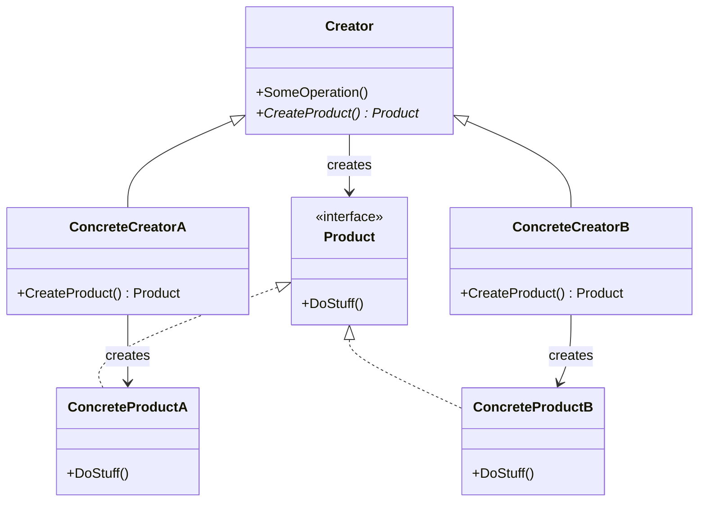
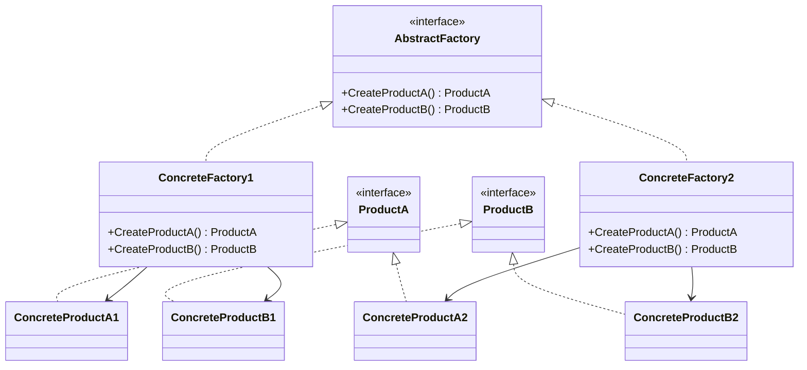
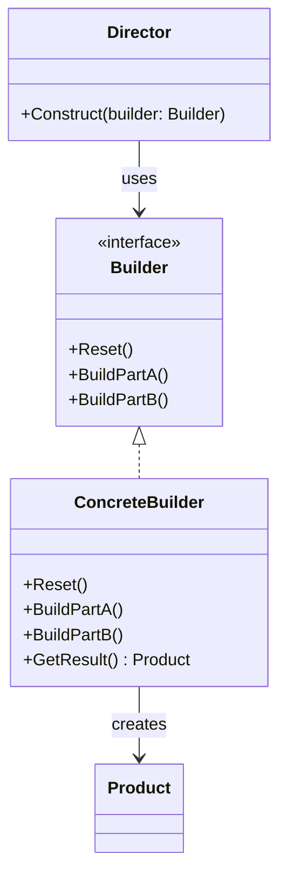
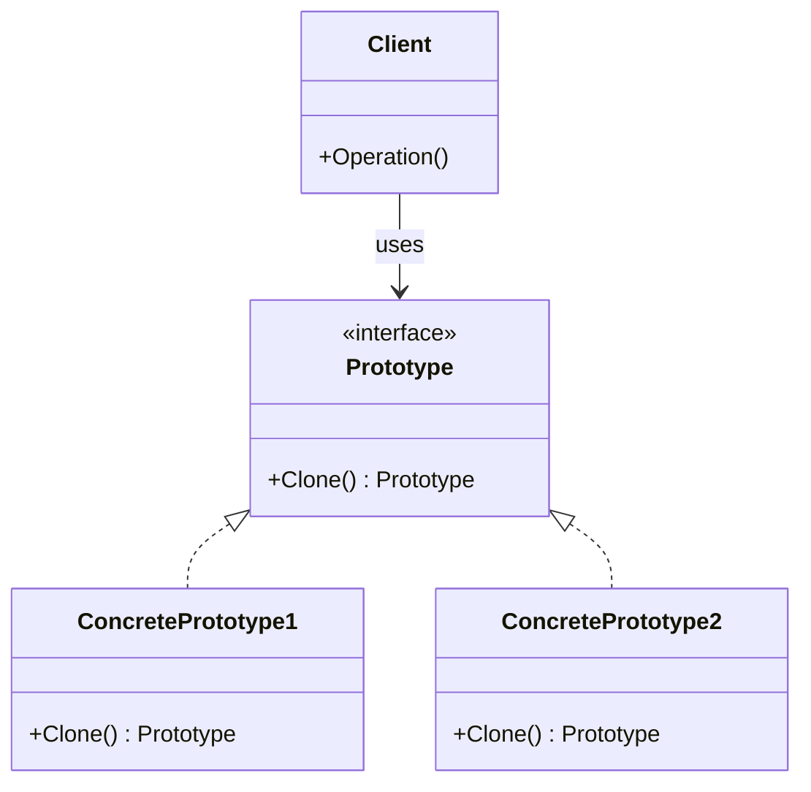
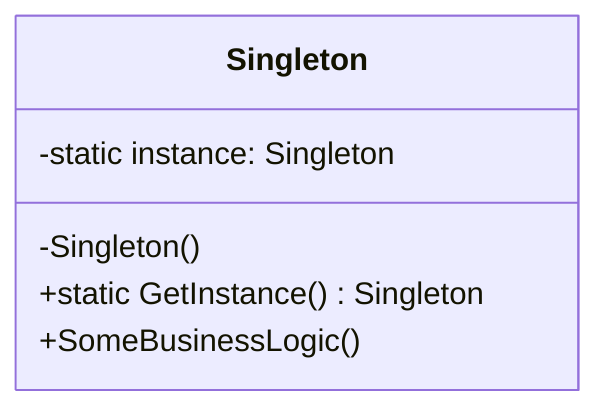
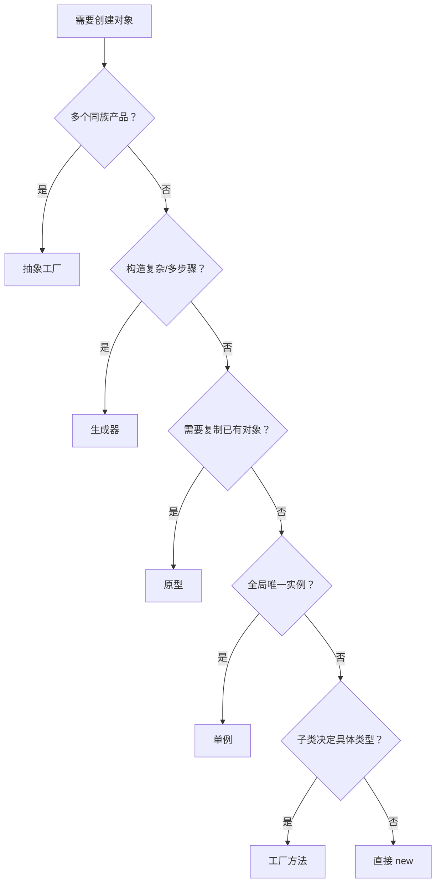

# 创建型设计模式

创建型模式关注**对象是如何创建的**。它们将对象的创建与使用分离，使得系统在创建什么、谁创建、何时创建、如何创建这些方面获得更大的灵活性。

GoF 定义了五种创建型模式，按抽象层次递进：

| 模式 | 核心思想 | 典型场景 |
|------|----------|----------|
| 工厂方法 | 子类决定实例化哪个类 | 框架中让用户扩展产品类型 |
| 抽象工厂 | 创建一系列相关对象 | 跨平台 UI 组件族 |
| 生成器 | 分步构造复杂对象 | 构建需要多步配置的对象 |
| 原型 | 克隆已有对象 | 对象创建成本高，需要副本 |
| 单例 | 全局唯一实例 | 配置管理、日志、连接池 |

---

## 1. 工厂方法模式 (Factory Method)

### 意图

定义一个用于创建对象的接口，但让子类决定实例化哪一个类。工厂方法使一个类的实例化延迟到其子类。

### 问题

直接使用 `new` 创建对象会与具体类耦合。当需要更换产品类型时，必须修改所有 `new` 调用的位置。

### 解决方案

将对象创建的代码抽取到一个独立的方法（工厂方法）中，子类可以通过重写该方法来改变所创建的产品类型。

> [!note] 关键约束
> 所有产品必须共享一个公共基类或接口。工厂方法的返回类型应声明为该公共接口，子类才能返回不同类型的产品。



### C# 示例

```csharp
// 产品接口
public interface ITransport
{
    void Deliver();
}

// 具体产品
public class Truck : ITransport
{
    public void Deliver() => Console.WriteLine("陆路卡车运输");
}

public class Ship : ITransport
{
    public void Deliver() => Console.WriteLine("海路船舶运输");
}

// 创建者基类
public abstract class Logistics
{
    // 工厂方法——子类决定创建什么
    protected abstract ITransport CreateTransport();

    // 模板方法：依赖工厂方法但不依赖具体产品
    public void PlanDelivery()
    {
        ITransport transport = CreateTransport();
        transport.Deliver();
    }
}

// 具体创建者
public class RoadLogistics : Logistics
{
    protected override ITransport CreateTransport() => new Truck();
}

public class SeaLogistics : Logistics
{
    protected override ITransport CreateTransport() => new Ship();
}

// 使用
var logistics = new RoadLogistics();
logistics.PlanDelivery(); // "陆路卡车运输"
```

### 与依赖注入的关系

工厂方法本身就是一种依赖注入形式：创建者依赖抽象产品接口，具体产品通过子类"注入"。在现代 C# 中，往往结合 DI 容器使用工厂委托：

```csharp
services.AddTransient<Func<TransportType, ITransport>>(sp => type => type switch
{
    TransportType.Road => new Truck(),
    TransportType.Sea => new Ship(),
    _ => throw new ArgumentOutOfRangeException()
});
```

---

## 2. 抽象工厂模式 (Abstract Factory)

### 意图

提供一个接口，用于创建一系列**相关或相互依赖**的对象，而无需指定它们的具体类。

### 问题

当系统需要创建一族相关联的产品（如 Windows 风格的按钮、文本框、窗口 vs macOS 风格的同族组件），如果每个产品都用工厂方法，会导致工厂数量爆炸且无法保证风格一致性。

### 解决方案

抽象工厂声明一族产品的创建方法，每个具体工厂实现该族产品的创建逻辑。客户端通过抽象接口操作，保证拿到的是同一风格/系列的产品。



### C# 示例：跨平台 UI 组件

```csharp
// 产品族接口
public interface IButton { void Render(); }
public interface ICheckbox { void Render(); }

// Windows 风格产品
public class WindowsButton : IButton {
    public void Render() => Console.WriteLine("渲染 Windows 风格按钮");
}
public class WindowsCheckbox : ICheckbox {
    public void Render() => Console.WriteLine("渲染 Windows 风格复选框");
}

// macOS 风格产品
public class MacButton : IButton {
    public void Render() => Console.WriteLine("渲染 macOS 风格按钮");
}
public class MacCheckbox : ICheckbox {
    public void Render() => Console.WriteLine("渲染 macOS 风格复选框");
}

// 抽象工厂
public interface IGUIFactory
{
    IButton CreateButton();
    ICheckbox CreateCheckbox();
}

// 具体工厂
public class WindowsFactory : IGUIFactory
{
    public IButton CreateButton() => new WindowsButton();
    public ICheckbox CreateCheckbox() => new WindowsCheckbox();
}

public class MacFactory : IGUIFactory
{
    public IButton CreateButton() => new MacButton();
    public ICheckbox CreateCheckbox() => new MacCheckbox();
}

// 客户端——只依赖抽象接口
public class Application
{
    private readonly IButton _button;
    private readonly ICheckbox _checkbox;

    public Application(IGUIFactory factory)
    {
        _button = factory.CreateButton();
        _checkbox = factory.CreateCheckbox();
    }

    public void Render()
    {
        _button.Render();
        _checkbox.Render();
    }
}

// 运行时根据平台选择工厂
IGUIFactory factory = RuntimeInformation.IsOSPlatform(OSPlatform.Windows)
    ? new WindowsFactory()
    : new MacFactory();
var app = new Application(factory);
app.Render();
```

### 与其他创建型模式的关系

- 抽象工厂通常由一组**工厂方法**构成——每个创建方法本质上是一个工厂方法
- 可与**生成器**结合：生成器分步构造，抽象工厂一次性返回一族产品
- 可用**单例**实现具体工厂实例
- 许多系统从工厂方法演化到抽象工厂，再根据需要引入原型或生成器

---

## 3. 生成器模式 (Builder)

### 意图

将复杂对象的构建与其表示分离，使得同样的构建过程可以创建不同的表示。

### 问题

当对象的构造需要大量参数（尤其是可选参数），或构造过程需要多个步骤时，使用含大量参数的构造函数（"重叠构造函数" / telescoping constructor）会导致代码难以阅读和维护。

### 解决方案

将对象构造代码从产品类中抽取到独立的**生成器**对象中，通过链式调用分步构建。可选引入**主管**（Director）类来封装常用的构建步骤序列。



### C# 示例：流畅建造者 (Fluent Builder)

现代 C# 中最实用的生成器变体——不使用 Director，通过流畅接口让客户端代码自描述：

```csharp
// 产品
public class Car
{
    public int Seats { get; set; }
    public string Engine { get; set; } = "";
    public bool HasTripComputer { get; set; }
    public bool HasGPS { get; set; }

    public override string ToString()
        => $"Car [Seats={Seats}, Engine={Engine}, "
         + $"Computer={HasTripComputer}, GPS={HasGPS}]";
}

// 流畅生成器
public class CarBuilder
{
    private readonly Car _car = new();

    public CarBuilder SetSeats(int count)
    {
        _car.Seats = count;
        return this;
    }

    public CarBuilder SetEngine(string engine)
    {
        _car.Engine = engine;
        return this;
    }

    public CarBuilder SetTripComputer(bool hasIt)
    {
        _car.HasTripComputer = hasIt;
        return this;
    }

    public CarBuilder SetGPS(bool hasIt)
    {
        _car.HasGPS = hasIt;
        return this;
    }

    public Car Build() => _car;
}

// 使用
var sportsCar = new CarBuilder()
    .SetSeats(2)
    .SetEngine("V8 Turbo")
    .SetTripComputer(true)
    .SetGPS(true)
    .Build();

var suv = new CarBuilder()
    .SetSeats(5)
    .SetEngine("V6 Hybrid")
    .SetTripComputer(true)
    .Build();

Console.WriteLine(sportsCar);
Console.WriteLine(suv);
```

### 分步生成器（含 Director）

当构建步骤的顺序是固定的——例如必须先设置底盘再安装引擎——Director 可以隐藏步骤细节：

```csharp
public class CarDirector
{
    public Car ConstructSportsCar(CarBuilder builder)
    {
        return builder.SetSeats(2)
                      .SetEngine("V8 Turbo")
                      .SetTripComputer(true)
                      .SetGPS(true)
                      .Build();
    }

    public Car ConstructSUV(CarBuilder builder)
    {
        return builder.SetSeats(5)
                      .SetEngine("V6 Hybrid")
                      .SetTripComputer(true)
                      .SetGPS(false)
                      .Build();
    }
}
```

> [!tip] C# 中的替代方案
> - **命名参数 + 可选参数**：简单场景下可用构造函数加可选参数替代 Builder
> - **`record` 类型 + `with` 表达式**：C# 9+ 的不可变类型配合 `with` 提供类似 Builder 的体验
> - **`IConfigurationBuilder`**：.NET 配置系统是 Builder 模式的经典应用

---

## 4. 原型模式 (Prototype)

### 意图

使用原型实例指定将要创建的对象类型，并通过复制这个原型创建新对象。

### 问题

当你需要创建一个与现有对象完全相同的副本时，直接复制成员变量会遇到两个问题：
1. 私有成员无法从对象外部访问
2. 必须知道对象的具体类型才能正确复制

### 解决方案

将克隆职责委托给对象自身。每个支持克隆的类实现 `Clone()` 方法并返回自身副本。



### C# 中的浅拷贝与深拷贝

C# 提供了内置的克隆机制。需要注意浅拷贝与深拷贝的区别：

```csharp
// ICloneable（不推荐——返回 object，且未明确浅/深语义）
public class Shape : ICloneable
{
    public int X { get; set; }
    public int Y { get; set; }
    public string Color { get; set; } = "";

    public object Clone() => MemberwiseClone(); // 浅拷贝
}

// 推荐：显式定义深拷贝方法
public class Rectangle : Shape
{
    public int Width { get; set; }
    public int Height { get; set; }

    // 复制构造函数——原型模式的核心
    public Rectangle() { }
    public Rectangle(Rectangle source)
    {
        X = source.X;
        Y = source.Y;
        Color = source.Color;
        Width = source.Width;
        Height = source.Height;
    }

    public Rectangle DeepClone() => new(this);
}

public class Circle : Shape
{
    public int Radius { get; set; }

    public Circle() { }
    public Circle(Circle source)
    {
        X = source.X;
        Y = source.Y;
        Color = source.Color;
        Radius = source.Radius;
    }

    public Circle DeepClone() => new(this);
}

// 使用
var circle = new Circle { X = 10, Y = 10, Radius = 20, Color = "Red" };
var clone = circle.DeepClone();
// clone 是一个完全独立的副本，修改 clone 不影响 circle
```

### C# 内置序列化深拷贝

对于复杂对象图，可使用序列化实现深拷贝：

```csharp
using System.Text.Json;

public static T DeepCopy<T>(T source)
{
    var json = JsonSerializer.Serialize(source);
    return JsonSerializer.Deserialize<T>(json)!;
}
```

> [!warning] 注意
> JSON 序列化不保留引用关系和循环引用。对于含循环引用的对象图，需使用 `ReferenceHandler.Preserve` 或专门的克隆库。

### 优点与局限

| 优点 | 局限 |
|------|------|
| 无需与具体类耦合即可克隆 | 包含循环引用的对象克隆困难 |
| 避免反复运行初始化代码 | `Clone()` 的浅/深语义必须明确定义 |
| 更便捷地生成复杂对象 | 克隆中初始化的顺序依赖需要小心 |
| 可替代继承来处理配置差异 | — |

---

## 5. 单例模式 (Singleton)

### 意图

保证一个类仅有一个实例，并提供一个访问它的全局访问点。

### 问题

某些类应当在整个应用程序中只存在一个实例（如数据库连接池、配置管理器、日志记录器）。如果通过 `new` 随意创建，会导致状态不一致和资源浪费。

### 解决方案

- 将构造函数设为 `private`，阻止外部 `new`
- 类自身持有其唯一实例的静态引用
- 通过静态方法/属性暴露该实例



### C# 实现演进

#### 版本 1：简单懒加载（线程不安全）

```csharp
// ❌ 多线程环境下可能创建多个实例
public sealed class Singleton
{
    private static Singleton? _instance;

    private Singleton() { }

    public static Singleton Instance
    {
        get
        {
            _instance ??= new Singleton();
            return _instance;
        }
    }
}
```

#### 版本 2：加锁（线程安全但性能差）

```csharp
public sealed class Singleton
{
    private static Singleton? _instance;
    private static readonly object _lock = new();

    private Singleton() { }

    public static Singleton Instance
    {
        get
        {
            lock (_lock)
            {
                _instance ??= new Singleton();
                return _instance;
            }
        }
    }
}
```

#### 版本 3：双重检查锁定 (Double-Check Locking)

只在实例未创建时才加锁，减少锁竞争开销：

```csharp
public sealed class Singleton
{
    private static Singleton? _instance;
    private static readonly object _lock = new();

    private Singleton() { }

    public static Singleton Instance
    {
        get
        {
            if (_instance is null)
            {
                lock (_lock)
                {
                    _instance ??= new Singleton();
                }
            }
            return _instance;
        }
    }
}
```

> [!warning] 内存模型与 volatile
> 在没有 `volatile` 关键字的情况下，由于指令重排序和 CPU 缓存，双重检查锁定可能存在隐患。.NET 2.0+ 的内存模型使上述写法安全，但更保险的做法是使用 `volatile` 或直接用方案 4。

#### 版本 4：静态构造函数（推荐）

```csharp
// CLR 保证静态构造函数只执行一次，且线程安全
public sealed class Singleton
{
    public static Singleton Instance { get; } = new();

    private Singleton() { }
}
```

#### 版本 5：`Lazy<T>`（.NET 4+，推荐用于延迟初始化）

```csharp
public sealed class Singleton
{
    private static readonly Lazy<Singleton> _lazy =
        new(() => new Singleton());

    public static Singleton Instance => _lazy.Value;

    private Singleton() { }
}
```

`Lazy<T>` 默认 `LazyThreadSafetyMode.ExecutionAndPublication`——只有一个线程运行工厂方法，其他线程等待结果。

#### 版本 6：泛型单例基类

```csharp
public abstract class SingletonBase<T> where T : class
{
    private static readonly Lazy<T> _lazy =
        new(() => (T)Activator.CreateInstance(typeof(T), nonPublic: true)!);

    public static T Instance => _lazy.Value;
}

// 使用
public sealed class ConfigManager : SingletonBase<ConfigManager>
{
    private ConfigManager() { } // private ctor required
    public string ConnectionString { get; set; } = "default";
}
```

### 单例 vs 依赖注入

单例模式与 DI 容器的 `Singleton` 生命周期是不同概念：

| | GoF 单例 | DI 单例 |
|--|----------|---------|
| 控制权 | 类自身管理生命周期 | 容器管理生命周期 |
| 耦合度 | 调用方直接引用 `Singleton.Instance` | 通过接口注入，调用方不知实例来源 |
| 测试性 | 难以替换为 mock | 易于替换 |
| 推荐度 | 仅用于少量必要场景 | 优先使用 |

> [!tip] 推荐
> 在 .NET 应用中，优先使用 DI 容器的 `AddSingleton<T>()` 注册，让容器管理唯一实例。仅在无法使用 DI 的场景（如静态工具类）下才考虑 GoF 单例。

---

## 模式选择指南


