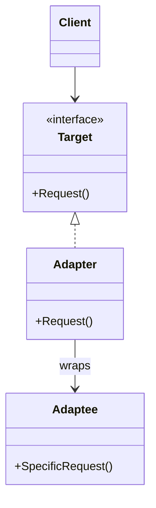
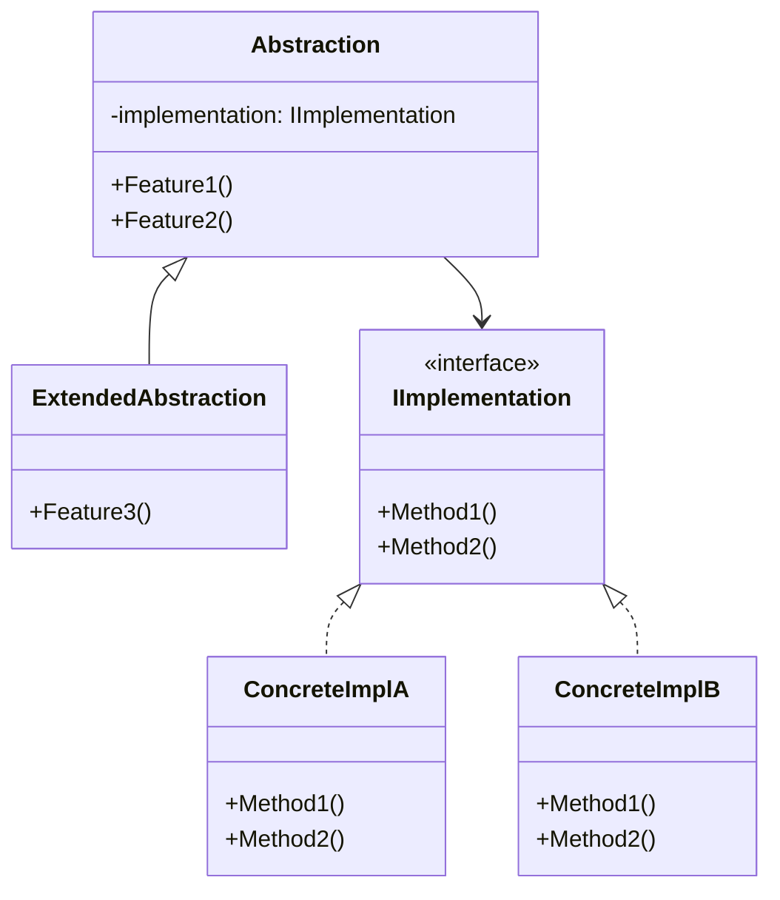
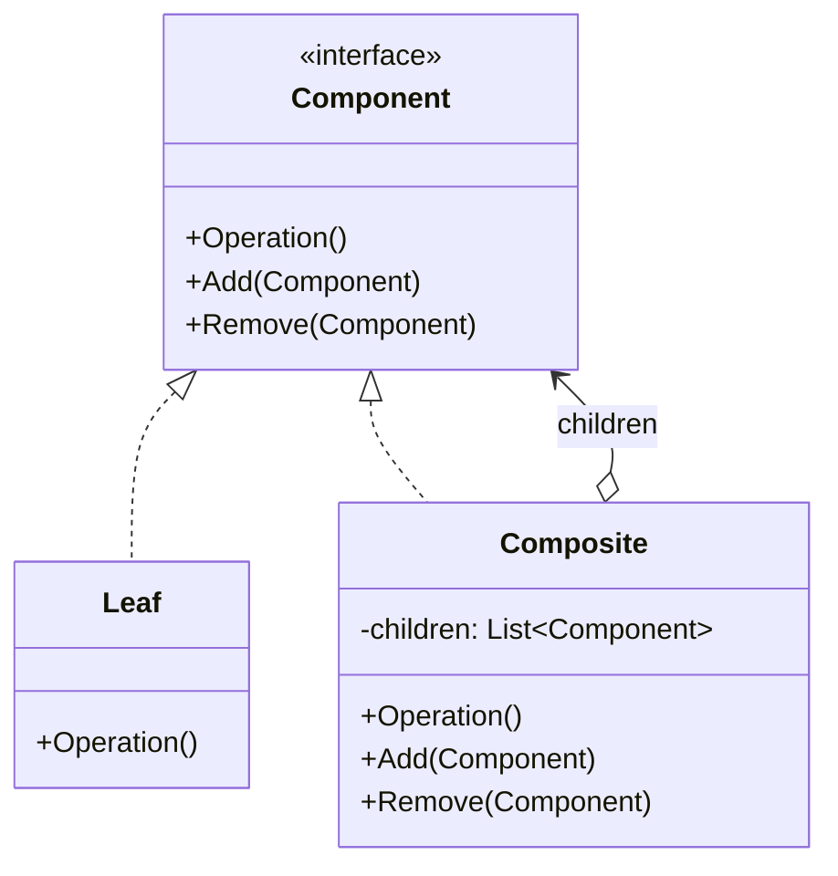
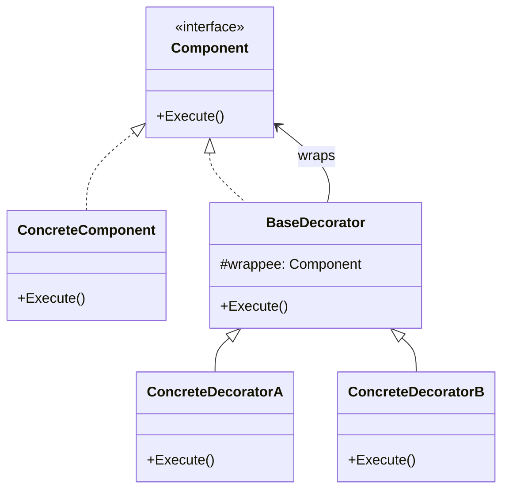
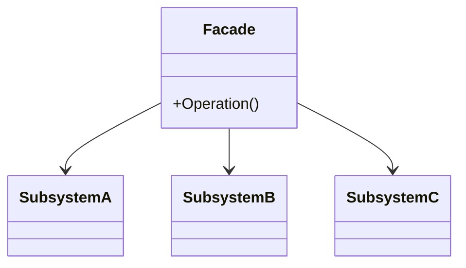
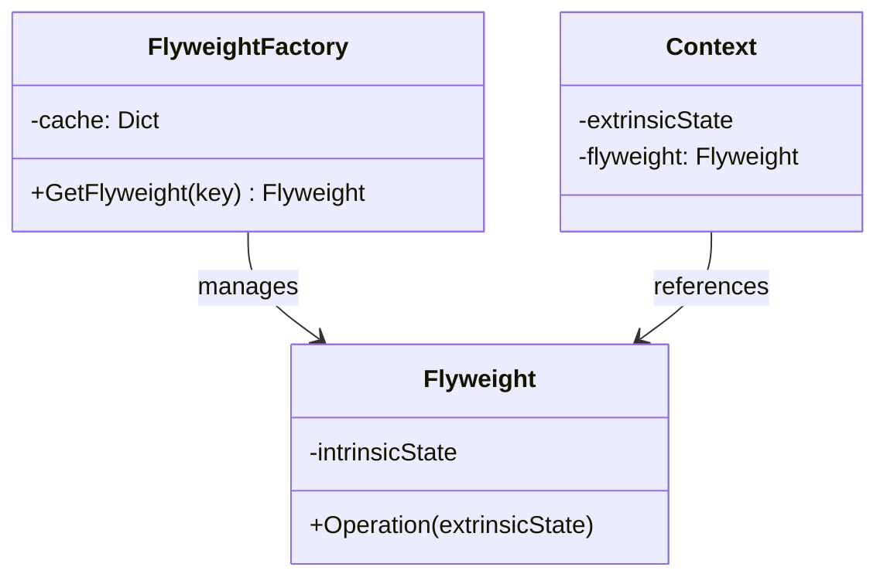
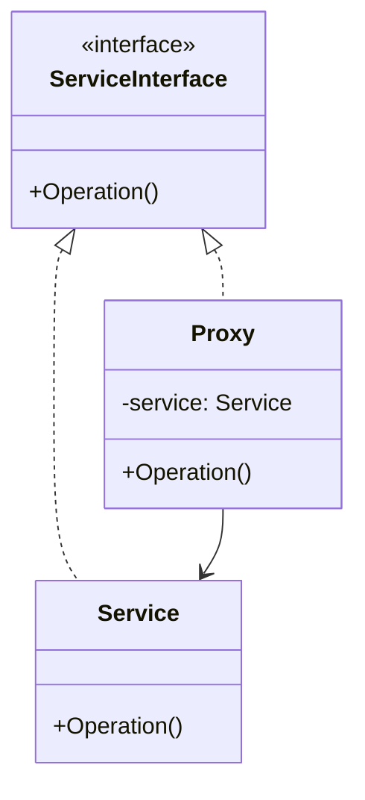
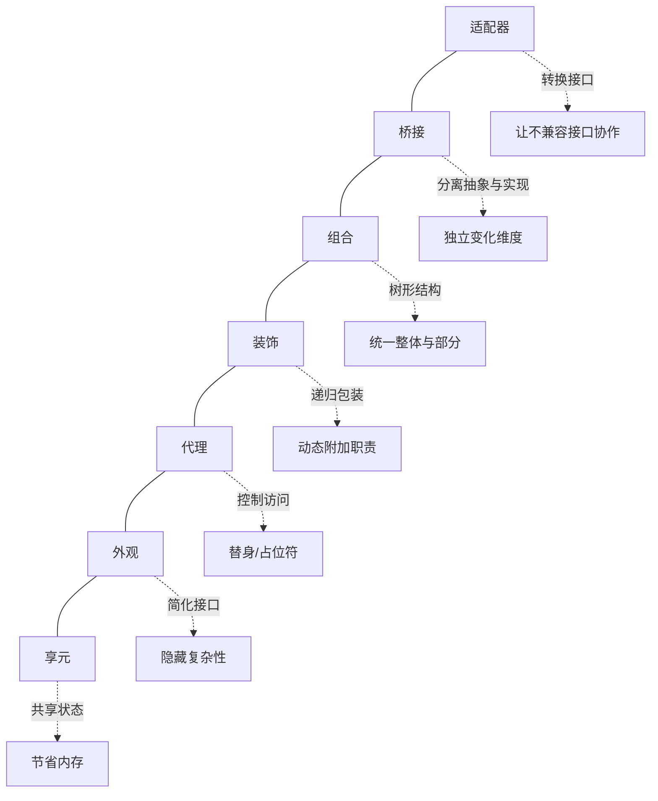

# 结构型设计模式

结构型模式解释如何将对象和类组装成较大的结构，同时保持结构的灵活和高效。它们通过识别实体之间的关系来简化设计。

| 模式 | 核心思想 | 典型场景 |
|------|----------|----------|
| 适配器 | 转换接口，使不兼容的类可以协作 | 集成第三方库、遗留系统 |
| 桥接 | 将抽象与实现分离，各自独立变化 | 跨平台 UI 框架 |
| 组合 | 将对象组织为树形结构，统一对待整体与部分 | 文件系统、GUI 组件层级 |
| 装饰 | 动态地为对象附加额外职责 | I/O 流、中间件管道 |
| 外观 | 为复杂子系统提供简单接口 | Video/Audio 转换库封装 |
| 享元 | 共享大量细粒度对象以节省内存 | 文字编辑器字符渲染、游戏粒子系统 |
| 代理 | 为另一个对象提供替代或占位符 | 延迟加载、访问控制、远程调用、缓存 |

---

## 1. 适配器模式 (Adapter)

### 意图

将一个类的接口转换成客户端期望的另一个接口。适配器让原本接口不兼容的类能够合作。

### 问题

需要集成第三方库或遗留代码，但其接口与当前系统不兼容。无法修改原有代码（或不应修改）。

### 解决方案

创建一个适配器类，实现客户端期望的接口，内部包装被适配对象并完成调用转换。



### C# 示例：将方钉适配为圆孔

```csharp
// 目标接口——系统期望的接口
public interface IRoundPeg
{
    double Radius { get; }
}

// 已有的兼容类
public class RoundPeg : IRoundPeg
{
    public double Radius { get; }

    public RoundPeg(double radius) => Radius = radius;
}

// 已有的圆孔类——依赖 IRoundPeg
public class RoundHole
{
    public double Radius { get; }

    public RoundHole(double radius) => Radius = radius;

    public bool Fits(IRoundPeg peg) => Radius >= peg.Radius;
}

// 不兼容的类——方钉
public class SquarePeg
{
    public double Width { get; }

    public SquarePeg(double width) => Width = width;
}

// 适配器——将 SquarePeg 适配为 IRoundPeg
public class SquarePegAdapter : IRoundPeg
{
    private readonly SquarePeg _peg;

    public SquarePegAdapter(SquarePeg peg) => _peg = peg;

    // 外接圆半径 = 宽度 * sqrt(2) / 2
    public double Radius => _peg.Width * Math.Sqrt(2) / 2;
}

// 使用
var hole = new RoundHole(5);
var roundPeg = new RoundPeg(5);
Console.WriteLine(hole.Fits(roundPeg)); // True

var smallSquare = new SquarePeg(5);
var largeSquare = new SquarePeg(10);

var smallAdapter = new SquarePegAdapter(smallSquare);
var largeAdapter = new SquarePegAdapter(largeSquare);

Console.WriteLine(hole.Fits(smallAdapter)); // True
Console.WriteLine(hole.Fits(largeAdapter)); // False
```

### 对象适配器 vs 类适配器

- **对象适配器**（推荐）：通过组合持有被适配对象——更灵活，可适配该类的所有子类
- **类适配器**（需要多重继承）：通过继承同时获得目标接口和被适配类的行为——C# 不支持，只能通过接口+继承近似模拟

---

## 2. 桥接模式 (Bridge)

### 意图

将抽象部分与它的实现部分分离，使它们都可以独立地变化。

### 问题

当类在两个独立维度上扩展时（如形状 × 颜色），使用继承会导致子类数量爆炸——m 种形状 × n 种颜色 = m×n 个子类。

### 解决方案

将其中一个维度抽取为独立的类层次（"实现"），然后让原始层次（"抽象"）持有对它的引用。通过组合替代继承。



### C# 示例：遥控器与设备

```csharp
// 实现部分——设备接口
public interface IDevice
{
    bool IsEnabled { get; }
    void Enable();
    void Disable();
    int Volume { get; set; }
    int Channel { get; set; }
}

public class TV : IDevice
{
    public bool IsEnabled { get; private set; }
    public int Volume { get; set; } = 30;
    public int Channel { get; set; } = 1;

    public void Enable() => IsEnabled = true;
    public void Disable() => IsEnabled = false;

    public override string ToString() => $"TV [Enabled={IsEnabled}, Vol={Volume}, Ch={Channel}]";
}

public class Radio : IDevice
{
    public bool IsEnabled { get; private set; }
    public int Volume { get; set; } = 20;
    public int Channel { get; set; } = 88;

    public void Enable() => IsEnabled = true;
    public void Disable() => IsEnabled = false;

    public override string ToString() => $"Radio [Enabled={IsEnabled}, Vol={Volume}, Ch={Channel}]";
}

// 抽象部分——遥控器
public class RemoteControl
{
    protected IDevice Device;

    public RemoteControl(IDevice device) => Device = device;

    public void TogglePower()
    {
        if (Device.IsEnabled) Device.Disable();
        else Device.Enable();
    }

    public void VolumeDown() => Device.Volume -= 10;
    public void VolumeUp() => Device.Volume += 10;
    public void ChannelDown() => Device.Channel--;
    public void ChannelUp() => Device.Channel++;
}

// 扩展抽象——高级遥控器
public class AdvancedRemoteControl : RemoteControl
{
    public AdvancedRemoteControl(IDevice device) : base(device) { }

    public void Mute() => Device.Volume = 0;
}

// 使用
var tv = new TV();
var remote = new RemoteControl(tv);
remote.TogglePower();
remote.VolumeUp();
Console.WriteLine(tv); // TV [Enabled=True, Vol=40, Ch=1]

var radio = new Radio();
var advRemote = new AdvancedRemoteControl(radio);
advRemote.TogglePower();
advRemote.Mute();
Console.WriteLine(radio); // Radio [Enabled=True, Vol=0, Ch=88]
```

---

## 3. 组合模式 (Composite)

### 意图

将对象组合成树形结构以表示"部分—整体"的层次结构。组合模式使客户端对单个对象和组合对象的使用具有一致性。

### 问题

当核心模型可以用树形结构表示时（如 GUI 控件容器包含控件，容器本身也是控件），客户端需要区分子节点和叶节点，导致代码充满类型判断。

### 解决方案

定义一个通用接口，叶节点和组合节点都实现该接口。组合节点内部管理子节点集合并将调用递归委派给子节点。



### C# 示例：图形编辑器

```csharp
// 组件接口
public interface IGraphic
{
    void Move(int dx, int dy);
    void Draw();
}

// 叶节点——点
public class Dot : IGraphic
{
    public int X { get; private set; }
    public int Y { get; private set; }

    public Dot(int x, int y) { X = x; Y = y; }

    public void Move(int dx, int dy) { X += dx; Y += dy; }
    public void Draw() => Console.WriteLine($"  Dot at ({X}, {Y})");
}

// 叶节点——圆
public class Circle : IGraphic
{
    public int X { get; private set; }
    public int Y { get; private set; }
    public int Radius { get; }

    public Circle(int x, int y, int r) { X = x; Y = y; Radius = r; }

    public void Move(int dx, int dy) { X += dx; Y += dy; }
    public void Draw() => Console.WriteLine($"  Circle at ({X}, {Y}) r={Radius}");
}

// 组合节点
public class CompoundGraphic : IGraphic
{
    private readonly List<IGraphic> _children = new();

    public void Add(IGraphic child) => _children.Add(child);
    public void Remove(IGraphic child) => _children.Remove(child);

    public void Move(int dx, int dy)
    {
        foreach (var child in _children)
            child.Move(dx, dy);
    }

    public void Draw()
    {
        Console.WriteLine("Group {");
        foreach (var child in _children)
            child.Draw();
        Console.WriteLine("}");
    }
}

// 使用
var all = new CompoundGraphic();
all.Add(new Dot(1, 2));
all.Add(new Circle(5, 3, 10));

var subGroup = new CompoundGraphic();
subGroup.Add(new Dot(10, 10));
subGroup.Add(new Dot(20, 20));
all.Add(subGroup);

all.Draw();
// Group {
//   Dot at (1, 2)
//   Circle at (5, 3) r=10
//   Group {
//     Dot at (10, 10)
//     Dot at (20, 20)
//   }
// }

all.Move(5, 5); // 递归移动所有节点
```

---

## 4. 装饰模式 (Decorator)

### 意图

动态地给一个对象添加一些额外的职责。就扩展功能而言，装饰模式比生成子类更为灵活。

### 问题

需要在不修改现有类的情况下为对象添加行为。通过继承添加功能会导致子类数量爆炸——加密 + 压缩 = EncryptionCompressionDataStream 等组合。

### 解决方案

创建装饰器类，实现与被装饰对象相同的接口，内部包装被装饰对象并在调用前后添加行为。装饰器可以嵌套形成栈结构。



### C# 示例：可组合的数据流

```csharp
// 组件接口
public interface IDataSource
{
    void WriteData(string data);
    string ReadData();
}

// 具体组件
public class FileDataSource : IDataSource
{
    private readonly string _filename;

    public FileDataSource(string filename) => _filename = filename;

    public void WriteData(string data)
    {
        File.WriteAllText(_filename, data);
        Console.WriteLine($"  [File] Wrote '{data}' to {_filename}");
    }

    public string ReadData()
    {
        var data = File.Exists(_filename) ? File.ReadAllText(_filename) : "";
        Console.WriteLine($"  [File] Read '{data}' from {_filename}");
        return data;
    }
}

// 装饰基类
public abstract class DataSourceDecorator : IDataSource
{
    protected readonly IDataSource Wrappee;

    protected DataSourceDecorator(IDataSource source) => Wrappee = source;

    public virtual void WriteData(string data) => Wrappee.WriteData(data);
    public virtual string ReadData() => Wrappee.ReadData();
}

// 加密装饰器
public class EncryptionDecorator : DataSourceDecorator
{
    public EncryptionDecorator(IDataSource source) : base(source) { }

    public override void WriteData(string data)
    {
        var encrypted = Convert.ToBase64String(
            System.Text.Encoding.UTF8.GetBytes(data));
        base.WriteData(encrypted);
    }

    public override string ReadData()
    {
        var encrypted = base.ReadData();
        return System.Text.Encoding.UTF8.GetString(
            Convert.FromBase64String(encrypted));
    }
}

// 压缩装饰器（模拟）
public class CompressionDecorator : DataSourceDecorator
{
    public CompressionDecorator(IDataSource source) : base(source) { }

    public override void WriteData(string data)
    {
        var compressed = $"[ZIP]{data}[/ZIP]";
        base.WriteData(compressed);
    }

    public override string ReadData()
    {
        var compressed = base.ReadData();
        return compressed.Replace("[ZIP]", "").Replace("[/ZIP]", "");
    }
}

// 使用——装饰器栈
IDataSource source = new FileDataSource("data.txt");
source.WriteData("Hello");
// [File] Wrote 'Hello' to data.txt

// 加一层压缩
source = new CompressionDecorator(source);
source.WriteData("Hello");
// [File] Wrote '[ZIP]Hello[/ZIP]' to data.txt

// 再加一层加密（先压缩后加密）
source = new EncryptionDecorator(source);
source.WriteData("Hello");
// [File] Wrote 'W1pJUF1IZWxsb1svWklQXQ==' to data.txt

// 读取时自动解密→解压
var result = source.ReadData();
Console.WriteLine($"Result: {result}"); // "Hello"
```

---

## 5. 外观模式 (Facade)

### 意图

为子系统中的一组接口提供一个统一的高层接口，使子系统更容易使用。

### 问题

客户端需要与一个复杂库/框架交互，其中涉及多个类的初始化、依赖管理和调用顺序。直接使用导致客户端与子系统紧密耦合。

### 解决方案

创建一个外观类，对客户端暴露简洁的接口，在内部管理子系统对象的交互。



### C# 示例：视频转换

```csharp
// 复杂的第三方视频转换框架（简化模拟）
public class VideoFile
{
    public string Filename { get; }
    public VideoFile(string filename) => Filename = filename;
}

public class CodecFactory
{
    public string Extract(VideoFile file) =>
        file.Filename.EndsWith(".mp4") ? "mp4" : "ogg";
}

public class BitrateReader
{
    public static string Read(string filename, string codec)
        => $"raw_data_from_{filename}_{codec}";

    public static string Convert(string buffer, string destCodec)
        => $"{buffer}_to_{destCodec}";
}

public class AudioMixer
{
    public string Fix(string result) => $"fixed_{result}";
}

// 外观——对外暴露简单接口，隐藏内部复杂性
public class VideoConverter
{
    public FileInfo Convert(string filename, string format)
    {
        var file = new VideoFile(filename);
        var sourceCodec = new CodecFactory().Extract(file);
        var destCodec = format == "mp4" ? "mp4" : "ogg";

        var buffer = BitrateReader.Read(filename, sourceCodec);
        var result = BitrateReader.Convert(buffer, destCodec);
        result = new AudioMixer().Fix(result);

        Console.WriteLine($"Converted {filename} -> {result}.{format}");
        return new FileInfo($"{result}.{format}");
    }
}

// 使用——客户端只需与 Facade 交互
var converter = new VideoConverter();
var mp4 = converter.Convert("input.ogg", "mp4");
```

> [!tip] 外观 vs 中介者
> 外观是**单向**的简化——客户端通过外观调用子系统，外观不管理子系统内部的通信。
> 中介者限制子系统组件之间的**多对多**直接通信，改为通过中介者进行。

---

## 6. 享元模式 (Flyweight)

### 意图

摒弃在每个对象中保存所有数据的方式，通过共享多个对象共有的相同状态，在有限内存中容纳更多对象。

### 问题

当创建大量相似对象时（如游戏中的粒子、文字编辑器中的字符），每个对象都保存完整的属性数据导致内存耗尽。

### 解决方案

将对象状态分为两部分：

- **内在状态 (Intrinsic)**：不变的、可共享的数据（如粒子的颜色和纹理）
- **外在状态 (Extrinsic)**：随场景变化的数据（如粒子的位置和速度），由客户端维护

享元对象仅持有内在状态，并被多个上下文共享。



### C# 示例：森林中的树

```csharp
// 享元——内在状态（纹理、颜色等重复数据）
public class TreeType
{
    public string Name { get; }
    public string Color { get; }
    public string Texture { get; }

    public TreeType(string name, string color, string texture)
    {
        Name = name;
        Color = color;
        Texture = texture;
    }

    public void Draw(int x, int y)
    {
        Console.WriteLine($"  Tree[{Name}, {Color}, {Texture}] at ({x}, {y})");
    }
}

// 享元工厂
public class TreeFactory
{
    private static readonly Dictionary<string, TreeType> _types = new();

    public static TreeType GetTreeType(string name, string color, string texture)
    {
        var key = $"{name}_{color}_{texture}";
        if (!_types.ContainsKey(key))
        {
            _types[key] = new TreeType(name, color, texture);
            Console.WriteLine($"  [Factory] Created new TreeType: {key}");
        }
        return _types[key];
    }
}

// 上下文对象——体积很小
public class Tree
{
    public int X { get; }
    public int Y { get; }
    private readonly TreeType _type;

    public Tree(int x, int y, TreeType type)
    {
        X = x; Y = y; _type = type;
    }

    public void Draw() => _type.Draw(X, Y);
}

// 森林——客户端
public class Forest
{
    private readonly List<Tree> _trees = new();

    public void PlantTree(int x, int y, string name, string color, string texture)
    {
        var type = TreeFactory.GetTreeType(name, color, texture);
        _trees.Add(new Tree(x, y, type));
    }

    public void Draw()
    {
        foreach (var tree in _trees)
            tree.Draw();
    }
}

// 使用——创建大量树，TreeType 被共享
var forest = new Forest();
forest.PlantTree(0, 0, "Oak", "Green", "oak.png");
forest.PlantTree(10, 5, "Oak", "Green", "oak.png");  // 复用 TreeType
forest.PlantTree(20, 0, "Pine", "DarkGreen", "pine.png");
forest.PlantTree(30, 5, "Oak", "Green", "oak.png");  // 复用 TreeType

forest.Draw();
// [Factory] Created new TreeType: Oak_Green_oak.png
// [Factory] Created new TreeType: Pine_DarkGreen_pine.png
// Tree[Oak, Green, oak.png] at (0, 0)
// Tree[Oak, Green, oak.png] at (10, 5)
// Tree[Pine, DarkGreen, pine.png] at (20, 0)
// Tree[Oak, Green, oak.png] at (30, 5)
```

> [!important] 不可变性
> 享元对象的状态由构造函数一次性初始化，不应暴露 setter 或 public 可变字段。由于享元被多处引用，任何修改都会产生难以追踪的副作用。

### 典型应用

- C# 的 `string.Intern()` —— 字符串驻留池
- .NET 的 `Type` 对象 —— 每种类型只有一个 `Type` 实例
- WPF/Brushes —— `Brushes.Red` 等预定义画刷

---

## 7. 代理模式 (Proxy)

### 意图

为另一个对象提供一个替身或占位符以控制对这个对象的访问。

### 问题

需要控制对某个对象的访问——延迟其创建（昂贵对象）、限制访问权限、处理远程通信、缓存结果等。直接修改原对象不可行或不应该。

### 解决方案

创建一个代理类，实现与服务对象相同的接口，客户端通过代理间接访问服务对象。代理在转发请求前后可添加额外行为。



### C# 示例：带缓存的视频下载代理

```csharp
// 服务接口
public interface IVideoService
{
    string[] ListVideos();
    string DownloadVideo(int id);
}

// 真实服务——代价高昂（网络请求）
public class VideoService : IVideoService
{
    public string[] ListVideos()
    {
        Console.WriteLine("  [Network] Fetching video list...");
        Thread.Sleep(500); // 模拟网络延迟
        return new[] { "Video1.mp4", "Video2.mp4", "Video3.mp4" };
    }

    public string DownloadVideo(int id)
    {
        Console.WriteLine($"  [Network] Downloading video {id}...");
        Thread.Sleep(1000); // 模拟下载
        return $"CONTENT_OF_VIDEO_{id}";
    }
}

// 缓存代理
public class CachedVideoService : IVideoService
{
    private readonly IVideoService _service;
    private string[]? _cachedList;
    private readonly Dictionary<int, string> _cachedVideos = new();

    public CachedVideoService(IVideoService service) => _service = service;

    public string[] ListVideos()
    {
        return _cachedList ??= _service.ListVideos();
    }

    public string DownloadVideo(int id)
    {
        if (!_cachedVideos.ContainsKey(id))
            _cachedVideos[id] = _service.DownloadVideo(id);
        return _cachedVideos[id];
    }
}

// 使用
IVideoService service = new VideoService();
IVideoService proxy = new CachedVideoService(service);

var list1 = proxy.ListVideos(); // 网络请求
var list2 = proxy.ListVideos(); // 缓存命中，无网络

proxy.DownloadVideo(1); // 网络请求
proxy.DownloadVideo(1); // 缓存命中
```

### 代理的六种变体

| 变体 | 用途 | C# 中常见例子 |
|------|------|-------------|
| 虚拟代理 | 延迟初始化重量级对象 | `Lazy<T>` |
| 保护代理 | 访问控制 | Authorization proxy |
| 远程代理 | 隐藏远程调用细节 | WCF client proxy, gRPC stub |
| 日志代理 | 记录请求日志 | Logging decorator (与装饰模式重叠) |
| 缓存代理 | 缓存请求结果 | `IMemoryCache` 包装 |
| 智能引用 | 引用计数，自动释放 | `WeakReference`, 连接池管理 |

> [!note] 代理 vs 装饰
> 代理控制**对对象的访问**（可能根本不允许访问），装饰为对象**添加行为**。
> 实践中代理常涉及资源管理（创建/销毁服务对象），而装饰器通常由客户端组装并传递。

---

## 模式关系总览


