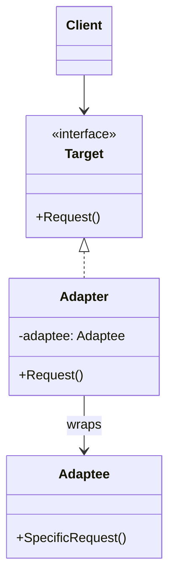
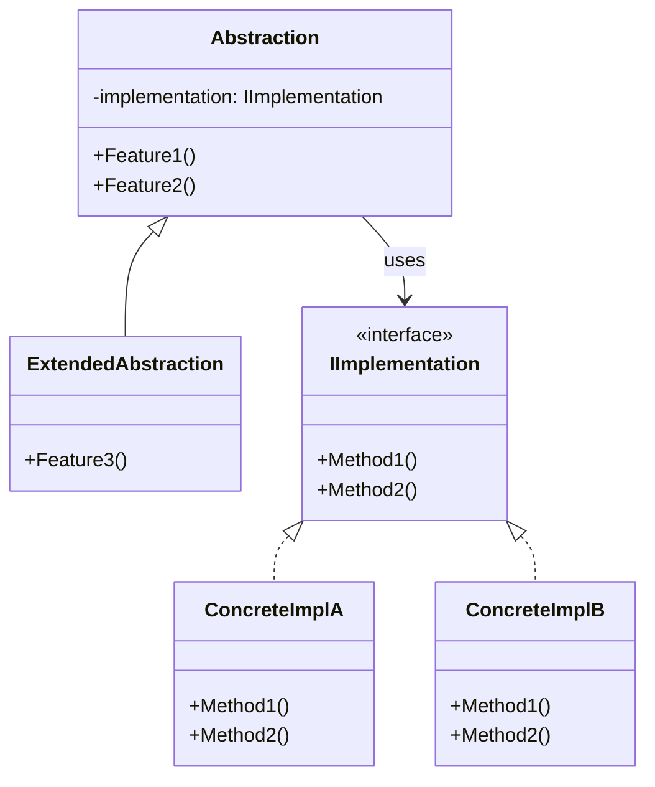
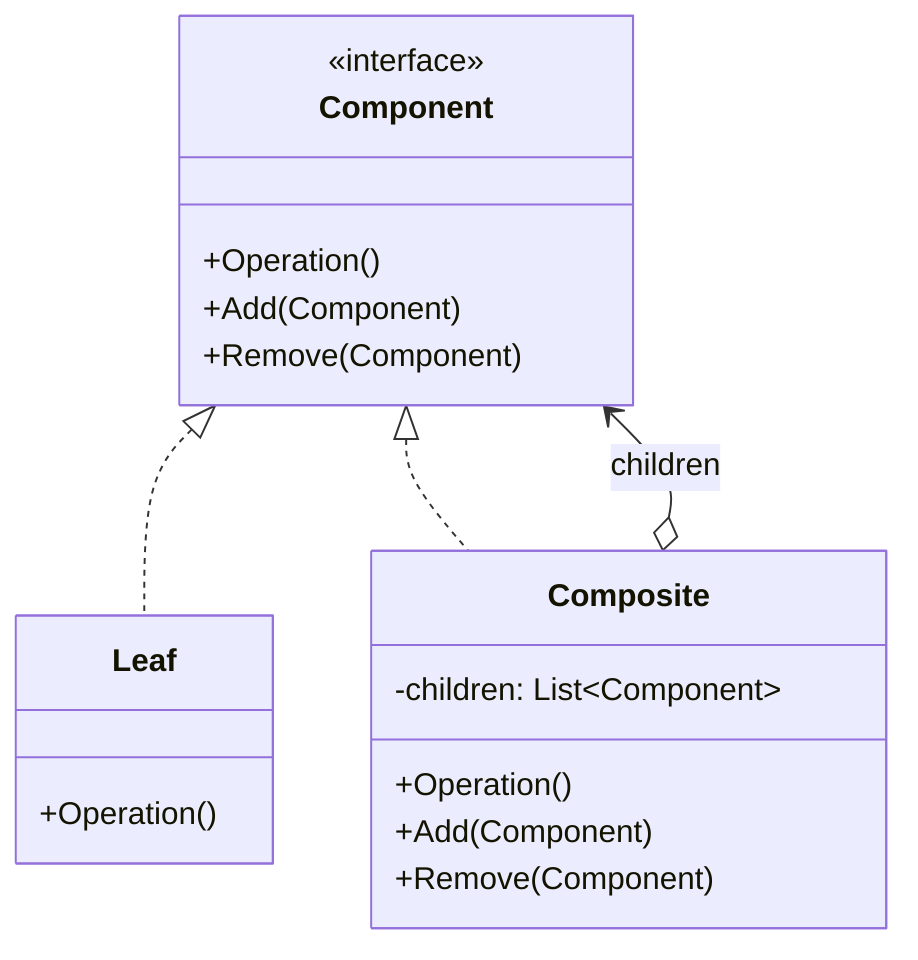
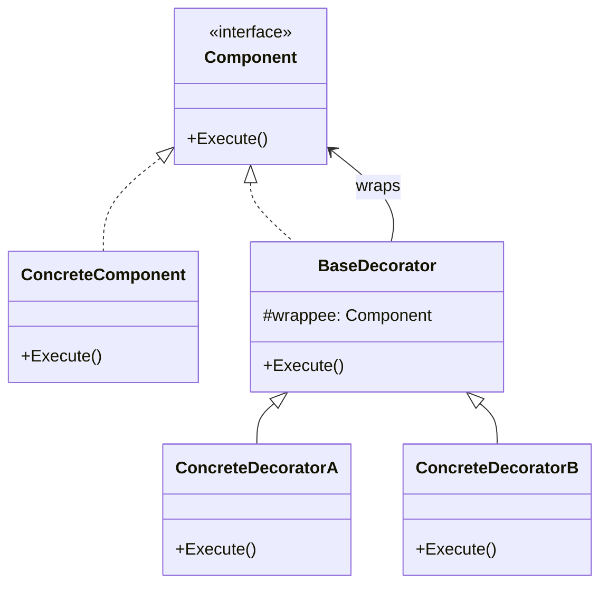
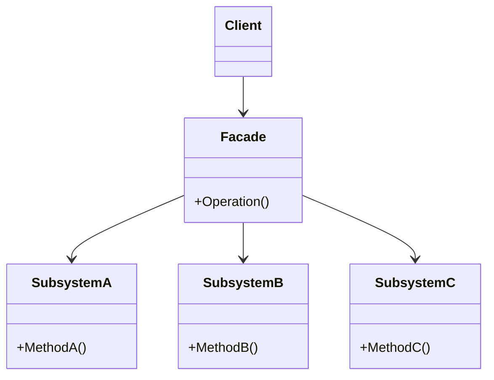
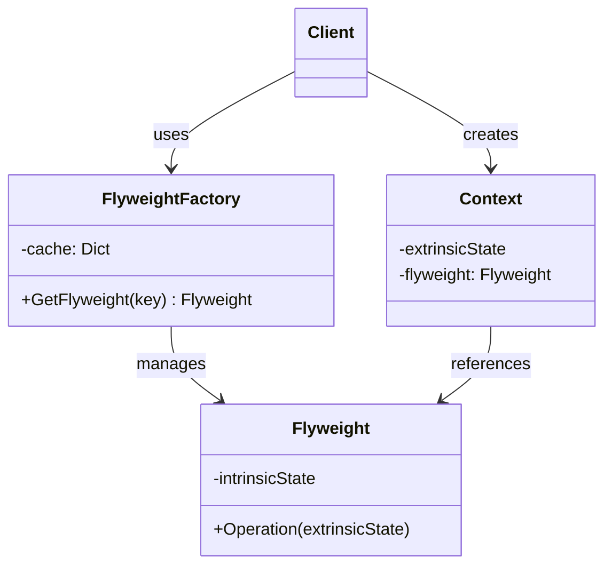
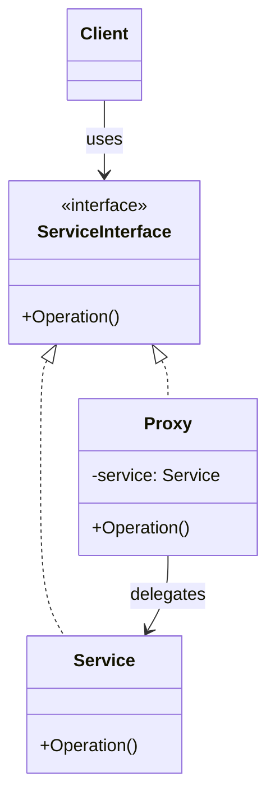
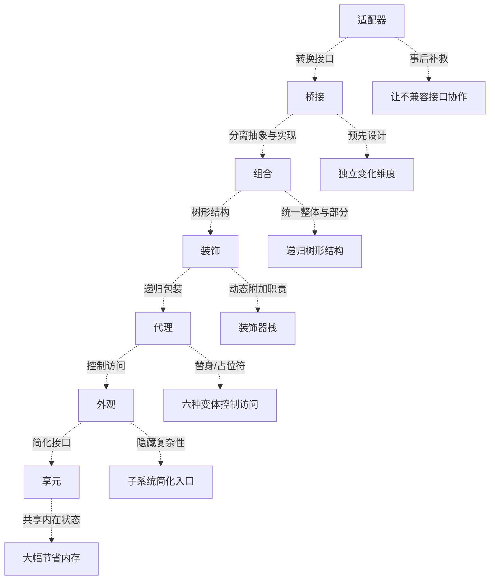

# 结构型设计模式

结构型模式解释如何将对象和类组装成较大的结构，同时保持结构的灵活和高效。它们通过识别实体之间的关系来简化设计。

| 模式 | 核心思想 | 一句话 |
|------|----------|--------|
| 适配器 | 转换接口，使不兼容的类协作 | 方钉适配圆孔 |
| 桥接 | 将抽象与实现分离，各自独立变化 | 遥控器 × 设备，独立扩展 |
| 组合 | 将对象组织为树形结构，统一对待整体与部分 | 文件夹可以包含文件和文件夹 |
| 装饰 | 动态地为对象附加额外职责 | 俄罗斯套娃式包装 |
| 外观 | 为复杂子系统提供简单接口 | 一键视频转换 |
| 享元 | 共享大量细粒度对象以节省内存 | 共用纹理的森林树木 |
| 代理 | 为另一个对象提供替代或占位符 | 缓存代理、虚拟代理 |

---

## 1. 适配器模式 (Adapter)

### Intent

将一个类的接口转换成客户端期望的另一个接口。适配器让原本接口不兼容的类能够合作。

**核心思想**：适配器实现与其中一个现有对象兼容的接口，现有对象通过该接口调用适配器方法，适配器将请求转换为被适配对象兼容的格式。有时甚至可以创建双向适配器实现双向转换。

### Structure



### Participants

| 角色 | 职责 |
|------|------|
| **Target** (接口) | 定义客户端使用的领域特定接口 |
| **Client** | 通过 Target 接口与对象协作 |
| **Adaptee** | 需要适配的已有类，其接口不兼容 Target |
| **Adapter** | 实现 Target 接口，内部包装 Adaptee，完成接口转换 |

### C# Example: 将方钉适配为圆孔

```csharp
// 目标接口——系统期望的接口
public interface IRoundPeg
{
    double Radius { get; }
}

// 已有的兼容类
public class RoundPeg : IRoundPeg
{
    public double Radius { get; }

    public RoundPeg(double radius) => Radius = radius;
}

// 已有的圆孔类——依赖 IRoundPeg
public class RoundHole
{
    public double Radius { get; }

    public RoundHole(double radius) => Radius = radius;

    public bool Fits(IRoundPeg peg) => Radius >= peg.Radius;
}

// 不兼容的类——方钉
public class SquarePeg
{
    public double Width { get; }

    public SquarePeg(double width) => Width = width;
}

// 适配器——将 SquarePeg 适配为 IRoundPeg
public class SquarePegAdapter : IRoundPeg
{
    private readonly SquarePeg _peg;

    public SquarePegAdapter(SquarePeg peg) => _peg = peg;

    // 外接圆半径 = 宽度 * sqrt(2) / 2
    public double Radius => _peg.Width * Math.Sqrt(2) / 2;
}

// 使用
var hole = new RoundHole(5);
var roundPeg = new RoundPeg(5);
Console.WriteLine(hole.Fits(roundPeg)); // True

var smallSquare = new SquarePeg(5);
var largeSquare = new SquarePeg(10);

var smallAdapter = new SquarePegAdapter(smallSquare);
var largeAdapter = new SquarePegAdapter(largeSquare);

Console.WriteLine(hole.Fits(smallAdapter)); // True
Console.WriteLine(hole.Fits(largeAdapter)); // False
```

### Applicability

**何时使用：**
- 需要集成第三方库或遗留代码，但其接口与当前系统不兼容
- 无法修改原有代码（或不应修改）——适配器在不改 Adaptee 的基础上解决问题
- 需要复用多个已有子类，但它们缺少公共功能——适配器统一接口

**何时不使用：**
- 可以修改 Adaptee 的接口——直接改比加适配器层更简单
- 接口差异很小——适配器引入不必要的间接层
- 可以改用 [[concepts/设计模式-结构型|桥接]] 预先设计——适配器是补救措施，桥接是前期设计

### Relations

- 与 [[concepts/设计模式-结构型|桥接]] 对比：适配器是**事后补救**（已有不兼容接口），桥接是**预先设计**（分离抽象与实现）
- 与 [[concepts/设计模式-结构型|装饰]] 对比：适配器**改变接口**，装饰**增强接口**（接口不变）
- 与 [[concepts/设计模式-结构型|外观]] 对比：适配器转换**一个**对象的接口，外观为**整个子系统**提供简化接口
- 与 [[concepts/设计模式-结构型|代理]] 对比：适配器提供**不同**接口，代理提供**相同**接口

### Variants

- **对象适配器**（C# 唯一可行方式）：通过组合持有被适配对象。更灵活，可适配该类的所有子类
- **类适配器**（需要多重继承）：通过继承同时获得 Target 和 Adaptee 的行为。C# 不支持，只能通过接口+继承近似模拟
- **双向适配器**：实现两个接口，在两个系统之间双向转换调用。适用于旧系统与新系统共存期

### Anti-patterns / Pitfalls

- **过度适配**：为每个不兼容的类都写适配器——考虑在边界处统一适配
- **适配器泄露**：适配器暴露了 Adaptee 的细节——适配器应完全封装转换逻辑
- **适配器链**：A 适配 B，B 适配 C——过多的间接层使调试困难

---

## 2. 桥接模式 (Bridge)

### Intent

将抽象部分与它的实现部分分离，使它们都可以独立地变化。

**核心思想**：问题的根本原因是在两个独立维度上扩展类（如形状 × 颜色）时，继承导致子类数量爆炸。桥接模式通过**将继承改为组合**——抽取其中一个维度成为独立的类层次——让初始类引用新层次的对象。抽象部分（接口）是高层控制层，实现部分是底层操作层。

### Structure



### Participants

| 角色 | 职责 |
|------|------|
| **Abstraction** | 定义高层控制接口；持有 Implementation 引用；委派工作给实现 |
| **ExtendedAbstraction** | 扩展抽象层——提供更丰富的控制功能 |
| **Implementation** (接口) | 声明底层操作的原语方法——与 Abstraction 接口可以完全不同 |
| **ConcreteImplementation** | 实现 Implementation 接口——提供平台/设备特定的具体实现 |

> [!note] 两个独立维度
> 一般来说，你可以在两个独立方向上扩展：
> - 开发多个不同的抽象（如基础遥控器 vs 高级遥控器）
> - 支持多个不同的实现（如 TV vs Radio，或 Windows vs macOS API）

### C# Example: 遥控器与设备

```csharp
// 实现部分——设备接口
public interface IDevice
{
    bool IsEnabled { get; }
    void Enable();
    void Disable();
    int Volume { get; set; }
    int Channel { get; set; }
}

public class TV : IDevice
{
    public bool IsEnabled { get; private set; }
    public int Volume { get; set; } = 30;
    public int Channel { get; set; } = 1;

    public void Enable() => IsEnabled = true;
    public void Disable() => IsEnabled = false;

    public override string ToString() =>
        $"TV [Enabled={IsEnabled}, Vol={Volume}, Ch={Channel}]";
}

public class Radio : IDevice
{
    public bool IsEnabled { get; private set; }
    public int Volume { get; set; } = 20;
    public int Channel { get; set; } = 88;

    public void Enable() => IsEnabled = true;
    public void Disable() => IsEnabled = false;

    public override string ToString() =>
        $"Radio [Enabled={IsEnabled}, Vol={Volume}, Ch={Channel}]";
}

// 抽象部分——遥控器
public class RemoteControl
{
    protected IDevice Device;

    public RemoteControl(IDevice device) => Device = device;

    public void TogglePower()
    {
        if (Device.IsEnabled) Device.Disable();
        else Device.Enable();
    }

    public void VolumeDown() => Device.Volume -= 10;
    public void VolumeUp() => Device.Volume += 10;
    public void ChannelDown() => Device.Channel--;
    public void ChannelUp() => Device.Channel++;
}

// 扩展抽象——高级遥控器（增加静音功能）
public class AdvancedRemoteControl : RemoteControl
{
    public AdvancedRemoteControl(IDevice device) : base(device) { }

    public void Mute() => Device.Volume = 0;
}

// 使用
var tv = new TV();
var remote = new RemoteControl(tv);
remote.TogglePower();
remote.VolumeUp();
Console.WriteLine(tv); // TV [Enabled=True, Vol=40, Ch=1]

var radio = new Radio();
var advRemote = new AdvancedRemoteControl(radio);
advRemote.TogglePower();
advRemote.Mute();
Console.WriteLine(radio); // Radio [Enabled=True, Vol=0, Ch=88]
```

### Applicability

**何时使用：**
- 希望在两个独立维度上扩展类——避免子类数量爆炸（m 个抽象 × n 个实现 = m×n 类 → m+n 类）
- 需要在运行时切换实现——通过 setter 更换 `Device` 对象
- 抽象和实现都通过子类化扩展——各自独立演化
- 希望实现部分对客户端完全隐藏

**何时不使用：**
- 只有一个变化维度——普通继承就够了
- 抽象和实现之间的映射关系固定不变——桥接引入不必要的复杂度
- 性能敏感的场景——多一层间接调用引入开销

### Relations

- 与 [[concepts/设计模式-结构型|适配器]] 对比：桥接是**预先设计**的分离；适配器是**事后补救**不兼容接口
- 与 [[concepts/设计模式-创建型|抽象工厂]] 结合：抽象工厂可以封装桥接中抽象与实现的配对关系
- 与 [[concepts/设计模式-行为型|策略]] 关系：桥接的结构与策略相似——两者都是组合接口引用。区别：桥接是**结构型**（分离抽象与实现），策略是**行为型**（封装可互换算法）
- .NET 经典案例：`Stream`（抽象）+ `TextReader`/`TextWriter`（另一层抽象），底层的 `FileStream` / `MemoryStream` 是具体实现

### Variants

- **退化桥接**：当只有一个实现时，桥接退化为普通的组合关系
- **分层桥接**：多个抽象层叠——`RemoteControl` → `TouchRemote` → `VoiceRemote`，每个层持有 Implementation 引用
- **DI 驱动的桥接**：通过 [[concepts/依赖注入|DI 容器]] 注入具体实现——切换注册即可切换底层实现

### Anti-patterns / Pitfalls

- **桥接过度**：只有一个实现类时强行桥接——等于多写了一套接口
- **抽象泄露**：Abstraction 的高层方法直接依赖 ConcreteImplementation 的方法名——抽象和实现应通过接口独立定义
- **接口不匹配**：Implementation 接口太细碎或太粗糙——应保持原语操作粒度

---

## 3. 组合模式 (Composite)

### Intent

将对象组合成树形结构以表示"部分—整体"的层次结构。组合模式使客户端对单个对象和组合对象的使用具有一致性。

**核心思想**：如果应用的核心模型能用树状结构表示，使用组合模式。最大优点在于你无需了解构成树状结构的对象的具体类——也无需了解对象是简单产品还是复杂容器，只需调用通用接口以相同方式处理即可。

### Structure



### Participants

| 角色 | 职责 |
|------|------|
| **Component** (接口) | 声明叶节点和组合节点的公共操作；可选定义子节点管理方法 |
| **Leaf** | 表示树的叶节点——没有子节点；完成实际工作 |
| **Composite** | 包含子组件（Component 集合）；将操作委派给子组件；管理子组件的添加/删除 |
| **Client** | 通过 Component 接口与所有对象交互，无需区分叶节点和组合节点 |

> [!note] 设计权衡
> 将 `Add`/`Remove` 放在 Component 接口中**透明性更好**（客户端完全一致），但**安全性更差**（叶节点上调用 `Add` 需抛出异常）。放在 Composite 中则相反。选择取决于你更看重透明性还是类型安全。

### C# Example: 图形编辑器

```csharp
// 组件接口
public interface IGraphic
{
    void Move(int dx, int dy);
    void Draw();
}

// 叶节点——点
public class Dot : IGraphic
{
    public int X { get; private set; }
    public int Y { get; private set; }

    public Dot(int x, int y) { X = x; Y = y; }

    public void Move(int dx, int dy) { X += dx; Y += dy; }
    public void Draw() => Console.WriteLine($"  Dot at ({X}, {Y})");
}

// 叶节点——圆
public class Circle : IGraphic
{
    public int X { get; private set; }
    public int Y { get; private set; }
    public int Radius { get; }

    public Circle(int x, int y, int r) { X = x; Y = y; Radius = r; }

    public void Move(int dx, int dy) { X += dx; Y += dy; }
    public void Draw() => Console.WriteLine($"  Circle at ({X}, {Y}) r={Radius}");
}

// 组合节点
public class CompoundGraphic : IGraphic
{
    private readonly List<IGraphic> _children = new();

    public void Add(IGraphic child) => _children.Add(child);
    public void Remove(IGraphic child) => _children.Remove(child);

    public void Move(int dx, int dy)
    {
        foreach (var child in _children)
            child.Move(dx, dy);
    }

    public void Draw()
    {
        Console.WriteLine("Group {");
        foreach (var child in _children)
            child.Draw();
        Console.WriteLine("}");
    }
}

// 使用
var all = new CompoundGraphic();
all.Add(new Dot(1, 2));
all.Add(new Circle(5, 3, 10));

var subGroup = new CompoundGraphic();
subGroup.Add(new Dot(10, 10));
subGroup.Add(new Dot(20, 20));
all.Add(subGroup);

all.Draw();
// Group {
//   Dot at (1, 2)
//   Circle at (5, 3) r=10
//   Group {
//     Dot at (10, 10)
//     Dot at (20, 20)
//   }
// }

all.Move(5, 5); // 递归移动所有节点
```

### Applicability

**何时使用：**
- 需要表示对象的"部分—整体"层次结构——如文件系统、GUI 组件树、组织架构
- 希望客户端忽略组合对象与单个对象的差异——统一处理容器和内容

**何时不使用：**
- 叶节点和组合节点的行为差异太大——强行统一接口导致叶节点有大量空实现
- 树结构简单且不需要递归操作——普通集合够用
- 类型安全比透明性更重要——将子节点管理方法放在 Composite 而非 Component 中

### Relations

- 与 [[concepts/设计模式-创建型|生成器]] 结合：生成器可用于分步构造组合树
- 与 [[concepts/设计模式-行为型|迭代器]] 结合：迭代器遍历组合树——深度优先/广度优先
- 与 [[concepts/设计模式-行为型|访问者]] 结合：访问者对组合树执行操作，访问者可跨节点累积状态
- 与 [[concepts/设计模式-结构型|装饰]] 对比：装饰是**包装单个对象**添加行为，组合是**聚合多个对象**形成树

### Variants

- **透明组合**：Component 接口包含 `Add`/`Remove`——叶节点抛出 `NotSupportedException`
- **安全组合**：Component 接口仅包含公共操作，`Add`/`Remove` 仅在 Composite 中定义——更类型安全
- **带父引用的组合**：子节点持有父节点引用——支持自底向上遍历和删除自身

### Anti-patterns / Pitfalls

- **Component 接口过重**：把所有可能的操作都放在 Component 中——叶节点满载无关方法
- **循环引用**：Composite 无意中将自身添加为自己的子节点——`Move`/`Draw` 栈溢出
- **类型转换**：客户端通过 `is Composite` 或 `as Leaf` 判断类型——破坏了透明性，违背组合模式初衷

---

## 4. 装饰模式 (Decorator)

### Intent

动态地给一个对象添加一些额外的职责。就扩展功能而言，装饰模式比生成子类更为灵活。

**核心思想**：通过将对象放入包含行为的特殊封装对象中，为原对象绑定新行为。所有装饰器实现与基础组件相同的接口——客户端代码不关心自己与"纯粹"对象还是装饰后对象交互。装饰器形成栈结构。

### Structure



### Participants

| 角色 | 职责 |
|------|------|
| **Component** (接口) | 定义被装饰对象和装饰器的公共接口 |
| **ConcreteComponent** | 提供操作的默认实现——被装饰的核心对象 |
| **BaseDecorator** (抽象类) | 持有 Component 引用（wrappee）；实现 Component 接口，将请求委派给 wrappee |
| **ConcreteDecorator** | 在调用 wrappee 前后添加额外行为 |

> [!note] 装饰器栈
> 实际与客户端交互的对象是最后一个进入栈中的装饰对象。由于所有装饰都实现了与基础组件相同的接口，客户端代码可以透明地使用装饰器。

### C# Example: 可组合的数据流

```csharp
// 组件接口
public interface IDataSource
{
    void WriteData(string data);
    string ReadData();
}

// 具体组件
public class FileDataSource : IDataSource
{
    private readonly string _filename;

    public FileDataSource(string filename) => _filename = filename;

    public void WriteData(string data)
    {
        File.WriteAllText(_filename, data);
        Console.WriteLine($"  [File] Wrote '{data}' to {_filename}");
    }

    public string ReadData()
    {
        var data = File.Exists(_filename) ? File.ReadAllText(_filename) : "";
        Console.WriteLine($"  [File] Read '{data}' from {_filename}");
        return data;
    }
}

// 装饰基类——委派给 wrappee
public abstract class DataSourceDecorator : IDataSource
{
    protected readonly IDataSource Wrappee;

    protected DataSourceDecorator(IDataSource source) => Wrappee = source;

    public virtual void WriteData(string data) => Wrappee.WriteData(data);
    public virtual string ReadData() => Wrappee.ReadData();
}

// 加密装饰器
public class EncryptionDecorator : DataSourceDecorator
{
    public EncryptionDecorator(IDataSource source) : base(source) { }

    public override void WriteData(string data)
    {
        var encrypted = Convert.ToBase64String(
            System.Text.Encoding.UTF8.GetBytes(data));
        base.WriteData(encrypted);
    }

    public override string ReadData()
    {
        var encrypted = base.ReadData();
        return System.Text.Encoding.UTF8.GetString(
            Convert.FromBase64String(encrypted));
    }
}

// 压缩装饰器（模拟）
public class CompressionDecorator : DataSourceDecorator
{
    public CompressionDecorator(IDataSource source) : base(source) { }

    public override void WriteData(string data)
    {
        var compressed = $"[ZIP]{data}[/ZIP]";
        base.WriteData(compressed);
    }

    public override string ReadData()
    {
        var compressed = base.ReadData();
        return compressed.Replace("[ZIP]", "").Replace("[/ZIP]", "");
    }
}

// 使用——装饰器栈
IDataSource source = new FileDataSource("data.txt");

// 加一层压缩
source = new CompressionDecorator(source);
source.WriteData("Hello");
// [File] Wrote '[ZIP]Hello[/ZIP]' to data.txt

// 再加一层加密（先压缩后加密）
source = new EncryptionDecorator(source);
source.WriteData("Hello");
// [File] Wrote 'W1pJUF1IZWxsb1svWklQXQ==' to data.txt

// 运行时根据配置组装装饰栈
public class ApplicationConfigurator
{
    public void Configure(bool enableEncryption, bool enableCompression)
    {
        IDataSource source = new FileDataSource("salary.dat");
        if (enableEncryption)
            source = new EncryptionDecorator(source);
        if (enableCompression)
            source = new CompressionDecorator(source);

        // 将装饰后的 source 传递给使用方
        var manager = new SalaryManager(source);
        manager.Save();
    }
}
```

### Applicability

**何时使用：**
- 需要在不修改现有类的情况下为对象添加行为——满足开闭原则
- 需要在运行时动态附加/撤销职责——装饰器可任意顺序组合
- 通过继承扩展会导致子类爆炸——m 个独立功能 → 2^m 个组合子类，装饰器只需 m 个

**何时不使用：**
- 对象行为的扩展是静态的、不会组合——直接继承更简单
- 装饰层数过多使调试困难——> 5 层考虑重构
- 组件接口很大且装饰器只需修改少量方法——每个装饰器都要转发所有其他方法
- ASP.NET Core 中间件或 `Stream` 装饰链已有现成模式——遵循框架约定

### Relations

- 与 [[concepts/设计模式-结构型|代理]] 对比：结构几乎相同，但意图不同——**装饰添加行为**，**代理控制访问**
- 与 [[concepts/设计模式-结构型|适配器]] 对比：装饰**不改变接口**，适配器**改变接口**
- 与 [[concepts/设计模式-结构型|组合]] 对比：装饰包装**一个**对象，组合聚合**多个**对象
- 与 [[concepts/设计模式-行为型|责任链]] 关系：装饰栈和责任链都是线性序列——区别是装饰**每个都执行**，责任链**有一个处理**
- 与 [[concepts/设计模式-行为型|策略]] 关系：装饰改变对象的"外壳"，策略改变对象的"内核"

### Variants

- **透明装饰**：所有装饰器方法都转发给 wrappee（如上面的例子）
- **半透明装饰**：装饰器添加 Component 接口之外的新方法——客户端需要知道装饰器的具体类型才能使用这些方法
- **无 BaseDecorator 的扁平装饰**：每个具体装饰器直接实现 Component 接口并持有 wrappee——减少一层继承

### Anti-patterns / Pitfalls

- **装饰器顺序依赖**：加密后压缩 ≠ 压缩后加密——顺序错误导致数据损坏
- **装饰器泄露**：客户端持有具体装饰器引用——破坏了透明性
- **接口过重**：Component 接口方法太多——每个装饰器必须转发所有方法，即使不关心

---

## 5. 外观模式 (Facade)

### Intent

为子系统中的一组接口提供一个统一的高层接口，使子系统更容易使用。

**核心思想**：如果需要指向复杂子系统的直接接口，且该接口的功能有限，使用外观模式。子系统可能更灵活或易于复用，但其所需的配置和样板代码会快速增长——外观提供指向最常用功能的快捷方式。

### Structure



### Participants

| 角色 | 职责 |
|------|------|
| **Facade** | 对外暴露简洁的高层接口；内部协调子系统对象的交互和生命周期 |
| **Subsystem Classes** | 实现子系统功能；处理 Facade 委派的任务；不知道 Facade 的存在 |
| **Client** | 通过 Facade 与子系统交互，不与子系统类直接耦合 |

> [!note] 可选子系统访问
> 外观并不阻止客户端直接访问子系统类。如果客户端需要子系统的细粒度控制，可以绕过外观直接使用子系统——外观只是**提供一个便捷入口**。

### C# Example: 视频转换

```csharp
// 复杂的第三方视频转换框架（简化模拟）
public class VideoFile
{
    public string Filename { get; }
    public VideoFile(string filename) => Filename = filename;
}

public class CodecFactory
{
    public string Extract(VideoFile file) =>
        file.Filename.EndsWith(".mp4") ? "mp4" : "ogg";
}

public class BitrateReader
{
    public static string Read(string filename, string codec)
        => $"raw_data_from_{filename}_{codec}";

    public static string Convert(string buffer, string destCodec)
        => $"{buffer}_to_{destCodec}";
}

public class AudioMixer
{
    public string Fix(string result) => $"fixed_{result}";
}

// 外观——对外暴露简单接口，隐藏内部复杂性
public class VideoConverter
{
    public FileInfo Convert(string filename, string format)
    {
        var file = new VideoFile(filename);
        var sourceCodec = new CodecFactory().Extract(file);
        var destCodec = format == "mp4" ? "mp4" : "ogg";

        var buffer = BitrateReader.Read(filename, sourceCodec);
        var result = BitrateReader.Convert(buffer, destCodec);
        result = new AudioMixer().Fix(result);

        Console.WriteLine($"Converted {filename} -> {result}.{format}");
        return new FileInfo($"{result}.{format}");
    }
}

// 使用——客户端只需与 Facade 交互
var converter = new VideoConverter();
var mp4 = converter.Convert("input.ogg", "mp4");
```

### Applicability

**何时使用：**
- 需要为复杂子系统提供简单接口——客户端只关心结果，不关心内部调用序列
- 子系统与客户端之间存在大量依赖——外观切断这些耦合
- 需要将子系统组织为多层结构——为每层创建外观作为入口点，减少层间耦合

**何时不使用：**
- 子系统简单，直接使用也不复杂——外观是多余层
- 客户端需要子系统的全部灵活性——外观限制了功能，反而需要绕道
- 外观类变得巨大（God Object）——考虑拆分为多个面向特定用例的外观

### Relations

- 与 [[concepts/设计模式-创建型|抽象工厂]] 关系：当只需对客户端隐藏子系统创建对象的方式时，可用抽象工厂代替外观
- 与 [[concepts/设计模式-行为型|中介者]] 对比：外观是**单向**简化（客户端→子系统），中介者是**双向**协调（组件之间不直接通信）。两者可以共存——外观是子系统的入口，中介者管理子系统内部
- 与 [[concepts/设计模式-结构型|适配器]] 对比：外观为**整个子系统**提供新接口，适配器为**单个对象**转换已有接口
- 与 [[concepts/设计模式-创建型|单例]] 结合：外观类通常以单例存在（无状态的外观）

### Variants

- **多层次外观**：子系统分层，每层有独立的外观——减少层间耦合
- **外观 + 接口**：外观实现接口——客户端可以替换不同的外观实现（如 mock 外观用于测试）
- **静态外观**：外观方法都是静态方法——适合无状态的工具型外观（如 `Math`、`Console`）

### Anti-patterns / Pitfalls

- **上帝外观**：外观变成系统中最大的类——职责不单一，难以维护
- **外观绑定**：客户端代码写死依赖具体外观类——应通过接口注入
- **忽略底层能力**：外观屏蔽了子系统的强大功能——为高级用户提供绕过外观的通道

---

## 6. 享元模式 (Flyweight)

### Intent

摒弃在每个对象中保存所有数据的方式，通过共享多个对象共有的相同状态，在有限内存中容纳更多对象。

**核心思想**：将对象状态分为**内在状态**（不变的、可共享的数据，如纹理和颜色）和**外在状态**（随情景变化的数据，如位置和速度）。享元对象仅持有内在状态，通过工厂管理缓存。

### Structure



### Participants

| 角色 | 职责 |
|------|------|
| **Flyweight** | 持有内在状态；通过方法参数接收外在状态；必须是**不可变的** |
| **FlyweightFactory** | 管理享元缓存池；根据 key 返回已有享元或创建新享元 |
| **Context** | 持有外在状态和享元引用；将外在状态传递给享元的方法 |
| **Client** | 创建 Context 对象；通过工厂获取享元 |

> [!important] 享元与不可变性
> 由于享元对象可在不同情景中使用，必须确保其状态不能被修改。享元类的状态只能由构造函数的参数进行一次性初始化，不能暴露 setter 或公共可变字段。

### C# Example: 森林中的树

```csharp
// 享元——内在状态（纹理、颜色等重复数据）
public class TreeType
{
    public string Name { get; }
    public string Color { get; }
    public string Texture { get; }

    public TreeType(string name, string color, string texture)
    {
        Name = name;
        Color = color;
        Texture = texture;
    }

    public void Draw(int x, int y)
    {
        Console.WriteLine($"  Tree[{Name}, {Color}, {Texture}] at ({x}, {y})");
    }
}

// 享元工厂
public class TreeFactory
{
    private static readonly Dictionary<string, TreeType> _types = new();

    public static TreeType GetTreeType(string name, string color, string texture)
    {
        var key = $"{name}_{color}_{texture}";
        if (!_types.ContainsKey(key))
        {
            _types[key] = new TreeType(name, color, texture);
            Console.WriteLine($"  [Factory] Created new TreeType: {key}");
        }
        return _types[key];
    }
}

// 上下文对象——体积很小，仅含坐标和引用
public class Tree
{
    public int X { get; }
    public int Y { get; }
    private readonly TreeType _type;

    public Tree(int x, int y, TreeType type)
    {
        X = x; Y = y; _type = type;
    }

    public void Draw() => _type.Draw(X, Y);
}

// 森林——客户端
public class Forest
{
    private readonly List<Tree> _trees = new();

    public void PlantTree(int x, int y, string name, string color, string texture)
    {
        var type = TreeFactory.GetTreeType(name, color, texture);
        _trees.Add(new Tree(x, y, type));
    }

    public void Draw()
    {
        foreach (var tree in _trees)
            tree.Draw();
    }
}

// 使用——创建大量树，TreeType 被共享
var forest = new Forest();
forest.PlantTree(0, 0, "Oak", "Green", "oak.png");
forest.PlantTree(10, 5, "Oak", "Green", "oak.png");  // 复用 TreeType
forest.PlantTree(20, 0, "Pine", "DarkGreen", "pine.png");
forest.PlantTree(30, 5, "Oak", "Green", "oak.png");  // 复用 TreeType

forest.Draw();
// [Factory] Created new TreeType: Oak_Green_oak.png
// [Factory] Created new TreeType: Pine_DarkGreen_pine.png
// Tree[Oak, Green, oak.png] at (0, 0)
// Tree[Oak, Green, oak.png] at (10, 5)
// Tree[Pine, DarkGreen, pine.png] at (20, 0)
// Tree[Oak, Green, oak.png] at (30, 5)
```

### Applicability

**何时使用：**
- 程序需要创建大量相似对象（如游戏粒子、文字编辑器字符、地图瓦片）
- 对象的大部分状态可抽取为外在状态——内在状态体积大且可共享
- 内存是瓶颈——移除外在状态后，每组内在状态只需一个享元对象

**何时不使用：**
- 对象数量少（< 1000）——享元引入的工厂缓存和状态分离不值得
- 内在状态变化频繁——每种组合都创建新享元，缓存效果差
- 对象没有可共享的状态——所有数据都是外在状态，享元退化到无内在状态
- C# 已有内置方案——`string.Intern()` 等已解决的问题不需要重新实现

### Relations

- 与 [[concepts/设计模式-结构型|组合]] 结合：组合树的共享叶节点可用享元实现——大量相同叶节点共享一个享元实例
- 与 [[concepts/设计模式-行为型|状态]] 结合：状态对象可以作为享元共享——如果状态是无状态的逻辑
- 与 [[concepts/设计模式-创建型|单例]] 结合：FlyweightFactory 通常以单例存在
- 与 [[concepts/设计模式-创建型|原型]] 结合：享元工厂内部可用原型来克隆享元模板

### Variants

- **享元 + 组合**：在组合树中共享叶节点——文件系统中相同内容的文件共享数据块
- **多级缓存享元**：两级缓存——L1 常用享元，L2 不常用享元
- **不可变享元**：享元完全不可变（如 C# 的 `string`）——天然线程安全
- **可变享元**（不推荐）：享元持有可变外在状态——违背模式初衷

### 典型应用

- C# 的 `string.Intern()` —— 字符串驻留池
- .NET 的 `Type` 对象 —— 每种类型只有一个 `Type` 实例
- WPF `Brushes.Red` 等预定义画刷
- Unity 粒子系统中同材质/纹理的粒子共享材质对象

### Anti-patterns / Pitfalls

- **外在状态计算成本高**：每次调用都重新计算外在状态——缓存计算结果
- **享元工厂内存泄露**：缓存无限增长——使用 `WeakReference` 或 LRU 淘汰策略
- **线程安全的享元修改**：享元被修改导致所有引用者的行为改变——必须保持不可变

---

## 7. 代理模式 (Proxy)

### Intent

为另一个对象提供一个替身或占位符以控制对这个对象的访问。

**核心思想**：代理模式建议新建一个与原服务对象接口相同的代理类，然后将代理对象传递给所有客户端。代理类接收到客户端请求后会创建实际的服务对象（或转发请求），并在请求提交给服务对象前后进行处理。

### Structure



### Participants

| 角色 | 职责 |
|------|------|
| **ServiceInterface** (接口) | 定义 Service 和 Proxy 的公共接口——代理可替代服务的关键 |
| **Service** | 提供实际的业务逻辑——重量级对象 |
| **Proxy** | 持有 Service 引用；实现 ServiceInterface；在转发请求前后添加控制逻辑 |

### C# Example: 带缓存的视频下载代理

```csharp
// 服务接口
public interface IVideoService
{
    string[] ListVideos();
    string DownloadVideo(int id);
}

// 真实服务——代价高昂（网络请求）
public class VideoService : IVideoService
{
    public string[] ListVideos()
    {
        Console.WriteLine("  [Network] Fetching video list...");
        Thread.Sleep(500); // 模拟网络延迟
        return new[] { "Video1.mp4", "Video2.mp4", "Video3.mp4" };
    }

    public string DownloadVideo(int id)
    {
        Console.WriteLine($"  [Network] Downloading video {id}...");
        Thread.Sleep(1000); // 模拟下载
        return $"CONTENT_OF_VIDEO_{id}";
    }
}

// 缓存代理
public class CachedVideoService : IVideoService
{
    private readonly IVideoService _service;
    private string[]? _cachedList;
    private readonly Dictionary<int, string> _cachedVideos = new();

    public CachedVideoService(IVideoService service) => _service = service;

    public string[] ListVideos()
    {
        return _cachedList ??= _service.ListVideos();
    }

    public string DownloadVideo(int id)
    {
        if (!_cachedVideos.ContainsKey(id))
            _cachedVideos[id] = _service.DownloadVideo(id);
        return _cachedVideos[id];
    }
}

// 使用
IVideoService service = new VideoService();
IVideoService proxy = new CachedVideoService(service);

var list1 = proxy.ListVideos(); // 网络请求
var list2 = proxy.ListVideos(); // 缓存命中，无网络

proxy.DownloadVideo(1); // 网络请求
proxy.DownloadVideo(1); // 缓存命中
```

### 代理的六种变体

| 变体 | 用途 | C# 中常见例子 |
|------|------|-------------|
| **虚拟代理** | 延迟初始化重量级对象 | `Lazy<T>` |
| **保护代理** | 访问控制——根据权限决定是否转发 | Authorization proxy |
| **远程代理** | 隐藏网络通信细节 | WCF client proxy, gRPC stub |
| **日志代理** | 记录请求日志 | 透明的监控包装 |
| **缓存代理** | 缓存重复请求结果 | `IMemoryCache` 包装 |
| **智能引用** | 引用计数，无引用时自动释放 | `WeakReference`, 连接池管理 |

### Applicability

**何时使用：**
- **延迟初始化**（虚拟代理）：重量级服务对象不总被使用→按需创建
- **访问控制**（保护代理）：只允许特定客户端使用服务对象
- **远程服务**（远程代理）：服务对象在远程服务器上→透明处理网络细节
- **日志记录**（日志代理）：需要记录服务请求历史
- **结果缓存**（缓存代理）：重复请求返回相同的大体积结果
- **智能引用**：跟踪客户端引用，无客户端时释放服务对象

**何时不使用：**
- 服务对象轻量——直接使用无额外成本
- 代理层引入的性能开销 > 其带来的价值
- C# 已有现成实现：`Lazy<T>`、`WeakReference`、gRPC 等——不要重新发明

### Relations

- 与 [[concepts/设计模式-结构型|装饰]] 对比：结构几乎相同，但意图不同——**代理控制访问**（可能根本不允许访问），**装饰添加行为**
- 与 [[concepts/设计模式-结构型|适配器]] 对比：代理提供**相同**接口，适配器提供**不同**接口
- 与 [[concepts/设计模式-结构型|外观]] 对比：代理控制**单个**对象访问，外观为**整个子系统**提供简化接口
- 与 [[concepts/设计模式-结构型|享元]] 结合：享元工厂可用代理实现——虚拟代理延迟加载享元

### Anti-patterns / Pitfalls

- **代理链**：A 代理 B，B 代理 C——过多的间接层使调试困难
- **代理与真实对象行为不一致**：例如缓存代理返回过期数据——违反里氏替换原则
- **代理变为单体**：一个代理类承担虚拟代理+保护代理+缓存代理多重职责——职责不单一

---

## 模式关系总览



## 关联页面

- [[concepts/设计模式-结构型|设计模式 — 结构型]]
- [[concepts/设计模式-创建型|设计模式 — 创建型]]
- [[concepts/设计模式-行为型|设计模式 — 行为型]]
- [[concepts/依赖注入|依赖注入]] — DI 容器是结构型模式中切换实现和注入依赖的核心机制
