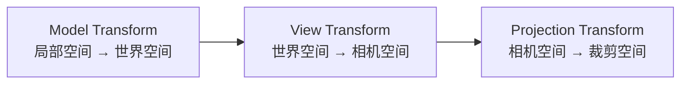
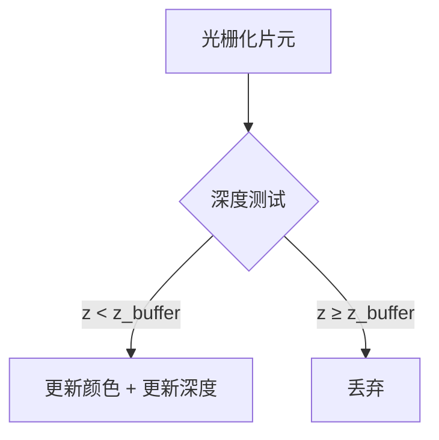
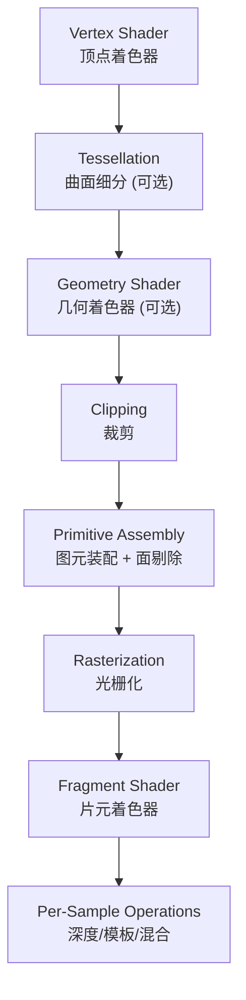
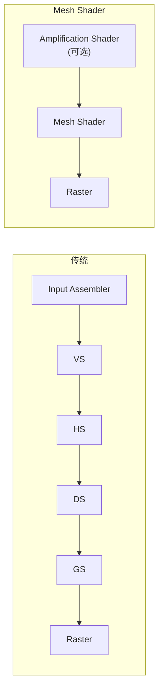
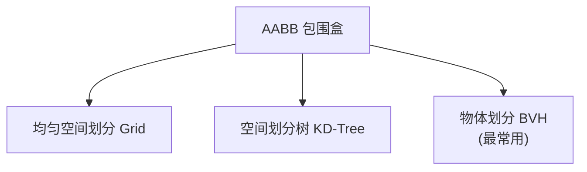
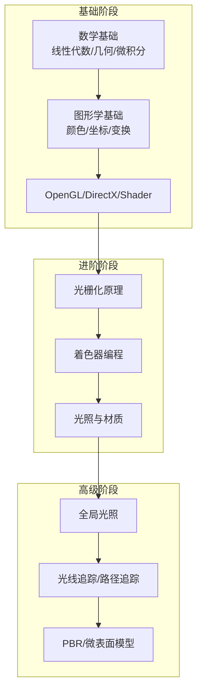

# 渲染管线理论与图形学基础

> [!note] 来源
> 基于 GAMES101、GAMES202、GAMES104 课程笔记，计算机图形学学习大纲，图形学面试实录，CS61C/CSAPP 硬件基础。

---

## 一、数学基础

### 1.1 线性代数

**向量（Vector）：**
- $\vec{a}$ 或 $\mathbf{a}$，指向方向无起始点
- 长度：$\left \| \vec{a} \right \|$，单位向量：$\hat{a} = \vec{a} / \left \| \vec{a} \right \|$
- 默认列向量，行向量记 $A^T$

**点乘（Dot Product）：**
$$
\vec{a} \cdot \vec{b} = \left \| \vec{a}\right \| \left \| \vec{b}\right \| \cos{\theta}
$$
用途：求夹角、找投影、判断前后关系（>0 同向，<0 反向）、分解向量。

**叉乘（Cross Product）：**
$$
\vec{a} \times \vec{b} = -\vec{b} \times \vec{a},\quad \vec{a} \times \vec{a} = 0
$$
用途：判断左右关系（右手坐标系 → 正为左、负为右），判断点是否在三角形内（三次叉乘符号一致）。

**矩阵：**
- 乘法不满足交换律
- 转置：$(AB)^T = B^T A^T$，逆：$(AB)^{-1} = B^{-1} A^{-1}$
- 坐标系变换：将向量从一组基变换到另一组基

### 1.2 齐次坐标

- 2D/3D point：$(x, y, 1)^T$ → 平移生效
- 2D/3D vector：$(x, y, 0)^T$ → 平移不变

### 1.3 几何与微积分基础

- 偏导数、梯度、曲线切线与法线
- 曲面参数化、包围盒（Bounding Box）
- 蒙特卡洛方法、随机采样、概率分布函数

---

## 二、变换（Transform）

### 2.1 二维变换矩阵

| 变换 | 矩阵形式 |
|:-----|:---------|
| 缩放 | `[Sx 0 0; 0 Sy 0; 0 0 1]` |
| 旋转 | `[cos -sin 0; sin cos 0; 0 0 1]` |
| 平移 | `[1 0 Tx; 0 1 Ty; 0 0 1]` |

逆变换 = 逆矩阵。组合 = 从右到左矩阵乘法。分解：变换到原点 → 旋转 → 变换回原位。

### 2.2 MVP 变换



**View Transform：**
- 相机永远在原点，看向 -Z，Y 为上方
- $M_{view}$ = 先逆旋转再逆平移
- 若相机和物体同时移动，效果相同

**投影变换：**

| 类型 | 特点 | 步骤 |
|:-----|:-----|:-----|
| 正交投影 Orthographic | 平行线保持平行 | 长方体移到原点 → 缩放到 $[-1,1]^3$ |
| 透视投影 Perspective | 近大远小 | Frustum 挤压为长方体 → 正交投影 |

**FOV 关系：** $\tan(\frac{fovY}{2}) = \frac{h/2}{near}$

---

## 三、光栅化（Rasterization）

### 3.1 光栅化基础

光栅化 = 将几何图形绘制到屏幕。

- 屏幕坐标系：像素 (0,0) 到 (width-1, height-1)，中心在 (x+0.5, y+0.5)
- **采样法**：判断像素中心是否在三角形内 → 三次叉乘符号一致

**加速方法：**
- **包围盒（Bounding Box）**：只检查包围盒范围内的像素
- **增量遍历**：逐行扫描

### 3.2 Z-Buffer（深度缓冲）



- 每像素存储最小深度值
- O(n) 复杂度（n 个三角形）
- 与绘制顺序无关
- 不能处理透明物体
- 浮点精度 → Z-Fighting

### 3.3 反走样（Antialiasing）

**走样（Aliasing）**：采样伪影，锯齿（Jaggies）。原因：信号频率高于采样频率（Nyquist 定理）。

**频域视角：**
- 时域乘积 = 频域卷积
- 采样 = 重复原始信号频谱
- 走样 = 频谱重叠（混叠）
- 反走样 = 先低通滤波（模糊）再采样

**抗锯齿技术：**

| 技术 | 说明 | 代价 |
|:-----|:-----|:-----|
| SSAA | 超采样（渲染更高分辨率再降采样） | 极高 |
| MSAA | 每像素多次采样，硬件支持 | 中等 |
| FXAA | 后处理快速近似，基于亮度边缘 | 低 |
| TAA | 时间域累积多帧信息 | 低（有重影） |
| DLSS | 深度学习超采样（NVIDIA） | 需 RTX GPU |
| SMAA | 形态学抗锯齿 | 低 |

---

## 四、GPU 管线架构

### 4.1 经典渲染管线



### 4.2 现代 GPU 架构（GAMES202）

- **SIMD/SIMT**：GPU 以 Warp/Wavefront 为单位并行执行
- **Framebuffer**：最终输出，按 Render Pass 组织
- 每个 Pass：指定物体 + MVP + 帧缓冲 + 输入/输出纹理 + Shader
- 帧缓冲可绑定多个渲染目标（MRT）

### 4.3 Mesh Shader 管线（DirectX 12 Ultimate / Vulkan）



Mesh Shader 替代传统 IA→VS→HS→DS→GS 全流程，在 GPU 端直接生成几何体并提交光栅化。

---

## 五、着色（Shading）

### 5.1 Blinn-Phong 反射模型

$$
L = L_a + L_d + L_s = k_a I_a + k_d (I/r^2) max(0, \mathbf{n} \cdot \mathbf{l}) + k_s (I/r^2) max(0, \mathbf{n} \cdot \mathbf{h})^p
$$

| 分量 | 公式 | 说明 |
|:-----|:-----|:-----|
| 环境光 Ambient | $L_a = k_a I_a$ | 简化假设，所有点相同 |
| 漫反射 Diffuse | $L_d = k_d (I/r^2) max(0, \mathbf{n} \cdot \mathbf{l})$ | Lambert 余弦定律 |
| 高光 Specular | $L_s = k_s (I/r^2) max(0, \mathbf{n} \cdot \mathbf{h})^p$ | Blinn-Phong，$p$ ≈ 200-600 |

半程向量：$\mathbf{h} = \frac{\mathbf{v} + \mathbf{l}}{\left\| \mathbf{v} + \mathbf{l} \right\|}$

### 5.2 着色频率

| 频率 | 计算位置 | 效果 |
|:-----|:---------|:-----|
| Flat Shading | 每个三角形 | 面片效果 |
| Gouraud Shading | 每个顶点 | 平滑但可能丢失高光 |
| Phong Shading | 每个像素 | 逐像素法线插值，最佳效果 |

逐顶点法线 = 相邻面法线面积加权平均。逐像素法线 = 重心坐标插值。

---

## 六、纹理映射（Texture Mapping）

### 6.1 基本概念

- 纹理定义在 [0,1]² UV 空间
- 三角形顶点对应 UV 坐标
- 重心坐标（Barycentric Coordinates）：$P = \alpha A + \beta B + \gamma C$，$\alpha+\beta+\gamma=1$

>[!warning] 投影后重心坐标会改变
>应在三维空间中计算重心坐标。

### 6.2 纹理放大 → 双线性插值

Texture Magnification（纹理太小）：像素映射的 texel 少于一个。
- 双线性插值（Bilinear）：周围 4 个 texel 线性插值
- 双三次插值（Bicubic）：周围 16 个 texel 三次插值

### 6.3 纹理过大 → Mipmap

近处一个像素对应多个 texel → 走样（摩尔纹）。

**Mipmap**：预生成逐级降采样（约 1/3 额外存储）。快速近似方形范围查询。

**三线性插值（Trilinear）**：Mipmap 两层级间再加一次插值。开销小，效果好。

**各向异性过滤（Anisotropic Filtering）**：解决非正方形区域的模糊。**EWA 过滤**：对任意形状区域加权平均。

### 6.4 纹理应用

| 用途 | 说明 |
|:-----|:-----|
| 环境光遮蔽（AO） | 预计算遮挡信息 |
| 凹凸贴图（Bump Map） | 扰动法线模拟几何细节 |
| 法线贴图（Normal Map） | 存储法线方向 |
| 位移贴图（Displacement Map） | 实际改变顶点位置 |
| 3D纹理 / 噪声 | Perlin Noise、程序化纹理 |
| 阴影贴图（Shadow Map） | 存储深度信息 |

---

## 七、几何（Geometry）

### 7.1 隐式 vs 显式几何

| | 隐式（Implicit） | 显式（Explicit） |
|:--|:--|:--|
| 表示 | $f(x,y,z) = 0$ | 参数化或点集 |
| 优点 | 容易判断内外 | 直观，容易枚举点 |
| 缺点 | 不直观，难枚举 | 难判断内外 |

隐式：代数曲面、CSG、SDF、Level Set、Fractal。
显式：点云、多边形网格、细分曲面、NURBS、贝塞尔曲面。

### 7.2 贝塞尔曲线（Bezier Curves）

由控制点定义，通过 **de Casteljau 算法**（多次线性插值）计算。

**性质：**
- 曲线过起点和终点
- 起点切线 = 起点→第一控制点方向
- 仿射变换下直接变换控制点
- 凸包性质：曲线在控制点凸包内
- 分段贝塞尔：常用 4 控制点，C¹ 连续需共线等长

### 7.3 曲面细分（Subdivision）

| 方法 | 适用 | 说明 |
|:-----|:-----|:-----|
| Loop 细分 | 仅三角形网格 | 一分四，新旧顶点分别加权调整 |
| Catmull-Clark | 任意多边形 | 一次细分后全为四边形，奇异点不再增加 |

### 7.4 网格简化（Mesh Simplification）

通过边坍缩（Edge Collapse）减少三角形数量。**二次误差度量（Quadric Error Metrics）** 选择坍缩顺序。

---

## 八、光线追踪（Ray Tracing）

### 8.1 光线基础

**光线方程：** $P(t) = \mathbf{O} + t\mathbf{d}$，$t \ge 0$

**光线性质：** 直线传播、光线间不碰撞、光路可逆。

### 8.2 光线与物体求交

- **与隐式表面**：代入方程求解
- **与三角形求交**：先和平面求交 → 判断点是否在三角形内（叉乘法）
- **Möller-Trumbore 算法**：一步到位求解重心坐标

### 8.3 加速结构



**AABB（轴对齐包围盒）**：面平行于坐标轴。求交 = 对每组平面求 t 区间取交集。

**KD-Tree**：按轴对齐平面二分空间。问题：三角形可能与多节点相交。

**BVH（Bounding Volume Hierarchy）**：
- 每次将物体集按某轴二分
- 每节点存包含所有物体的包围盒
- 递归至叶节点只有少量三角形
- 包围盒可能重叠 → 找中位数快速划分

### 8.4 Shadow Mapping

**基本思想**：光源"看到"的点 + 相机看到同一点 → 不在阴影中。

步骤：
1. 从光源位置渲染 → 生成 Shadow Map（深度图）
2. 从相机位置渲染 → 比较当前点在光源空间的深度
3. 当前深度 > Shadow Map 深度 → 在阴影中

**限制**：只能处理点光源（硬阴影）、Shadow Acne（浮点精度自遮挡）。
**硬阴影 vs 软阴影**：点光源 vs 面积光源（本影 Umbra + 半影 Penumbra）。

---

## 九、辐射度量学与全局光照

### 9.1 辐射度量学术语

| 术语 | 符号 | 含义 | 单位 |
|:-----|:-----|:-----|:-----|
| Radiant Energy | $Q$ | 辐射能量 | J |
| Radiant Flux (Power) | $\Phi$ | 单位时间能量 | W |
| Radiant Intensity | $I$ | 单位立体角功率 | W/sr |
| Irradiance | $E$ | 单位面积入射功率 | W/m² |
| Radiance | $L$ | 单位立体角单位面积功率 | W/sr·m² |

**立体角**：$\Omega = A / r^2$

**Irradiance vs Radiance**：Irradiance = 所有方向的光 → 一个点；Radiance = 某个方向的光 → 一个点。

### 9.2 BRDF

双向反射分布函数——描述光线被表面反射的方式：

$$
f_r(\omega_i \to \omega_r) = \frac{dL_r(\omega_r)}{dE_i(\omega_i)} = \frac{dL_r(\omega_r)}{L_i(\omega_i) \cos\theta_i \, d\omega_i}
$$

### 9.3 反射方程

$$
L_r(p, \omega_r) = \int_{H^2} f_r(p, \omega_i \to \omega_r) L_i(p, \omega_i) \cos\theta_i \, d\omega_i
$$

### 9.4 渲染方程（The Rendering Equation）

$$
L_o(p, \omega_o) = L_e(p, \omega_o) + \int_{H^2} f_r(p, \omega_i \to \omega_o) L_i(p, \omega_i) \cos\theta_i \, d\omega_i
$$

### 9.5 蒙特卡洛积分

$$
\int f(x) dx \approx \frac{1}{N} \sum_{i=1}^N \frac{f(X_i)}{p(X_i)}
$$

### 9.6 路径追踪（Path Tracing）

**Whitted-style 问题**：只处理完美镜面反射/折射，对漫反射表面不真实。

**路径追踪算法：**
1. 每像素多次发射光线
2. 击中表面后，随机采样方向继续追踪
3. 蒙特卡洛积分估计渲染方程
4. **俄罗斯轮盘赌（Russian Roulette）**：以概率 p 继续，结果除以 p 保持无偏

**优化**：直接光照单独重要性采样光源，间接光照随机采样半球。

### 9.7 高级光线传播方法

| 方法 | 类型 | 说明 |
|:-----|:-----|:-----|
| Path Tracing | 无偏 | 基础方法 |
| BDPT | 无偏 | 从相机和光源同时追踪 |
| MLT | 无偏 | 马尔科夫链采样，适合复杂光照 |
| Photon Mapping | 有偏 | 两阶段法，擅长焦散 |

---

## 十、材质与外观

### 10.1 菲涅尔项（Fresnel）

反射率随入射角变化。掠射角（接近平行）→ 反射率接近 1。
- 绝缘体：垂直入射时反射率低
- 导体：所有角度反射率高

**Schlick 近似**：$R(\theta) = R_0 + (1 - R_0)(1 - \cos\theta)^5$

### 10.2 微表面模型（Microfacet）

表面由微小镜面组成。粗糙度 = 微表面法线分布：
- 法线集中 → 镜面（Glossy）
- 法线发散 → 漫反射（Diffuse）

**当前业界标准模型（PBR）**。

### 10.3 各向同性/各向异性

- **各向同性（Isotropic）**：旋转表面不改变反射
- **各向异性（Anisotropic）**：不同方向有不同反射（拉丝金属条形高光）

### 10.4 次表面散射（SSS）

光线进入半透明物体后内部散射，从别处出射（皮肤、玉石、牛奶）。**BSSRDF** 泛化 BRDF。

### 10.5 参与介质（Participating Media）

光线在介质中传播时散射和吸收（雾、云、烟）。

---

## 十一、相机与光场

### 11.1 曝光三要素

- **光圈（Aperture）**：F数 = 焦距/直径
- **快门速度（Shutter Speed）**：曝光时间
- **ISO**：信号放大倍率（放大噪声）

### 11.2 薄透镜近似

$\frac{1}{f} = \frac{1}{z_i} + \frac{1}{z_o}$
- $z_i$ 像距，$z_o$ 物距，$f$ 焦距

### 11.3 景深（Depth of Field）

**Circle of Confusion（CoC）**：不在焦点上的点形成模糊圆。CoC 大小决定模糊程度。

### 11.4 光场（Light Field）

全光函数（Plenoptic Function）→ 4D 光场 $L(u,v,s,t)$（双平面参数化）。**光场相机**：微透镜阵列记录方向信息 → 拍摄后重聚焦。

---

## 十二、颜色科学

人眼三种锥形细胞（S/M/L 对应短/中/长波长）。**同色异谱（Metamerism）**：不同光谱产生相同颜色感知。

颜色空间：**sRGB**（标准 RGB）、**CIE XYZ**（标准观察者匹配函数）、**色域（Gamut）**：设备能表示的颜色范围。

---

## 十三、动画与物理模拟

### 13.1 关键帧动画

关键帧间插值。**Blend Space**：插值生成不同状态间过渡。

### 13.2 质点弹簧系统（Mass-Spring System）

- 弹簧力：$f_{a\to b} = k_s \frac{b-a}{\|b-a\|}(\|b-a\| - l)$
- 阻尼力：与相对速度关，投影到弹簧方向
- 结构：剪切弹簧、弯曲弹簧

**正向运动学（FK）**：给定关节角 → 末端位置。
**逆运动学（IK）**：给定末端位置 → 关节角（解不唯一，可能无解）。

### 13.3 数值积分方法

| 方法 | 特点 |
|:-----|:-----|
| 欧拉方法（Euler） | 简单但误差大、不稳定 |
| 中点法（Midpoint） | 二阶精度 |
| 自适应步长 | 误差大时减半步长 |
| 隐式欧拉 | 用下一步导数，更稳定 |
| Runge-Kutta 4 | 经典高阶方法 |
| Verlet / Position-Based | 常用于游戏物理 |

### 13.4 粒子系统

大量粒子受各种力作用的模拟。需要加速结构（空间哈希）。

---

## 十四、前向渲染 vs 延迟渲染

| | Forward | Deferred |
|:--|:--------|:---------|
| 光照计算 | 逐对象逐光源 | 先存 G-Buffer 后算 |
| DrawCall | 多 | 少 |
| MSAA | 支持 | 不支持 |
| 半透明 | 支持 | 不支持（需 Forward 混合） |
| 硬件 | 要求低 | 需 MRT+SM3.0 |
| 多光源 | 差（O(物体×光源)） | 好（O(光源)） |

**G-Buffer 存储**：位置（或从深度重建）、法线、Albedo、材质参数（粗糙度/金属度）。

### 现代趋势：Forward+ 与 Clustered Rendering

- **Forward+**：Tile-based 光照分类，前向渲染也能处理多光源
- **Clustered Forward/Deferred**：3D 空间划分光簇
- Unity URP 和 UE5 均支持 Forward+ 路径

---

## 十五、引擎架构（GAMES104）

五层结构：

| 层级 | 职责 |
|:-----|:-----|
| Tool Layer | 编辑器工具 |
| Function Layer | 功能系统（渲染、物理、动画等） |
| Resource Layer | 资源管理（加载、缓存） |
| Core Layer | 核心基础（数学库、内存管理） |
| Platform Layer | 平台抽象（OS、图形API） |

---

## 十六、图形学面试要点

### 16.1 渲染管线顺序

```
Vertex Shader → Tessellation → Geometry Shader → Clipping → Primitive Assembly → Rasterization → Fragment Shader
```

### 16.2 顶点着色器 vs 片元着色器

**顶点着色器输入**：顶点数据（位置、法线、纹理坐标）、常量（变换矩阵）
**顶点着色器输出**：变换后顶点属性（裁剪空间位置、颜色、UV）
**片元着色器输入**：光栅化插值后片元信息（颜色、UV、深度、法线）
**片元着色器输出**：每个像素的最终颜色（还可输出深度值等）

### 16.3 Mipmap

预生成不同尺寸的纹理图。解决远处物体纹理走样问题。约 1.33 倍额外存储。能减少传输带宽，消除像素闪烁。

### 16.4 碰撞检测

1. **包围盒检测**：AABB（轴对齐）、OBB（有向）、球包围盒
2. **分离轴定理（SAT）**：判断凸多边形间是否有间隙
3. **离散 vs 连续碰撞**：DCD 逐帧检测 → 快速物体穿透（Tunneling）；CCD 连续检测 → 防止穿透

---

## 十七、学习路线图



---

## 相关页面

- [[Unity Shader基础]] — Unity Shader 实践
- [[Shader高级特性]] — 透明、几何着色器、前向/延迟渲染
- [[光线追踪入门]] — Ray Tracing in One Weekend 实现
- [[OpenGL学习笔记]] — OpenGL 渲染编程
- [[渲染管线理论-摘要]] — 精简摘要
