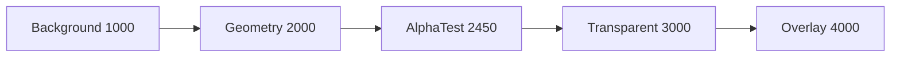
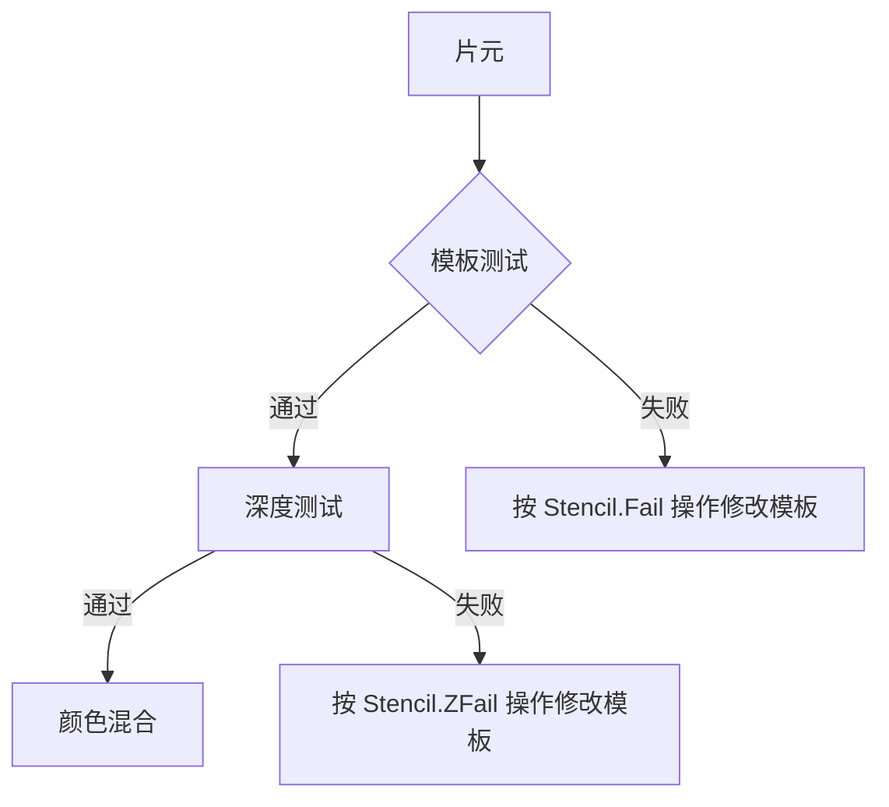
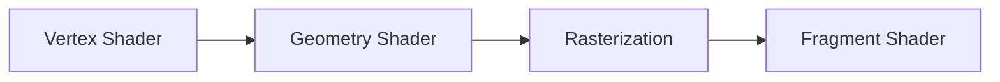
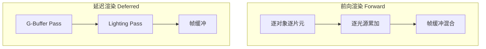
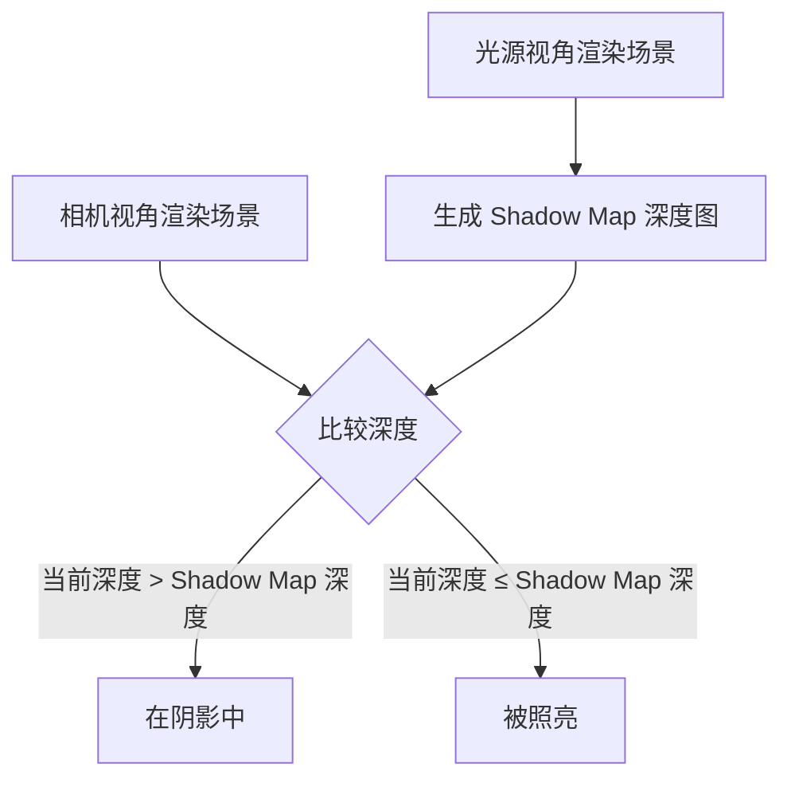
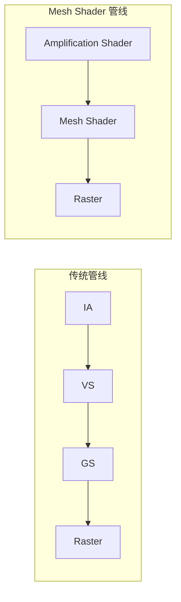

# Shader进阶：透明、几何、曲面细分与光照系统

> [!note] 来源
> 综合来自 `shader 入门精要--4 透明`、`shader 入门精要--5 复杂光源`、`Shader4 -- 几何着色器`、面试图形学笔记，以及 Unity 官方文档。

---

## 一、透明渲染与混合

### 1.1 渲染顺序

不透明物体先渲染（利用深度缓冲，从近到远），**透明物体从远到近渲染**（画家算法），因为后渲染的透明物体需混合到已渲染像素上。

**渲染队列：**

| Queue | 值 | 说明 |
|:------|:---|:-----|
| Background | 1000 | 最先渲染（背景） |
| Geometry | 2000 | 不透明物体（默认） |
| AlphaTest | 2450 | 透明度测试 |
| Transparent | 3000 | 半透明对象，从后往前 |
| Overlay | 4000 | 最后渲染（叠加效果） |



### 1.2 透明度测试（Alpha Test）

使用 `clip` 函数丢弃不满足条件的片元——要么完全透明，要么完全不透明。

```hlsl
Properties {
    _Color ("Color Tint", Color) = (1, 1, 1, 1)
    _MainTex ("Main Tex", 2D) = "white" {}
    _Cutoff ("Alpha Cutoff", Range(0, 1)) = 0.5
}

SubShader {
    Tags {"Queue"="AlphaTest" "IgnoreProjector"="True" "RenderType"="TransparentCutout"}
    Pass {
        Tags { "LightMode"="ForwardBase" }
        // ...
    }
}

// 片元着色器：
fixed4 frag(v2f i) : SV_Target {
    fixed4 texColor = tex2D(_MainTex, i.uv);
    clip(texColor.a - _Cutoff);  // alpha < Cutoff 则丢弃
    // 等价于: if ((texColor.a - _Cutoff) < 0.0) discard;
    // ... 光照计算 ...
}
```

- `clip(float4 x)`：若 x 任意分量 < 0，丢弃片元
- Queue = AlphaTest，RenderType = TransparentCutout
- 不需要关闭深度写入

### 1.3 透明度混合（Alpha Blending）

**混合公式：**

$$
DST_{color} = SrcAlpha \times SrcColor + (1-SrcAlpha) \times DstColor
$$

```hlsl
SubShader {
    Tags {"Queue"="Transparent" "IgnoreProjector"="True" "RenderType"="Transparent"}
    Pass {
        Tags { "LightMode"="ForwardBase" }
        ZWrite Off
        Blend SrcAlpha OneMinusSrcAlpha
        // ...
    }
}
```

片元着色器输出带 Alpha 的颜色：
```hlsl
return fixed4(ambient + diffuse, texColor.a * _AlphaScale);
```

### 1.4 开启深度写入的半透明（双 Pass 方案）

解决自身遮挡问题：

```hlsl
SubShader {
    Tags {"Queue"="Transparent" "IgnoreProjector"="True" "RenderType"="Transparent"}

    // Pass 0: 只写深度，不输出颜色
    Pass {
        ZWrite On
        ColorMask 0   // 不输出任何颜色通道
    }

    // Pass 1: 正常透明度混合
    Pass {
        Tags { "LightMode"="ForwardBase" }
        ZWrite Off
        Blend SrcAlpha OneMinusSrcAlpha
        // ... 光照计算 ...
    }
}
```

### 1.5 双面渲染（Cull）

透明渲染关闭深度写入会导致看不到背面。解决：两个 Pass 分别渲染背面和正面。

```hlsl
// Pass 0: 只渲染背面
Pass {
    Cull Front
    ZWrite Off
    Blend SrcAlpha OneMinusSrcAlpha
}

// Pass 1: 只渲染正面
Pass {
    Cull Back
    ZWrite Off
    Blend SrcAlpha OneMinusSrcAlpha
}
```

### 1.6 常见混合类型汇总

```hlsl
// 正常透明度
Blend SrcAlpha OneMinusSrcAlpha

// 柔和相加（Soft Additive）
Blend OneMinusDstColor One

// 正片叠底（Multiply）
Blend DstColor Zero

// 2x 乘法
Blend DstColor SrcColor

// 变暗（Darken）
BlendOp Min
Blend One One

// 变亮（Lighten）
BlendOp Max
Blend One One

// 滤色（Screen）
Blend OneMinusDstColor One   // 等同于 Blend One OneMinusSrcColor

// 线性减淡（Linear Dodge）
Blend One One
```

---

## 二、模板测试（Stencil Test）

模板缓冲区是每像素 8 位整数的通用遮罩，用于保存或丢弃像素。



```hlsl
Stencil {
    Ref 2               // 参考值
    Comp Always         // 比较函数（Always = 始终通过）
    Pass Replace        // 通过后：替换为 Ref 值
    Fail Keep           // 失败后：保持原值
    ZFail Keep          // 深度测试失败后：保持原值
}
```

比较函数：`Always`, `Never`, `Less`, `Equal`, `LEqual`, `Greater`, `NotEqual`, `GEqual`。
操作：`Keep`, `Zero`, `Replace`, `IncrSat`, `DecrSat`, `Invert`, `IncrWrap`, `DecrWrap`。

---

## 三、法线贴图与切线空间

### 3.1 法线贴图原理

法线贴图存储切线空间的法线信息，通过扰动法线方向模拟表面凹凸细节，不增加几何复杂度。

**模型空间 vs 切线空间法线：**

| 模型空间 | 切线空间 |
|:---------|:---------|
| 实现简单，计算简单 | 自由度高（相对切线） |
| 边界平滑 | 可进行 UV 动画 |
| — | 可重用、可压缩 |

### 3.2 TBN矩阵

**T**angent（切线）、**B**inormal（副切线）、**N**ormal（法线）。

```hlsl
// 计算副切线（v.tangent.w 确定方向：+1 或 -1）
float3 binormal = cross(normalize(v.normal), normalize(v.tangent.xyz)) * v.tangent.w;

// 构建模型空间到切线空间的旋转矩阵
float3x3 rotation = float3x3(v.tangent.xyz, binormal, v.normal);
```

快捷宏：`TANGENT_SPACE_ROTATION` 等价于上面的矩阵构建。

### 3.3 在切线空间计算光照

将光照方向和视角方向变换到切线空间：

```hlsl
// 顶点着色器
TANGENT_SPACE_ROTATION;
o.lightDir = mul(rotation, ObjSpaceLightDir(v.vertex)).xyz;
o.viewDir = mul(rotation, ObjSpaceViewDir(v.vertex)).xyz;

// 片元着色器：解包法线贴图
fixed4 packedNormal = tex2D(_BumpMap, i.uv.zw);
fixed3 tangentNormal;
tangentNormal = UnpackNormal(packedNormal);  // 推荐：处理平台差异
tangentNormal.xy *= _BumpScale;
tangentNormal.z = sqrt(1.0 - saturate(dot(tangentNormal.xy, tangentNormal.xy)));

// 在切线空间计算光照
fixed3 diffuse = _LightColor0.rgb * albedo * max(0, dot(tangentNormal, tangentLightDir));
```

### 3.4 在世界空间计算

将切线空间法线变换到世界空间（通过 TtoW 矩阵行存储）：

```hlsl
// 顶点着色器：构建世界空间 TBN 并存储行
float3 worldPos = mul(unity_ObjectToWorld, v.vertex).xyz;
fixed3 worldNormal = UnityObjectToWorldNormal(v.normal);
fixed3 worldTangent = UnityObjectToWorldDir(v.tangent.xyz);
fixed3 worldBinormal = cross(worldNormal, worldTangent) * v.tangent.w;

o.TtoW0 = float4(worldTangent.x, worldBinormal.x, worldNormal.x, worldPos.x);
o.TtoW1 = float4(worldTangent.y, worldBinormal.y, worldNormal.y, worldPos.y);
o.TtoW2 = float4(worldTangent.z, worldBinormal.z, worldNormal.z, worldPos.z);

// 片元着色器：变换法线到世界空间
bump = normalize(half3(dot(i.TtoW0.xyz, bump), dot(i.TtoW1.xyz, bump), dot(i.TtoW2.xyz, bump)));
```

世界空间方法的优势：可复用世界空间的光照和视角方向。

### 3.5 UnpackNormal 注意事项

Unity 根据平台使用不同打包方式，推荐使用 `UnpackNormal`：
- 未标记 "Normal map"：`tangentNormal.xy = (packedNormal.xy * 2 - 1) * _BumpScale`
- 标记 "Normal map"：`tangentNormal = UnpackNormal(packedNormal)`

法线 z 分量由 xy 导出：$z = \sqrt{1 - (x^2 + y^2)}$。xy=0 时 z=1（普通法线）。

---

## 四、GrabPass 玻璃折射

### 4.1 GrabPass 抓取屏幕

```hlsl
GrabPass { }                        // 每批次抓取一次
GrabPass { "_RefractionTex" }       // 首遇抓取，同帧多子着色器共享
```

通过 `_GrabTexture` 引用抓取的屏幕纹理。

### 4.2 ComputeGrabScreenPos

```hlsl
float4 screenPos = ComputeGrabScreenPos(o.pos);  // 齐次坐标
```

输入裁剪空间坐标，输出可直接用于 `_GrabTexture` 采样的屏幕坐标。

### 4.3 折射偏移

```hlsl
// 通过法线贴图方向偏移屏幕 UV
float2 offset = normal.xy * _BumpScale * _RefractionTex_TexelSize.xy;
float2 grabUV = screenPos.xy / screenPos.w + offset;  // 透视除法
fixed4 refractedColor = tex2D(_GrabTexture, grabUV);
```

`_RefractionTex_TexelSize` 是纹素大小。采样前需透视除法。

---

## 五、表面着色器与曲面细分

### 5.1 表面着色器（Surface Shader）

Unity 对顶点/片元着色器的更高层抽象，自动实现光照计算：

```hlsl
#pragma surface surf BlinnPhong addshadow fullforwardshadows vertex:disp tessellate:tessFixed nolightmap
```

| 指令 | 说明 |
|:-----|:-----|
| `surf` | 表面函数名 |
| `BlinnPhong` | 光照模型 |
| `addshadow` | 生成阴影投射 Pass |
| `fullforwardshadows` | 支持所有光源类型的阴影 |
| `vertex:disp` | 自定义顶点修改函数 |
| `tessellate:tessFixed` | 曲面细分函数 |

### 5.2 曲面细分（Tessellation）

四种细分方式：

| 方式 | 说明 |
|:-----|:-----|
| 固定数量 | 返回固定值 |
| 基于边长 | 根据三角形边长动态调整 |
| 基于距离 | 根据相机距离动态调整 |
| Phong 细分 | 基于 Phong 平滑 |

```hlsl
float _Tess;

float4 tessFixed() {
    return _Tess;  // 固定细分级别
}

void disp(inout appdata v) {
    float d = tex2Dlod(_DispTex, float4(v.texcoord.xy, 0, 0)).r * _Displacement;
    v.vertex.xyz += v.normal * d;
}
```

### 5.3 水面效果

通过顶点动画（正弦波）+ 法线贴图双向采样实现动态水面：

```hlsl
// 顶点着色器：正弦波浪
fixed height = sin(_Time.y * _WaveSpeed + v.vertex.z * _WaveGap + v.vertex.x) * _WaveHeight;
v.vertex.xyz += v.normal * height;

// 法线贴图双向采样增强动态感
float2 speed = _Time.x * float2(_WaveSpeed, _WaveSpeed) * _NormalSpeed;
fixed3 bump1 = UnpackNormal(tex2D(_NormalTex, IN.uv_FoamTex.xy + speed)).rgb;
fixed3 bump2 = UnpackNormal(tex2D(_NormalTex, IN.uv_FoamTex.xy - speed)).rgb;
```

双向采样（正反方向）使法线变化更自然。

---

## 六、几何着色器（Geometry Shader）

### 6.1 管线位置



几何着色器在顶点着色器之后、光栅化之前，可把输入顶点转变为**完全不同的基本图形**。

### 6.2 基础声明

```hlsl
[maxvertexcount(N)]
void ShaderName(PrimitiveType InputVertexType InputName[NumElements],
                inout StreamOutputObjectVertexType OutputName) {
    // 几何着色器实现
}
```

- `[maxvertexcount(N)]`：单次调用输出的最大顶点数。**应尽可能小**（1-20 为最佳性能，27-40 时性能下降到峰值 50%）
- 输出标量个数 = maxvertexcount × 输出顶点类型结构体中标量个数

### 6.3 输入图元类型

| 前缀 | 输入图元拓扑 |
|:-----|:------------|
| `point` | 点列表 |
| `line` | 线列表或线条带 |
| `triangle` | 三角形列表或三角形带 |
| `lineadj` | 线列表/带及其邻接图元 |
| `triangleadj` | 三角形列表/带及其邻接图元 |

**必须对应输入装配阶段的图元拓扑类型**。

### 6.4 输出流类型

| 流类型 | 输出 |
|:-------|:-----|
| `PointStream<T>` | 点列表 |
| `LineStream<T>` | 线条带 |
| `TriangleStream<T>` | 三角形带 |

输出图元拓扑必须是**线条带或三角形带**。线条列表和三角形列表可借助 `RestartStrip` 输出。

### 6.5 Append 和 RestartStrip

```hlsl
OutputName.Append(gout);       // 追加顶点到输出流
OutputName.RestartStrip();     // 结束当前条带，开始新条带
```

若当前条带顶点不足以填满基元拓扑，末端不完整基元将被丢弃。

### 6.6 应用示例

**三角形 → 点（质心），maxvertexcount(1)：**

```hlsl
[maxvertexcount(1)]
void geom(triangle v2g input[3], inout PointStream<g2f> outStream) {
    float4 vertex = (input[0].vertex + input[1].vertex + input[2].vertex) / 3;
    g2f o;
    o.vertex = UnityObjectToClipPos(vertex);
    o.uv = (input[0].uv + input[1].uv + input[2].uv) / 3;
    outStream.Append(o);
}
```

**三角形 → 线框（三边各 2 个顶点 = 6），maxvertexcount(6)：**

```hlsl
[maxvertexcount(6)]
void geom(triangle v2g input[3], inout LineStream<g2f> outStream) {
    for (int i = 0; i < 3; i++) {
        g2f o;
        o.vertex = UnityObjectToClipPos(input[i].vertex);
        o.uv = input[i].uv;
        outStream.Append(o);

        int next = (i + 1) % 3;
        o.vertex = UnityObjectToClipPos(input[next].vertex);
        o.uv = input[next].uv;
        outStream.Append(o);
    }
}
```

---

## 七、前向渲染与延迟渲染

### 7.1 渲染路径概览



| | Forward | Deferred |
|:--|:--------|:---------|
| 原理 | 每光源每对象逐片元 | 先存几何信息，后统一算光 |
| DrawCall | 多（对象数 × 光源数） | 少 |
| 抗锯齿 | 支持 | 不支持真正的 AA |
| 半透明 | 支持 | 不能处理 |
| 硬件要求 | 低 | 需 MRT + SM3.0 |

### 7.2 前向渲染（Forward Rendering）

**Unity 前向渲染规则：**
- 最亮的平行光 → 逐像素处理
- `Not Important` 光源 → 逐顶点或球谐函数（SH）
- `Important` 光源 → 逐像素处理
- 超过 Quality Setting 中 Pixel Light Count 数量 → 降级

**两种 Pass：**

| | ForwardBase | ForwardAdd |
|:--|:------------|:-----------|
| 执行次数 | 1 次 | 每额外逐像素光源 1 次 |
| 光照 | 环境光 + 自发光 + 主平行光 | 其他逐像素光 |
| 阴影 | 默认支持 | 默认不支持（可加 `_fullshadows`） |
| 混合 | 无 | `Blend One One` |
| 编译 | `#pragma multi_compile_fwdbase` | `#pragma multi_compile_fwdadd` |

**Base Pass 示例：**

```hlsl
Pass {
    Tags { "LightMode"="ForwardBase" }
    // ...
}

fixed4 frag(v2f i) : SV_Target {
    fixed3 ambient = UNITY_LIGHTMODEL_AMBIENT.xyz;
    fixed3 worldLightDir = normalize(_WorldSpaceLightPos0.xyz);
    fixed3 diffuse = _LightColor0.rgb * _Diffuse.rgb * max(0, dot(worldNormal, worldLightDir));
    fixed3 viewDir = normalize(_WorldSpaceCameraPos.xyz - i.worldPos.xyz);
    fixed3 halfDir = normalize(worldLightDir + viewDir);
    fixed3 specular = _LightColor0.rgb * _Specular.rgb * pow(max(0, dot(worldNormal, halfDir)), _Gloss);
    fixed atten = 1.0;  // 平行光无衰减
    return fixed4(ambient + (diffuse + specular) * atten, 1.0);
}
```

**Addition Pass 关键点：**
- **不计算**环境光和自发光（会重复叠加）
- `Blend One One` 叠加结果
- 用宏区分光源类型：

```hlsl
Pass {
    Tags { "LightMode"="ForwardAdd" }
    Blend One One
    // ...

    #ifdef USING_DIRECTIONAL_LIGHT
        fixed3 worldLightDir = normalize(_WorldSpaceLightPos0.xyz);
        fixed atten = 1.0;
    #else
        fixed3 worldLightDir = normalize(_WorldSpaceLightPos0.xyz - i.worldPos.xyz);
        // 计算衰减 ...
    #endif
}
```

### 7.3 光照衰减

**光源类型：** 平行光（无衰减）、点光源、聚光灯。可访问属性：位置、方向、颜色、强度、衰减。

**纹理查找法（Unity 内置）：**

```hlsl
// 点光源衰减
float3 lightCoord = mul(unity_WorldToLight, float4(i.worldPos, 1)).xyz;
fixed atten = tex2D(_LightTexture0, dot(lightCoord, lightCoord).rr).UNITY_ATTEN_CHANNEL;

// 聚光灯衰减
float4 lightCoord = mul(unity_WorldToLight, float4(i.worldPos, 1));
fixed atten = (lightCoord.z > 0) * tex2D(_LightTexture0, lightCoord.xy / lightCoord.w + 0.5).w
            * tex2D(_LightTextureB0, dot(lightCoord, lightCoord).rr).UNITY_ATTEN_CHANNEL;
```

原理：将世界坐标转到光源空间，计算到光源中心的距离平方，查找 `_LightTexture0` 纹理。`UNITY_ATTEN_CHANNEL` 获取衰减所在分量。

**公式计算法：**
```hlsl
float distance = length(_WorldSpaceLightPos0.xyz - i.worldPos.xyz);
atten = 1.0 / distance;
```

纹理查找法缺点：纹理大小影响精度、不直观，但性能更好。

### 7.4 延迟渲染（Deferred Rendering）

两个 Pass：
1. **G-Buffer Pass**：计算可见性，将几何信息写入 MRT
2. **Lighting Pass**：利用 G-Buffer 对每光源计算光照

**Unity G-Buffer 布局：**
- RT0：RGB 漫反射颜色
- RT1：RGB 高光反射颜色，A 高光指数
- RT2：RGB 世界空间法线
- RT3：自发光 + lightmap + 反射探针
- 深度缓冲 + 模板缓冲

**延迟渲染缺点：**
- 不支持真正的抗锯齿
- 不能处理半透明物体
- 对显卡有要求（MRT、Shader Model 3.0+、深度渲染纹理、双面模板缓冲）

---

## 八、阴影系统

### 8.1 阴影映射原理



### 8.2 Unity 阴影设置

**物体设置：**
- Cast Shadows：On / Off / Two Sided / Shadows Only
- Receive Shadows

**光源设置：**
| 设置 | 说明 |
|:-----|:-----|
| Shadow Type | No Shadows / Hard Shadows / Soft Shadows |
| Strength | 阴影强度 |
| Resolution | Shadow Map 分辨率 |
| Bias / Normal Bias | 偏差值（避免 Shadow Acne） |

### 8.3 接收阴影的 Shader 代码

```hlsl
#include "AutoLight.cginc"

struct v2f {
    float4 pos : SV_POSITION;
    float3 worldNormal : TEXCOORD0;
    float3 worldPos : TEXCOORD1;
    SHADOW_COORDS(2)              // 声明阴影坐标
};

v2f vert(a2v v) {
    v2f o;
    o.pos = UnityObjectToClipPos(v.vertex);
    o.worldNormal = UnityObjectToWorldNormal(v.normal);
    o.worldPos = mul(unity_ObjectToWorld, v.vertex).xyz;
    TRANSFER_SHADOW(o);           // 传递阴影坐标
    return o;
}

fixed4 frag(v2f i) : SV_Target {
    // ... 光照计算 ...
    fixed shadow = SHADOW_ATTENUATION(i);  // 获取阴影衰减
    return fixed4(ambient + (diffuse + specular) * atten * shadow, 1.0);
}
```

三个核心宏：`SHADOW_COORDS(n)` → `TRANSFER_SHADOW(o)` → `SHADOW_ATTENUATION(i)`。

### 8.4 默认 Shadow Caster Pass

```hlsl
struct v2f {
    V2F_SHADOW_CASTER;
};

v2f vert(appdata_base v) {
    v2f o;
    TRANSFER_SHADOW_CASTER_NORMALOFFSET(o)
    return o;
}

float4 frag(v2f i) : SV_Target {
    SHADOW_CASTER_FRAGMENT(i)
}
```

若只有一面投射阴影，可将 Cast Shadows 设为 Two Sided。

---

## 九、现代渲染技术进展

### 9.1 GPU-Driven Rendering 与 Mesh Shaders

现代 GPU（NVIDIA Turing+ / AMD RDNA2+ / DirectX 12 Ultimate）支持 **Mesh Shader**，替代传统 Vertex → Geometry 管线：



- **Amplification Shader**：可选的预处理阶段，控制 Mesh Shader 调用
- **Mesh Shader**：生成 primitives 并直接输出到光栅化器
- **GPU Resident Drawer**（Unity 6）：将可见性判断、剔除、Draw Call 提交完全迁移到 GPU

### 9.2 Unity 6 Render Graph

Unity 6（SRP Core 17）引入 Render Graph API，提供：
- 自动资源生命周期管理
- 显式渲染依赖图
- 更好的 GPU 内存管理和屏障优化
- URP/HDRP 统一渲染框架

### 9.3 DLSS 与 Neural Rendering

NVIDIA DLSS 5（2026）被称为"图形学的 GPT 时刻"：
- **DLSS 4.5**：Ray Reconstruction 光线重建
- **DLSS 5**：全神经网络渲染，从 G-Buffer 直接生成最终帧
- **RTX Neural Shaders**：在材质中使用小型神经网络替代复杂 BRDF 计算

---

## 相关页面

- [[Unity Shader基础]] — ShaderLab 基础与基本光照
- [[渲染管线理论]] — GAMES101 图形学理论
- [[OpenGL学习笔记]] — OpenGL GLSL 对比
- [[Shader高级特性-摘要]] — 精简摘要
