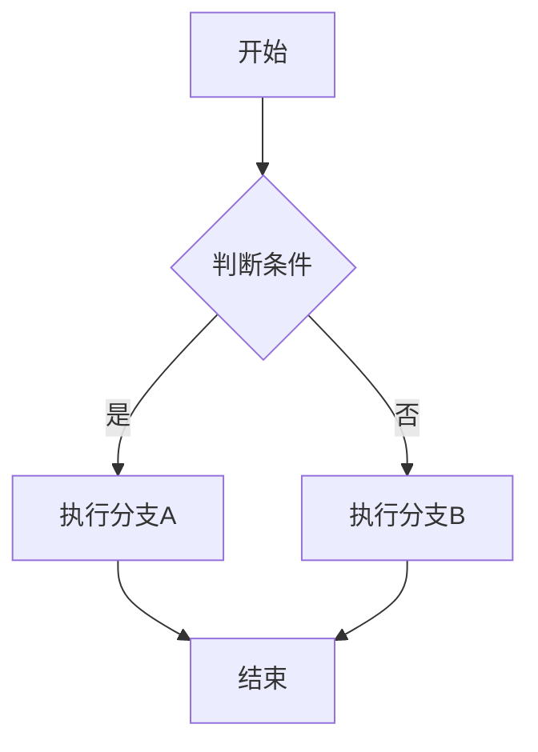

# Dev 工具集：Docker Protobuf SVN dotnet 笔记系统

## Docker 基本概念

### 核心三要素

1. **Dockerfile** — 构建镜像的蓝图/配方
2. **Image（镜像）** — 只读模板，包含运行环境和应用
3. **Container（容器）** — 镜像的运行实例，轻量级隔离环境

### 基本工作流

```shell
# 编写 Dockerfile后，构建镜像
docker build -t my-app .

# 运行容器
docker run -d -p 8080:80 --name my-container my-app

# 查看运行中的容器
docker ps

# 停止/启动容器
docker stop my-container
docker start my-container

# 删除容器
docker rm my-container

# 查看镜像
docker images

# 删除镜像
docker rmi my-app
```

### Dockerfile 基础

```dockerfile
# 基础镜像
FROM ubuntu:22.04

# 设置工作目录
WORKDIR /app

# 复制文件
COPY . .

# 运行命令
RUN apt update && apt install -y python3

# 声明端口
EXPOSE 8080

# 启动命令
CMD ["python3", "app.py"]
```

### Docker Compose 基础

用于管理多容器应用，`docker-compose.yml`：

```yaml
version: '3'
services:
  web:
    build: .
    ports:
      - "8080:80"
  db:
    image: postgres:15
    environment:
      POSTGRES_PASSWORD: example
```

```shell
# 启动所有服务
docker-compose up -d

# 停止
docker-compose down
```

## Protobuf（Protocol Buffers）

### Proto3 基础

```proto
syntax = "proto3";

message SearchRequest {
  string query = 1;
  int32 page_number = 2;
  int32 results_per_page = 3;
}
```

- 第一行声明 proto3 版本
- 每个字段有唯一的**字段编号**（field number），用于二进制序列化标识
- 字段编号 1-15 使用 1 字节编码，16-2047 使用 2 字节；频繁使用的字段应分配 1-15

### 字段标签

| 标签 | 说明 |
|------|------|
| `optional` | 可设置或不设置；未设置时返回默认值，不序列化到 wire |
| `repeated` | 可重复零次或多次，保留顺序 |
| `map` | 键值对字段 |

```proto
message Test {
  optional string key = 1;
  optional int32 value = 2;
  repeated string tags = 3;
  map<string, int32> scores = 4;
}
```

### 类型对应表

| .proto | C++ | C# | Python | Go |
|--------|-----|-----|--------|-----|
| `double` | double | double | float | float64 |
| `float` | float | float | float | float32 |
| `int32` | int32 | int | int | int32 |
| `int64` | int64 | long | int/long | int64 |
| `uint32` | uint32 | uint | int/long | uint32 |
| `uint64` | uint64 | ulong | int/long | uint64 |
| `sint32` | int32 | int | int | int32 |
| `sint64` | int64 | long | int/long | int64 |
| `fixed32` | uint32 | uint | int/long | uint32 |
| `fixed64` | uint64 | ulong | int/long | uint64 |
| `bool` | bool | bool | bool | bool |
| `string` | string | string | str | string |
| `bytes` | string | ByteString | bytes | []byte |

`sint32`/`sint64` 使用 ZigZag 编码，对负数比 `int32`/`int64` 更高效。`fixed32`/`fixed64` 固定占用 4/8 字节，对大值更高效。

### 默认值

- `string` → 空字符串
- `bytes` → 空字节
- `bool` → `false`
- 数字 → `0`
- 枚举 → **第一个定义的枚举值**（必须为 0）
- `message` 字段 → 未设置（取决于语言具体行为）

### 枚举

```proto
enum Corpus {
  CORPUS_UNSPECIFIED = 0;
  CORPUS_UNIVERSAL = 1;
  CORPUS_WEB = 2;
  CORPUS_IMAGES = 3;
  CORPUS_LOCAL = 4;
  CORPUS_NEWS = 5;
  CORPUS_PRODUCTS = 6;
  CORPUS_VIDEO = 7;
}

message SearchRequest {
  string query = 1;
  int32 page_number = 2;
  Corpus corpus = 3;
}
```

**规则**：枚举的第一个值必须为 0（作为默认值/未设置值）。

### Any 类型

允许将任意消息类型作为嵌入字段，无需预先知道 `.proto` 定义：

```proto
import "google/protobuf/any.proto";

message ErrorStatus {
  string message = 1;
  repeated google.protobuf.Any details = 2;
}
```

### Oneof

至多同时设置一个字段，字段间共享内存：

```proto
message SampleMessage {
  oneof test_oneof {
    string name = 4;
    SubMessage sub_message = 9;
  }
}
```

设置 oneof 的任意成员会自动清除其他成员。使用 `case()` / `WhichOneof()` 方法检查当前设置的值。

**注意**：如果同时设置多个值，按 proto 中声明顺序，最后一个覆盖前面的。

### Package

防止消息类型名称冲突：

```proto
package foo.bar;
message Open { ... }
```

各语言映射：
- **C++** → 命名空间 `foo::bar`
- **Java/Kotlin** → Java package
- **Python** → 忽略（由文件系统位置决定）
- **Go** → 忽略，需设置 `go_package` 选项
- **C#** → 命名空间 `Foo.Bar`（PascalCase）

### 定义 Service

```proto
service SearchService {
  rpc Search(SearchRequest) returns (SearchResponse);
}
```

需配合 gRPC 使用。

### C# 完整使用示例

**Proto 定义** (`user.proto`)：

```proto
syntax = "proto3";

message pb_user_info {
    string user_id = 1;
    string leader_id = 2;
    repeated string members = 3;
    int32 status = 4;
}
```

**C# 调用代码**：

```csharp
// 构造消息
var userInfo = new pb_user_info
{
    LeaderId = "123",
    Status = 5,
    UserId = "newbie"
};
userInfo.Members.Add("张三");
userInfo.Members.Add("李四");

// 序列化为字节数组
var bytes = userInfo.ToByteArray();

// 反序列化
var ub = new pb_user_info();
ub.MergeFrom(bytes);

Console.WriteLine($"User: {ub.UserId}, Leader: {ub.LeaderId}");
Console.WriteLine($"Members: {string.Join(",", userInfo.Members)}");
```

### Protobuf 在 Unity 中的安装

1. 确定 Unity 使用的 C# API 兼容版本（通常 netstandard2.0 / net4.x）
2. 下载 Google.Protobuf 源码，修改 `.csproj` 中的 `TargetFrameworks`，删除不需要的目标框架：

```xml
<TargetFrameworks>netstandard1.1;netstandard2.0;net45;net50</TargetFrameworks>
```

3. 使用 NuGet 安装缺少的 SDK（如 `Microsoft.NETFramework.ReferenceAssemblies.net45`）
4. 修改 `global.json` 中的 SDK 版本以匹配 Unity
5. 执行 `dotnet build` 生成 DLL，导入 Unity

## dotnet CLI

### 安装

下载 .NET SDK：[dotnet.microsoft.com/download](https://dotnet.microsoft.com/en-us/download/dotnet)

验证：

```shell
dotnet --version
dotnet --list-sdks
```

### 常用命令

```shell
# 通过模板创建新项目
dotnet new console -n MyApp
dotnet new webapi -n MyApi
dotnet new classlib -n MyLib
dotnet new mvc -n MyWeb

# 列出可用模板
dotnet new list

# 还原依赖
dotnet restore

# 构建
dotnet build

# 运行
dotnet run

# 发布
dotnet publish -c Release -o ./publish

# 添加 NuGet 包
dotnet add package Newtonsoft.Json

# 添加项目引用
dotnet add reference ../MyLib/MyLib.csproj

# 运行测试
dotnet test
```

## xmake

xmake — 基于 Lua 的跨平台 C/C++ 构建工具，语法简洁，内置包管理。

```shell
# 安装
curl -fsSL https://xmake.io/shget.text | bash

# 创建项目
xmake create -l c++ -P myproject

# 构建
xmake

# 运行
xmake run
```

## 静态博客工具

### 常见静态博客框架

| 框架 | 语言 | 特点 |
|------|------|------|
| **Docsify** | JavaScript | 运行时渲染 Markdown，无需预构建 HTML，适合文档站 |
| **Hugo** | Go | 构建速度极快，主题丰富 |
| **Hexo** | Node.js | 插件生态丰富，中文社区活跃 |
| **VuePress** | Vue.js | Vue 驱动的静态站点生成器 |
| **GitBook** | Node.js | 从 Git 仓库自动生成文档 |
| **Jekyll** | Ruby | GitHub Pages 原生支持 |
| **Pelican** | Python | Python 博客生成器 |
| **WordPress** | PHP | 动态 CMS（非静态） |

### Docsify 快速上手

Docsify 无需预构建 HTML，在浏览器中动态渲染 Markdown：

```bash
# 全局安装
npm install -g docsify-cli

# 初始化项目
docsify init ./docs

# 本地预览
docsify serve ./docs
```

参考：[Docsify 官网](https://docsify.js.org/)、[教学视频](https://www.bilibili.com/video/BV14U4y1x7jH/)

## 多端同步工具

### Syncthing

开源跨平台文件夹同步工具，支持 Windows / macOS / Linux：

- **Windows / macOS / Linux**：使用 [Syncthing](https://syncthing.net/) 官方客户端
- **iOS**：使用 **Mobius Sync**（收费）获得 Syncthing 兼容同步
- **备选方案**：Resilio Sync（闭源，P2P 同步）

### 典型用法

在多设备间同步 Obsidian 笔记库：
1. 各设备安装 Syncthing
2. 将 Obsidian Vault 文件夹添加为共享文件夹
3. 其他设备接受共享请求
4. 自动实时同步，无中心服务器

> [!note] Syncthing 优势
> 端到端加密、P2P 传输（不经过第三方服务器）、开源免费、支持文件版本历史。


## SVN 版本控制基础

SVN（Apache Subversion）— 集中式版本控制系统。

### 核心概念

| 操作 | 说明 |
|------|------|
| **repository** | 源代码统一存放位置（中央仓库） |
| **checkout** | 从仓库提取/拉取源码到本地工作副本 |
| **commit** | 将本地修改提交到中央仓库 |
| **update** | 从仓库同步最新代码到本地 |

### 工作生命周期

1. **Update** — 获取最新版本
2. **修改** — 本地编辑文件
3. **复查变化** — `svn status` 查看变更
4. **修复错误** — `svn revert` 丢弃本地修改
5. **解决冲突** — `svn resolve` 合并冲突
6. **提交** — `svn commit` 上传修改

### SVN vs Git 对比

| 特性 | SVN | Git |
|------|-----|-----|
| 架构 | 集中式（单一中央仓库） | 分布式（每个克隆即完整仓库） |
| 提交 | 直接到中央服务器 | 本地提交 + 推送 |
| 分支 | 目录拷贝（重操作） | 轻量指针 |
| 离线工作 | 受限 | 完全支持 |
| 学习曲线 | 简单 | 较陡 |

## Obsidian 笔记系统

### 目录结构设计

核心原则：
- **按领域划分**（非技术栈），按知识维度分类
- **功能导向命名**（如 `CheatSheet/` 存放速查表）
- **低认知负担**：层级不超过 3 层
- **工具协同**：配合 Git 管理版本，ripgrep 全文搜索

```markdown
📁 Notes/
├─ 📁 0_Areas/          # 核心知识领域
│  ├─ 📁 Algorithms/
│  ├─ 📁 SystemDesign/
│  └─ 📁 DevOps/
├─ 📁 1_Projects/       # 项目笔记（按项目独立）
├─ 📁 2_TechStack/      # 技术栈专项
├─ 📁 3_References/     # 参考资料库
│  ├─ 📁 CheatSheets/   # 速查表
│  ├─ 📁 RFCs/          # 技术标准
│  └─ 📁 Papers/        # 论文摘要
├─ 📁 4_Workflows/      # 工作流与效率
├─ 📁 5_KnowledgeBase/  # 通用知识库
│  ├─ 📁 Concepts/      # 核心概念
│  ├─ 📁 Patterns/      # 设计模式
│  └─ 📁 Books/         # 读书笔记
├─ 📁 9_Inbox/          # 临时内容
├─ 📁 10_Archive/       # 归档（过时内容）
└─ ⭐_Highlights/       # 精华内容
```

### 文件命名技巧

- **关键词前置**：`设计模式_工厂模式应用场景.md`
- **添加状态标识**：`[WIP]分布式事务调研.md`、`[DRAFT]QUIC协议分析.md`
- **日期格式统一**：`20230725_会议记录.md`（ISO 8601：年月日）
- **避免特殊字符**：文件名使用下划线或短横线分隔

### 常用插件

- **Admonition** — 增强型提示块（callout 扩展）
- **Dataview** — 基于元数据的自动聚合查询

### Mermaid 图表

在 Obsidian 中嵌入可视化图表：

````markdown

````

支持的图表类型：流程图（graph）、时序图（sequenceDiagram）、类图（classDiagram）、状态图（stateDiagram）、甘特图（gantt）。

### 嵌入内容

Obsidian 支持多种嵌入方式：

**文件嵌入**：`![[filename]]` 支持格式包括：
- Markdown 文件：`.md`
- 图像文件：`.png`、`.jpg`、`.jpeg`、`.gif`、`.bmp`、`.svg`
- 音频文件：`.mp3`、`.webm`、`.wav`、`.m4a`、`.ogg`、`.3gp`、`.flac`
- 视频文件：`.mp4`、`.webm`、`.ogv`
- PDF 文件：`.pdf`

**网页嵌入**（iframe）：
```html
<iframe src="https://www.bilibili.com/"></iframe>
```

可添加属性控制尺寸：`<iframe border=0 frameborder=0 height=250 width=550 src="..."></iframe>`

**调整大小**：Markdown 风格 `` 或 Wikilink 风格 `![[image.png|100x100]]`。

### 笔记别名

在 frontmatter 中添加 `aliases: [别名1, 别名2]` 实现多名称引用。

### 自用插件清单

**编辑增强**：
- Advanced Table — 便捷表格编辑
- Admonitions — 增强型提示块（支持 note/abstract/info/tip/success/question/warning/failure/danger/bug/example/quote 类型）
- Breadcrumb — 笔记前后关系导航
- Editing Toolbar — 编辑按钮栏
- Emoji Toolbar — 表情选择菜单 😀
- Excalidraw — 画图软件
- Footnote Shortcut — 快速添加脚注
- Kanban — Markdown 看板（计划与项目总览）
- LaTeX Suite — LaTeX 快捷键
- QuickAdd — 模板与自动化操作
- Templater — 模板引擎（支持变量和 JS 函数）
- ToggleList — 快速切换选项状态

**视觉增强**：
- Execute Code — 阅读模式运行代码（需配置环境）
- Editor Syntax Highlight — 编辑模式代码高亮
- Image Toolkit — 图片预览增强
- Linter — 格式化插件
- Image in Editor — 调整图片大小

**查找管理**：
- Metadata Menu — 定制化元数据管理，按 class 分类
- Remote Save — 非官方远程存储
- Tag Wrangler — 标签重命名/合并/搜索

**主题**：Blue Topaz

### 笔记系统最佳实践

- **检索增强**：
  - `ripgrep` 命令行全文搜索（比 GUI 更快，支持正则）
  - Obsidian 插件（如 Dataview）自动聚合查询
- **避坑指南**：
  - 不要过度分类（避免 `Python/Pandas/DataFrame` 深层嵌套，用标签关联）
  - 定期归档旧内容（每季度移入 `Archive/`）
  - 重要笔记加星标（`⭐_Highlights/`）
- **定期维护**：每半年重构一次目录结构，删除冗余内容，合并碎片笔记

> 笔记系统的核心价值在于**降低信息检索成本**。遇到问题时能快速找到历史解决方案，才算真正发挥作用。

## 相关资源

- [Protocol Buffers 官方](https://protobuf.dev/)
- [Docker 官方文档](https://docs.docker.com/)
- [dotnet 下载](https://dotnet.microsoft.com/en-us/download/dotnet)
- [SVN 官方](https://subversion.apache.org/)
- [Obsidian 官方](https://obsidian.md/)
- [xmake 官方](https://xmake.io/)
