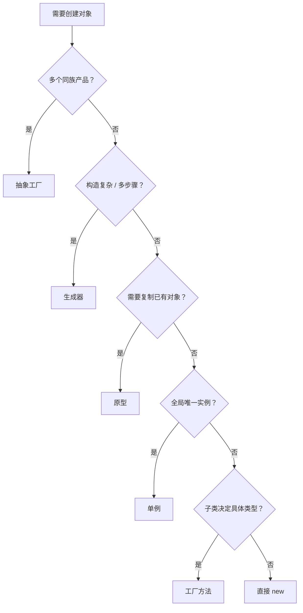

# 设计模式 — 创建型

创建型模式抽象了对象的实例化过程，使系统独立于具体的产品类。GoF 定义了五种创建型模式：工厂方法、抽象工厂、生成器、原型、单例。

## 核心问题

直接使用 `new` 创建对象会导致代码与具体类耦合，使得更换产品类型、改变构造方式或控制实例数量变得困难。

## 五种模式速览

| 模式 | 一句话 | 核心机制 | C# 等价 |
|------|--------|----------|---------|
| 工厂方法 | 子类决定创建什么 | 继承 + 多态 | `Func<T>` 委托 |
| 抽象工厂 | 创建一族相关对象 | 接口 + 产品族 | DI 容器注册多个关联服务 |
| 生成器 | 分步构造复杂对象 | 链式调用 + 分步构建 | Fluent API / `IConfigurationBuilder` |
| 原型 | 克隆已有对象 | 复制构造函数 | `ICloneable` / 复制构造函数 / `record with` |
| 单例 | 全局唯一实例 | 私有构造 + 静态实例 | `Lazy<T>` / DI `AddSingleton` |

## 演变路径

```
工厂方法 ──→ 抽象工厂 ──→ 生成器 / 原型
(简单定制)    (产品族)     (更灵活但更复杂)
```

许多系统从工厂方法起步，随需求增长演化为抽象工厂。当构造过程极其复杂时引入生成器；当对象创建开销高时引入原型。单例常与其他四种模式组合使用。

## 模式关系

- **工厂方法 → 抽象工厂**：抽象工厂通常由一组工厂方法构成
- **抽象工厂 → 生成器**：抽象工厂一次性返回产品，生成器允许分步构造
- **抽象工厂 + 原型**：工厂用原型克隆预配置对象替代 `new`
- **单例 + 其他**：工厂实例、注册表、配置管理器常用单例实现

## 与依赖注入的关系

[[concepts/依赖注入|依赖注入]] 是现代 C# 中创建型模式的核心实践：

- **DI 容器**（`Microsoft.Extensions.DependencyInjection`）：替代手动工厂和手动单例的首选方案
- **`record` 类型**：不可变数据对象的天然载体，配合 `with` 表达式部分替代原型和生成器
- **`Lazy<T>`**：线程安全的懒加载，是现代单例的首选实现
- **配置系统**（`IConfigurationBuilder`）：生成器的实际应用，分步构建配置对象

> [!tip] 推荐
> 优先使用 DI 容器的生命周期管理（`AddSingleton`、`AddTransient`）替代手写工厂和单例。仅在 DI 无法覆盖的场景（如静态工具类）下才考虑 GoF 原始实现。

## 选择决策树



## 关联页面

- [[sources/design-patterns-creational-摘要|创建型设计模式 — 来源摘要]]
- [[concepts/设计模式-结构型|设计模式 — 结构型]]
- [[concepts/设计模式-行为型|设计模式 — 行为型]]
- [[concepts/依赖注入|依赖注入]] — DI 容器是创建型模式在现代 C# 中的核心实践
