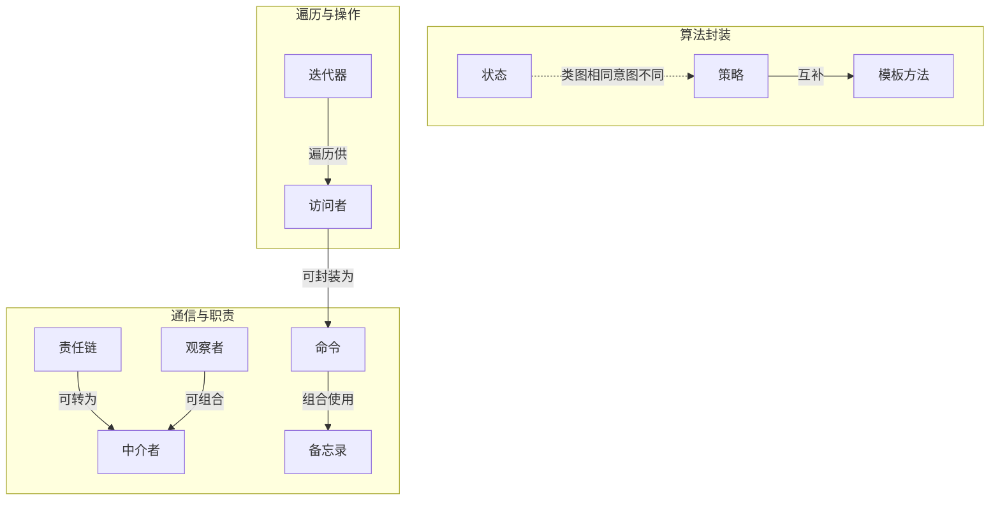

# 设计模式 — 行为型

行为型模式关注对象之间的通信、职责分配和算法封装。GoF 定义了十种行为型模式。

## 核心问题

随着系统复杂度增长，对象之间的通信模式会变得混乱。行为型模式通过显式定义通信协议和算法框架来保持代码的可维护性。

## 十种模式速览

| 模式 | 一句话 | C# 原生/框架支持 |
|------|--------|-----------------|
| 责任链 | 请求沿处理者链传递，直到被处理 | ASP.NET Core 中间件管道 |
| 命令 | 将请求封装为可撤销/排队的对象 | `ICommand` (WPF), `BackgroundJob` |
| 迭代器 | 不暴露集合内部结构地遍历 | `IEnumerable<T>` + `yield return` |
| 中介者 | 通过中介对象减少组件间直接耦合 | `IMediator` (MediatR 库) |
| 备忘录 | 保存和恢复对象状态，不破坏封装 | Undo/Redo 系统 |
| 观察者 | 状态变化时通知所有依赖方 | `event`, `IObservable<T>` (Rx.NET) |
| 状态 | 内部状态变化时改变对象行为 | 有限状态机, `IAsyncStateMachine` |
| 策略 | 定义可互换的算法族 | `IComparer<T>`, 排序/支付策略 |
| 模板方法 | 在父类定义算法骨架，子类实现步骤 | `Stream` 的 `Read`/`Write` 抽象 |
| 访问者 | 将操作与对象结构分离 | Roslyn `SyntaxWalker`, AST 遍历 |

## 关键对比

### 策略 vs 状态

类图相同，意图不同：

- **策略**：外部切换算法，策略对象彼此独立（如运行时选择支付方式）。客户端决定切换
- **状态**：内部驱动转换，状态对象知道下一个状态是什么（如文档审批流程）。状态对象触发转换

### 命令 vs 策略

- **命令**：封装**请求**及其参数——支持延迟执行、队列、撤销/重做
- **策略**：封装**算法**——运行时切换，策略通常无状态

### 模板方法 vs 策略

- **模板方法**：**继承**——父类控制骨架，子类填充细节（编译时确定）。遵循好莱坞原则："Don't call us, we'll call you."
- **策略**：**组合**——上下文持有策略接口，运行时切换（运行时确定）。遵循单一职责原则：每个策略封装一个独立算法

### 观察者 vs 中介者

- **观察者**：一对多通知，Subject 不知道 Observer 的具体类型。**广播模式**
- **中介者**：多对多协调，所有组件只知道中介者。**集中式协调**

两者可以组合——中介者可以作为观察者处理组件事件后协调其他组件。

### 命令 vs 备忘录

- **命令**：封装操作本身——Execute 执行操作，Undo 撤销
- **备忘录**：保存操作前后的状态——快照

两者常组合使用——命令在执行前用备忘录保存状态，撤销时恢复。这是撤销/重做系统的标准实现。

### 责任链 vs 装饰

- **责任链**：请求沿链传递，**可提前终止**——找到处理者即停
- **装饰**：每个装饰器**都执行**——装饰器栈

ASP.NET Core 中间件管道兼具两者特性：每个中间件都执行（装饰），但短路时提前终止（责任链）。

## C# 的语言级模式支持

C# 通过语言特性和框架对某些行为型模式提供了原生支持，大幅降低了实现成本：

- `IEnumerable<T>` / `yield return` → 迭代器
- `event` 关键字 → 观察者
- `IObservable<T>` / Rx.NET → 观察者（流式/可组合）
- `IAsyncStateMachine` → 状态（编译器为 `async` 方法生成）
- ASP.NET Core Middleware → 责任链 + 装饰
- MediatR 库 → 中介者（社区标准实现）
- `Func<T>` / `Action<T>` 委托 → 简单策略和命令的替代

## 模式关系

## 关联页面

- [[sources/design-patterns-behavioral-摘要|行为型设计模式 — 来源摘要]]
- [[concepts/设计模式-创建型|设计模式 — 创建型]]
- [[concepts/设计模式-结构型|设计模式 — 结构型]]
- [[concepts/依赖注入|依赖注入]] — 策略模式、观察者模式常用 DI 注入策略/观察者集合
